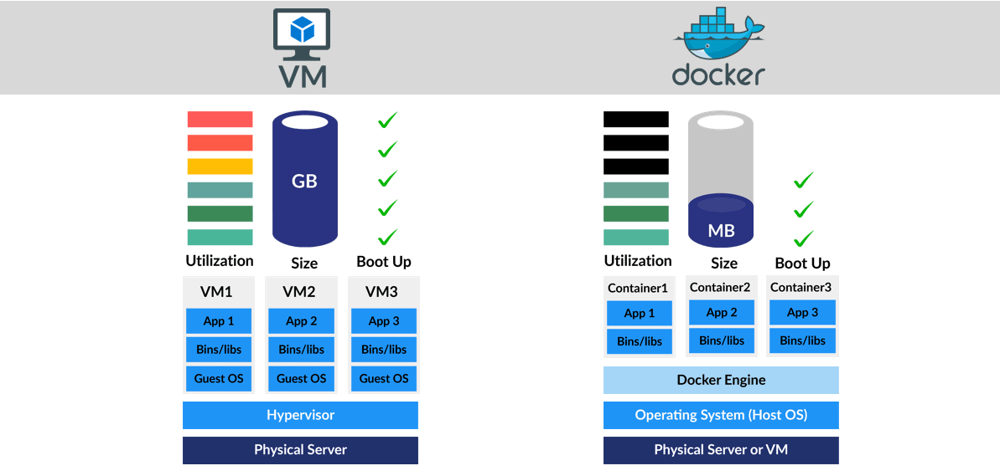
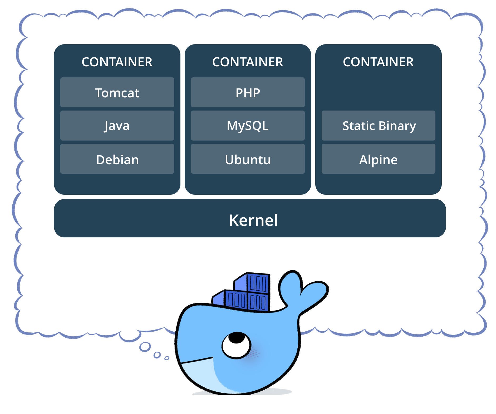

# Capítulo 01 - Fundamentos e Instalação

## Virtualização

A virtualização é uma tecnologia que permite a um único computador físico **(host)** executar múltiplas máquinas virtuais **(VMs)**, cada uma com seu próprio sistema operacional **(guest)**.

Essas VMs compartilham os recursos físicos — CPU, memória, disco e rede — do host, funcionando como sistemas independentes dentro de um ambiente isolado. Em outras palavras, a virtualização torna possível executar **sistemas operacionais dentro de sistemas operacionais**. Cada máquina virtual roda como um processo de usuário no sistema host, gerenciado pelo hipervisor.

> **Observação:** O Host é o computador físico real. É a máquina que você pode tocar, que tem o processador (CPU), a memória RAM e o disco rígido instalados. A VM é um "computador de software". Ela se comporta exatamente como um computador real, com seu próprio sistema operacional e aplicativos, mas ela não existe fisicamente; ela é apenas um arquivo ou um processo rodando no Host. O Guest é o sistema operacional que está rodando dentro da VM (como um Windows rodando dentro de um Linux, ou vice-versa).

**Essa abordagem oferece inúmeras vantagens:**

- Permite testar e validar configurações de software de forma segura e reversível;
- Facilita o ensino e aprendizado de administração de sistemas;
- Possibilita execução de softwares legados em sistemas modernos;
- Aumenta a eficiência e aproveitamento do hardware;

No contexto do Linux, a virtualização possui um papel estratégico. Diferente de soluções externas ou proprietárias, o Linux integra nativamente tecnologias de virtualização diretamente no kernel, oferecendo alto desempenho, segurança e estabilidade. Ferramentas como o `KVM (Kernel-based Virtual Machine)` transformam o próprio kernel Linux em um hipervisor, permitindo a execução de máquinas virtuais com desempenho próximo ao hardware real.

**Existem três principais abordagens de virtualização:**

### Virtualização Completa (Bare-metal)

A virtualização Bare-Metal (também conhecida como Tipo 1) é a forma mais pura e eficiente de virtualização. O termo "Bare-Metal" (metal exposto) refere-se ao fato de que o software de virtualização — o Hipervisor — é instalado diretamente sobre o hardware físico, sem a necessidade de um sistema operacional convencional (como Windows ou macOS) por baixo. O hipervisor interage diretamente com o hardware do host, oferecendo alto desempenho e baixo overhead.

> **Exemplos:** `KVM`, `VMware ESXi`, `Microsoft Hyper-V`, `Proxmox`.

### Paravirtualização

Enquanto a virtualização Bare-Metal (Full Virtualization) foca em simular o hardware completo para que a máquina virtual (VM) não saiba que está sendo virtualizada, a Paravirtualização (PV) adota uma abordagem de "colaboração".

Na paravirtualização, o sistema operacional convidado (Guest) sabe que está rodando em um hipervisor e é modificado para trabalhar em conjunto com ele.

Na paravirtualização, as instruções privilegiadas do sistema operacional convidado são substituídas por Hypercalls.
- **Hypercalls:** São chamadas diretas ao Hipervisor. Em vez de a VM tentar "tomar o controle" do hardware, ela pede educadamente ao hipervisor: "Por favor, execute esta tarefa de escrita no disco para mim".

> **Exemplos:** `Xen`, `VirtualBox` (em modo paravirtualizado).

### Virtualização por Software (ou Emulação)

A Virtualização por Software, frequentemente chamada de Emulação, é o nível mais básico e, ao mesmo tempo, o mais versátil de virtualização. Diferente do KVM (que usa o hardware) ou da Paravirtualização (que exige um Kernel modificado), aqui o software simula cada componente de um computador físico. Por outro lado, é o método mais lento devido à tradução binária constante.

> **Exemplos:** `QEMU puro`, `VirtualBox`, `VMware Workstation`.

### Por que Utilizar a Virtualização

A virtualização é uma tecnologia essencial tanto para laboratórios de estudo, quanto para ambientes corporativos.

**Seus principais benefícios incluem:**

- **Melhor aproveitamento de recursos:** múltiplos servidores podem compartilhar o mesmo hardware físico.
- **Redução de custos operacionais:** menor consumo de energia, refrigeração e espaço físico.
- **Facilidade de manutenção:** snapshots, clonagem e migração reduzem o tempo de recuperação.
- **Isolamento e segurança:** falhas em uma VM não afetam as demais.
- **Flexibilidade e escalabilidade:** criação rápida de novos servidores conforme a necessidade.

### Soluções

Várias empresas oferecem soluções de virtualização que abrangem tarefas específicas de data center ou cenários de virtualização de desktop focados no usuário final. Exemplos mais conhecidos incluem o VMware, que se especializa em virtualização de servidor, área de trabalho, rede e armazenamento. O Citrix, que tem um nicho em virtualização de aplicativos, mas também oferece soluções de virtualização de servidor e de desktop virtual. A Microsoft, cuja solução de virtualização Hyper-V é fornecida com o Windows e foca em versões virtuais de computadores de servidor e desktop.

### Tipos de serviços virtualizado

Até esse ponto discutimos a virtualização de servidor, mas muitos outros elementos da infraestrutura de TI podem ser virtualizados para oferecer vantagens significativas aos gerentes de TI (em particular) e à empresa como um todo. 

- Virtualização da área de trabalho
- Virtualização de rede
- Virtualização de armazenamento
- Virtualização de dados
- Virtualização de aplicativos
- Virtualização de data center
- Virtualização de CPU
- Virtualização de GPU
- Virtualização de Linux
- Virtualização de cloud

##  O que é um Hipervisor

O hipervisor é o componente que gerencia a execução das máquinas virtuais, controlando o acesso delas aos recursos físicos do host.
Ele cria e mantém o isolamento entre os guests, garantindo que cada um funcione de forma segura e independente.

**Ele é responsável por:**

- Gerenciar o hardware físico (CPU, RAM, disco, rede)
- Distribuir recursos entre as máquinas virtuais
- Proteger o isolamento entre elas
- Criar, executar, pausar, migrar e remover máquinas virtuais

**Existem dois tipos principais:**

#### Hypervisor Tipo 1 (Bare Metal)

**Um hipervisor tipo 1** é executado diretamente no hardware físico do computador, interagindo diretamente com sua unidade central de processamento (CPU), memória e armazenamento físico. Por esse motivo, as pessoas também se referem aos hipervisores tipo 1 como hipervisores bare metal ou hipervisores nativos. Um hipervisor tipo 1 assume o lugar do sistema operacional host.

[Hypervisor1](imagens/hypervisor1.png)

Os hipervisores tipo 1 são altamente eficientes porque acessam diretamente o hardware físico. Esse recurso também aumenta sua segurança, pois não há nada entre eles e a CPU que um invasor possa comprometer. No entanto, um hipervisor tipo 1 geralmente exige uma máquina de gerenciamento separada para administrar diversas VMs e controlar o hardware do host.

#### Hypervisor Tipo 2 (Hospedado)

**Um hypervisor tipo 2** (também conhecido como hipervisor incorporado ou hospedado) não é executado diretamente no hardware subjacente. Em vez disso, é executado como uma aplicação em um SO.

[Hypervisor1](imagens/hypervisor2.png)

Os hipervisores tipo 2 raramente aparecem em ambientes baseados em servidores. Em vez disso, são adequados para usuários individuais de PCs que precisam executar sistemas operacionais diferentes. Por exemplo, engenheiros, profissionais de segurança que analisam malware e usuários corporativos que precisam acessar aplicações disponíveis somente em outras plataformas de software.

Os hipervisores tipo 2 muitas vezes apresentam toolkits adicionais para os usuários instalarem no SO convidado. Essas ferramentas oferecem conexões aprimoradas entre o convidado e o SO host, normalmente possibilitando que o usuário corte e cole entre os dois ou acesse arquivos e pastas do SO host a partir da máquina virtual convidada.

Um hipervisor tipo 2 possibilita o acesso rápido e fácil a um SO convidado alternativo juntamente com o sistema principal em execução no sistema host. Esse recurso possibilita produtividade para o usuário final. Um consumidor pode utilizá-lo para acessar suas ferramentas de desenvolvimento favoritas baseadas em Linux enquanto utiliza um sistema de ditado de voz disponível somente no Windows, por exemplo.

No entanto, um hipervisor tipo 2, ao acessar recursos de computação, memória e rede por meio do SO host, introduz problemas de latência que podem afetar o desempenho. Ele também introduz possíveis riscos de segurança se um invasor comprometer o SO host, pois ele poderá manipular qualquer SO convidado em execução no hipervisor tipo 2.

### Hipervisores no mercado

Há atualmente muitos hipervisores no mercado. Veja a seguir algumas das principais soluções de propriedade de fornecedores.

- **VMware ESXi:** O VMware ESXi (Elastic Sky X Integrated) é um hipervisor tipo 1 (ou bare metal) dedicado à virtualização de servidores no data center. O ESXi gerencia coleções de virtual machines da VMware.
- **VMware Workstation Pro:** Esse hipervisor é compatível com desktops e notebooks que executam sistemas operacionais Windows e Linux.
- **VMware Fusion Pro.** Também para usuários de desktops e notebooks, esse hipervisor é a oferta da empresa voltada para o MacOS, que permite que os usuários de Mac executem uma grande variedade de sistemas operacionais convidados. O VMware Fusion Pro é gratuito para uso pessoal e pago para uso comercial.

> **Observação:** a VMware descontinuou o Workstation Player e o VMware Fusion Player desde o início do VMware Workstation Pro e do Fusion Pro.3

- **Oracle VM VirtualBox:** O VirtualBox é um hipervisor tipo 2 que é executado nos sistemas operacionais Linux, Mac OS e Windows.
- **Parallels Desktop:** O Parallels Desktop é uma tecnologia de hipervisor que permite aos usuários executar sistemas operacionais (como Linux ou Windows) e outros aplicativos em um Mac.
- **Microsoft Hyper-V:** O Hyper-V é o hipervisor da Microsoft projetado para uso em sistemas Windows
- **Citrix Hypervisor:** O Citrix Hypervisor (antigo Xen Server do projeto de código aberto Xen) é um hipervisor comercial tipo 1 compatível com os sistemas operacionais Linux e Windows.
- **Hipervisores de código aberto:** As tecnologias de hipervisor de código aberto oferecem boa relação custo-benefício, opções de personalização e forte suporte da comunidade. Os hipervisores de código aberto mais populares incluem os seguintes.
- **Xen Hypervisor:** Esse hipervisor tipo 1 de código aberto é executado em arquiteturas Intel e ARM. O Xen é compatível com diversos tipos de virtualização, incluindo ambientes com assistência de hardware usando Intel VT e AMD-V. 
- **Linux KVM (virtual machine baseada no kernel):** O KVM é um hipervisor tipo 1 baseado em Linux que pode ser adicionado à maioria dos sistemas operacionais Linux, inclusive Ubuntu, SUSE e Red Hat Enterprise Linux (RHEL).
- **Red Hat OpenShift Virtualization:** O Red Hat OpenShift Virtualization é baseado no KubeVirt, um projeto de código aberto que possibilita executar VMs em uma plataforma de contêineres gerenciada do Kubernetes. O KubeVirt oferece virtualização nativa de contêineres usando uma KVM dentro de um contêiner Kubernetes.

> Cada sistema virtualizado é chamado de máquina virtual (VM) ou hóspede, e comporta-se como um computador real — com BIOS, controladores, disco, interfaces de rede e drivers próprios.

### Máquinas virtuais (VMs)

As máquinas virtuais (VMs) são ambientes virtuais que simulam um computador físico em forma de software. Elas normalmente compreendem vários arquivos contendo a configuração da VM, o armazenamento para o disco rígido virtual e algumas capturas instantâneas da VM que preservam o seu estado em um determinado ponto no tempo.

### Recuperação de Desastres e Alta Disponibilidade

A recuperação de desastres é um dos pontos fortes da virtualização.
Em caso de falha grave no sistema, é possível restaurar rapidamente uma VM a partir de um snapshot ou migrá-la para outro host.

Além disso, como cada VM é totalmente independente, o tempo de inatividade de um servidor não afeta os demais — um fator crítico em ambientes de produção.

Para fechar o entendimento necessário para a LPI, a virtualização pode ser resumida como a tecnologia que permite criar múltiplos recursos computacionais simulados a partir de um único hardware físico. Ela é o pilar que sustenta o Cloud Computing e a infraestrutura moderna.

## KVM — Kernel-based Virtual Machine

O **KVM (Kernel-based Virtual Machine)** ou **máquina virtual baseada em Kernel** é a solução nativa de virtualização completa do Linux, integrada diretamente ao kernel desde a versão `2.6.20`. Ele transforma o Linux em um hipervisor de alto desempenho, capaz de executar múltiplos sistemas operacionais simultaneamente — incluindo Linux, Windows e BSD.

O KVM utiliza o QEMU (Quick Emulator) como mecanismo de emulação de hardware, oferecendo um ambiente flexível e altamente eficiente.

### Principais Recursos do KVM

- **Overcommitting:** permite alocar mais recursos virtuais (CPU/RAM) do que os disponíveis fisicamente, otimizando a utilização do hardware.
- **KSM (Kernel Same-page Merging):** permite que diferentes VMs compartilhem páginas de memória idênticas, reduzindo o consumo de RAM.
- **QEMU Guest Agent:** agente instalado no sistema convidado que permite controle e monitoramento detalhado pela máquina host.
- **Compatibilidade com Hyper-V:** o KVM implementa diversas funções do Hyper-V, otimizando o desempenho de VMs Windows.

### Ferramentas de Gerenciamento: Libvirt e Ecosistema

Uma ferramenta de gerenciamento de virtualização é útil para monitorar as VMs quando várias delas estão sendo executadas. Algumas ferramentas de gerenciamento de VM são executadas na linha de comando, outras oferecem interfaces de usuário gráficas (GUIs), e outras são criadas para gerenciar VMs em grandes ambientes empresariais. Confira algumas soluções comuns de gerenciamento de virtualização para a KVM.

O `libvirt` `virsh` é uma ferramenta de interface de linha de comando (CLI) para gerenciar o hypervisor e as máquinas virtuais convidadas, é a camada de gerenciamento da virtualização no Linux. 

O comando `virsh` pode ser usado em modo somente leitura por usuários sem privilégios ou para administração completa por usuários com acesso `root`. Além disso, `virsh` é a principal interface de gerenciamento para domínios, convidados e pode ser usada para `criar`, `pausar`, `encerrar` domínios, bem como `listar` domínios atuais, além de entrar em um shell de virtualização. Esta ferramenta é instalada como parte do pacote libvirt-client.

Ele fornece uma API unificada e independente de hipervisor, permitindo criar, modificar e controlar VMs de forma segura.

**Principais Ferramentas:**

- **virsh:** ferramenta de linha de comando (CLI) baseada em libvirt. Permite criar, pausar, listar, iniciar e encerrar máquinas virtuais.
- **virt-manager:** ferramenta gráfica leve e intuitiva, ideal para gerenciar VMs localmente, criar novas instâncias e acessar consoles gráficos.
- **Consoles web:** os administradores podem gerenciar VMs usando interfaces baseadas na web. Por exemplo, o Cockpit oferece uma solução para os usuários gerenciarem VMs em uma interface web. O Red Hat Enterprise Linux tem um plug-in de console web voltado à virtualização.
- **KubeVirt:** o  `KubeVirt` é uma solução para gerenciar grandes quantidades de VMs em um ambiente do Kubernetes. Nesse local, as VMs podem ser gerenciadas junto às aplicações em container. O Kubevirt oferece a base para o Red Hat OpenShift® Virtualization.
- **virt-install:** utilitário em linha de comando para provisionar novas VMs de forma interativa ou automatizada, suportando mídias locais e remotas (HTTP, FTP, NFS).

Essas ferramentas permitem o gerenciamento completo do ciclo de vida das máquinas virtuais, incluindo criação, migração, monitoramento de desempenho e controle de recursos.

### KVM vs. VMware

A VMware oferece um conjunto completo de produtos de virtualização, incluindo o ESXi (um hipervisor de tipo 1) e o vSphere. Uma das principais diferenças em relação à VMware reside nos seus modelos de licenciamento. Sendo open source, o KVM não tem custos de licenciamento para o hipervisor em si, ao passo que os produtos da VMware normalmente requerem licenças comerciais.

O ecossistema maduro e o conjunto abrangente de funcionalidades da VMware, incluindo ferramentas de gestão avançadas, podem ser vantajosos para grandes empresas com necessidades de virtualização complexas. Contudo, isso acarreta um custo superior.

O KVM, com o seu conjunto crescente de funcionalidades e um desempenho robusto, é uma alternativa interessante, especialmente para as organizações que procuram uma solução económica e flexível. Frequentemente, a escolha depende do orçamento, das funcionalidades pretendidas e do nível de suporte necessário.

### KVM vs. Hyper-V

O Hyper-V é a plataforma de virtualização da Microsoft, perfeitamente integrada no sistema operativo Windows Server. Tal como o KVM, o Hyper-V é um hipervisor de tipo 1 (executado diretamente sobre o hardware). Uma diferença fundamental reside no ecossistema: o KVM é nativo do Linux, enquanto o Hyper-V é a base do ecossistema Windows. Isto faz do Hyper-V uma escolha natural para as organizações que investem fortemente nas tecnologias da Microsoft.

O KVM, por outro lado, oferece uma maior flexibilidade em termos de sistemas operativos convidados (guests) e beneficia de uma comunidade open source vibrante. Do ponto de vista do desempenho, ambas as plataformas oferecem excelentes resultados, embora os ensaios de referência (benchmarks) específicos possam variar em função da carga de trabalho e do tipo de serviços alojados.

### Escolher a plataforma de virtualização adequada

O custo é invariavelmente um fator determinante, e a natureza open source do KVM torna-o uma opção altamente rentável. Contudo, devem ser avaliadas as funcionalidades específicas exigidas pelo negócio, tais como a migração em direto (live migration), a gestão de armazenamento e a alta disponibilidade (HA).

As métricas de desempenho e o seu alinhamento com os requisitos da carga de trabalho (workload) são fundamentais. Adicionalmente, deve-se ponderar a maturidade do ecossistema, a disponibilidade de recursos de suporte e a dimensão da comunidade. Por fim, a integração na infraestrutura informática existente e a compatibilidade com o conjunto de ferramentas de gestão atuais são aspetos cruciais para garantir a continuidade do negócio.

### Resumo do Cenário de Laboratório

Compreender o conceito de virtualização e o funcionamento do KVM é fundamental para montar um ambiente de laboratório eficiente. O cenário apresentado neste capítulo servirá de base para os próximos, onde serão implementados diversos serviços de rede — tais como DNS, DHCP, HTTP, Firewall, Proxy e Controlador de Domínio — sobre as distribuições Debian 13, Rocky Linux e Ubuntu Server LTS.

A partir deste ponto, cada máquina virtual (VM) criada será configurada como parte de uma infraestrutura de rede simulada, refletindo as práticas reais de administração de servidores corporativos GNU/Linux. Todo este percurso está alinhado com os requisitos da trilha de certificação LPI.

## O que é o Docker

**Docker** é uma plataforma Open Source escrita em Go (Linguagem de programação em alta performance desenvolvida pela Google) que ajuda na criação e a administração de ambientes isolados. Isso permite que as aplicações partilhem o kernel do SO anfitrião em vez de executarem um SO convidado. Este design torna os containers Docker leves, rápidos e portáteis, mantendo-os isolados uns dos outros

Com a utilização do Docker podemos gerenciar toda a infraestutura de uma aplicação, bem como garantir que ambientes de desenvolvimento, homologação e produção contenham os mesmos componentes e versões de aplicações, a fim de minimizar impactos no processo de desenvolvimento e entrega de software.

O Docker trabalha com uma virtualização a nível do sistema operacional, onde o mesmo utiliza de recursos como o kernel do sistema hospedeiro para executar seus containers. Diferente do modelo tradicional de Máquinas Virtuais, o Docker não necessita da instalação de um sistema operacional por completo, e sim apenas dos arquivos necessários para a aplicação ser executada. 

**Então o docker já trás as seguintes vantagens:**

* Escrito na linguagem de programação Go.
* Suporta instalações Windows, macOS e Linux (o Docker Engine é executado nativamente no Linux).
* Resolve o problema _“funciona na minha máquina”_, garantindo que o código seja executado de forma idêntica em todos os ambientes.
* Ao contrário do VMware (virtualização no nível do hardware), o Docker opera no nível do sistema operacional.

Embora o Docker e as máquinas virtuais tenham um propósito semelhante, seu desempenho, portabilidade e suporte a sistemas operacionais diferem significativamente.

A principal diferença é que os containers do Docker compartilham o sistema operacional do host, enquanto as máquinas virtuais também têm um sistema operacional convidado sendo executado no sistema host, (virtual box,vmware, etc...). Esse método de operação afeta o desempenho, as necessidades de hardware e o suporte do SO. Confira a tabela abaixo para uma comparação detalhada.

### Tabela de comparação docker Vs maquinas virtuais



### Por que usar Docker?

- Antes do Docker:

A implantação de aplicativos entre ambientes era muitas vezes difícil, dependências, configurações e variações de sistema operacional causavam dores de cabeça do tipo **“funciona aqui, mas não lá”**.

Em 2013, Docker introduziu o que se tornou o padrão da indústria para containers, trouxe uma maneira simples, rápida e eficiente de executar aplicações sem a complexidade de uma máquina virtual.

Docker garante um ecossistema completo, fazendo com que o desenvolvedor possa trabalhar sem se preocupar, por exemplo, com a abertura de tickets para uma equipe de infraestrutura provisionar um ambiente por completo, atrasando o trabalho de entrega de software.

Existem diversas engines e runtimes de containers e até é possível utilizar containers sem Docker, mas atualmente o Docker é a engine/runtime de container mais utilizada no mercado, o que torna o conhecimento do mesmo um **"Must have"** e dificilmente encontraremos vagas na área de tecnologia que não pedem um conhecimento, mesmo que básico, de containers ou Docker. **Viu a expressão container?**. Vamos ver mais adiante.

### Componentes do Docker

A seguir estão alguns dos principais componentes do Docker:

- **Docker Engine:** O Docker Engine tem um daemon docker como parte central, que lida com a criação e o gerenciamento de contêineres.
- **Imagem do Docker:** A imagem Docker é um modelo só de leitura que é utilizado para criar contentores, contendo o código da aplicação e as dependências.
- **Docker Hub:** É um repositório baseado na nuvem que é utilizado para encontrar e partilhar as imagens de contentores.
- **Dockerfile:** É um ficheiro que descreve os passos para criar uma imagem rapidamente.
- **Docker Registry:** É um sistema de distribuição de armazenamento para imagens Docker, onde é possível armazenar as imagens nos modos público e privado.

### Docker Engine

O Docker Engine é o componente principal que permite que o Docker execute contêineres em um sistema. Segue uma arquitetura cliente-servidor e é responsável pela criação, execução e gestão de contentores Docker.

O Docker Engine Daemon (dockerd) é executado em segundo plano, ouvindo pedidos de API e gerindo objectos como imagens, containers, redes e volumes.
O Cliente Docker (docker CLI) se comunica com o daemon usando uma API REST. Fornece o ambiente de execução onde as imagens Docker são instanciadas em containers activos.

[Motro Docker](../pic/docker_enginer.png)

Sem o motor Docker, as imagens Docker não podem ser construídas ou os contentores executados.

O Cliente envia comandos Docker (docker build, docker run, etc.).
O Daemon recebe estes comandos e executa operações de contentores.
A API REST é a interface que permite esta comunicação.
Em suma, o Docker Engine é o tempo de execução que torna a contentorização possível, ligando o cliente Docker ao daemon para construir e gerir contentores de forma eficiente.

### Dockerfile

O Dockerfile usa DSL (Domain Specific Language) e contém instruções para gerar uma imagem Docker. O Dockerfile definirá os processos para produzir rapidamente uma imagem. Ao criar a sua aplicação, deve criar um Dockerfile por ordem, uma vez que o daemon do Docker executa todas as instruções de cima para baixo.

[Docke file](../pic/docke_file.png)

O Dockerfile é o código-fonte da imagem. (O daemon do Docker, muitas vezes referido simplesmente como "Docker", é um serviço em segundo plano que gere os contentores Docker num sistema).

É um documento de texto que contém os comandos necessários que, ao 
serem executados, ajudam a montar uma imagem Docker. A imagem Docker é 
criada usando um Dockerfile.

### Imagem Docker

Uma imagem Docker é um ficheiro composto por várias camadas que contém as instruções para construir e executar um contentor Docker. Funciona como um pacote executável que inclui tudo o que é necessário para executar uma aplicação - código, tempo de execução, bibliotecas, variáveis de ambiente e configurações.

### Como funciona:

- A imagem define como um containers deve ser criado.
- Especifica quais componentes de software serão executados e como eles são configurados.
- Uma vez que uma imagem é executada, ela se torna um Docker Container.

**Relação com Containers:**

1. Imagem do Docker → Blueprint (estático, somente leitura).
2. Docker Container → Instância de execução dessa imagem (dinâmica, executável)

### Arquitetura e funcionamento do Docker

O Docker utiliza uma arquitetura cliente-servidor. O cliente Docker 
fala com o daemon Docker que ajuda a construir, executar e distribuir 
os contentores Docker. O cliente Docker é executado com o daemon no 
mesmo sistema ou podemos conectar o cliente Docker com o daemon Docker 
remotamente. Com a ajuda da API REST através de um socket UNIX ou de 
uma rede, o cliente Docker e o daemon interagem entre si. Para saber 
mais sobre o funcionamento do Docker, consulte arquitetura do docker.

[Arquitetura Docker](../pic/docker_architecture.png)

- **CLI do Docker**: Interface de linha de comandos para interagir com o Docker
Comandos comuns: docker run, docker build, docker pull
- **API Rest do Docker**: API HTTP utilizada pela CLI e outras ferramentas
Facilita a comunicação com o daemon do Docker
- **Daemon do Docker**: Trata de imagens, contentores, redes e volume
Serviço principal que gere objectos do Docker
- **Tempo de execução de alto nível**: Gere as operações do ciclo de vida dos containers. As tarefas incluem criar, iniciar, parar e eliminar contentores

## O que é um container

Um container é um ambiente completo (uma aplicação e todas suas dependências, bibliotecas, binários, arquivos de configuração) em um único pacote. Ao containerizar uma plataforma de aplicação e suas dependências, as diferenças em distribuições de sistemas operacionais, e camadas inferiores da infraestrutura são abstraídas.

Todas as configurações e instruções para iniciar ou parar containers são ditadas pela imagem do Docker. Sempre que um usuário executa uma imagem, um novo container é criado.

É fácil gerenciar containers com a ajuda da API do Docker ou da interface de linha de comando (ILC). Se forem necessários vários containers, os usuários podem controlá-los com a Ferramenta de composição do Docker.

> Imagine que o container Docker é como se fosse um container real em um navio (servidor), todos os containeres estão lado a lado, porém seu conteúdo (ecossistema) não tem interferência de outros containers.

Podemos dizer também que um container é a unidade mínima computacional do Docker, ou seja, o menor recurso que o Docker pode fornecer.



### Docker Container

Um Docker Container é uma instância leve e executável de uma imagem Docker. Ele empacota o código do aplicativo junto com todas as suas dependências e o executa em um ambiente isolado. Os contentores permitem que as aplicações sejam executadas de forma rápida e consistente em diferentes ambientes - seja no computador portátil de um programador, em servidores de teste ou em produção.

Um container  é criado quando uma imagem Docker é executada.
Ele é executado como um processo isolado no computador host, mas compartilha o kernel do sistema operacional do host. Vários contentores podem ser executados no mesmo sistema sem interferir uns com os outros.

Por exemplo: suponha que existe uma imagem do SO Ubuntu com o NGINX SERVER e que esta imagem é executada com o comando docker run, será criado um contentor e o NGINX SERVER será executado no SO Ubuntu.

**Relação com imagens:**

- Imagem do Docker = Blueprint (estático, somente leitura).
- Docker Container = instância viva desse blueprint (dinâmico, executável)

### O que é o Docker Hub?

O Docker Hub é um serviço de repositório e é um serviço baseado em nuvem onde as pessoas enviam suas imagens de contêineres Docker e também puxam as imagens de contêineres Docker do Docker Hub a qualquer momento ou em qualquer lugar através da Internet.

De um modo geral, facilita a procura e a reutilização de imagens. Fornece funcionalidades como a possibilidade de enviar as suas imagens para um registo privado ou público, onde pode armazenar e partilhar imagens Docker.

A equipa DevOps utiliza principalmente o Docker Hub. É uma ferramenta de código aberto e está disponível gratuitamente para todos os sistemas operativos. É como um armazenamento onde guardamos as imagens e as extraímos quando necessário. Quando uma pessoa quer empurrar/puxar imagens do Docker Hub, ela deve ter um conhecimento básico do Docker. Vamos discutir os requisitos da ferramenta Docker.

### Comandos Docker

Através da introdução dos comandos essenciais do docker, o docker tornou-se um software poderoso na racionalização do processo de gestão de contentores. Ele ajuda a garantir um desenvolvimento contínuo e fluxos de trabalho de implantação. 

A seguir estão alguns dos comandos do docker que são usados comumente:

| Comando Docker            | Descrição |
|---------------------------|-----------|
| **docker run**            | Usado para iniciar contêineres a partir de imagens, especificando opções de execução e comandos. |
| **docker pull**           | Faz o download de imagens de contêiner do registro (como Docker Hub) para a máquina local. |
| **docker ps**             | Exibe os contêineres em execução com informações importantes como ID, imagem e status. |
| **docker stop**           | Encerra contêineres em execução, desligando os processos de forma controlada. |
| **docker start**          | Reinicia contêineres parados, retomando suas operações do estado anterior. |
| **docker login**          | Permite autenticar-se no registro Docker, habilitando o acesso a repositórios privados. |
| **docker restart**        | Reinicia um contêiner em execução, útil para aplicar novas configurações ou atualizações. |
| **docker rm**             | Remove contêineres parados do sistema para liberar espaço. |
| **docker rmi**            | Remove imagens Docker não utilizadas do sistema. |
| **docker images**         | Lista todas as imagens Docker disponíveis localmente, mostrando tamanho e tags. |
| **docker exec**           | Executa um comando dentro de um contêiner em execução. Ex: `docker exec -it <container> bash`. |
| **docker logs**           | Exibe os logs de saída de um contêiner, útil para depuração. |

### Docker Engine

O software que aloja os contentores chama-se Docker Engine. O Docker Engine é uma aplicação baseada em cliente-servidor. O motor do docker tem 3 componentes principais:

- **Servidor**: É responsável pela criação e gestão de imagens Docker, contentores, redes e volumes no Docker. É referido como um processo daemon.
- **API REST**: especifica a forma como as aplicações podem interagir com o servidor e dá-lhe instruções sobre o que fazer.
- **Cliente**: O cliente é uma interface de linha de comando (CLI) do Docker, que nos permite interagir com o Docker usando os comandos do Docker.

### Versões

O Docker possui basicamente duas versões, a `versão da comunidade (Community Edition)` e a `versão empresarial (Enterprise Edition)`.

1. **Community Edition (CE)**: Gratuito, open-source, usado por indivíduos, equipas de desenvolvimento, contribuidores de open-source.
2. **Enterprise Edition (EE)**: Paga, com melhorias de segurança, plugins/imagens certificados e suporte empresarial.

A maioria dos sistemas Docker em produção utiliza a versão Docker Community Edition. O licenciamento anual da versão Enterprise custa cerca de **US$750** por nó, o que torna o processo inviável para algumas empresas.

> **ATENÇÃO:** Para fins da prova Docker Certified Associate **(Docker DCA)** a versão Community deve ser utilizada apenas em ambientes de desenvolvimento e não deve ser utilizada em produção. Para produção a única versão a ser utilizada é a Enterprise Edition.

A versão Enterprise conta com recursos como o **UCP** (Universal Control Plane) e o **DTR** (Docker Trusted Registry), bem como suporte da Docker Inc.

**A recomendação mínima para a versão Enterprise do Docker EE é:**

- 8GB de RAM para nós Managers
- 4GB de RAM para nós Workers
- 2vCPUs para nós Managers
- 10GB de espaço em disco livre para a partição `/var` em nós Managers (Minimo de 6GB Recomendado)
- 500MB de espaço em disco livre para a partição `/var` em nós workers

**A recomendação para ambientes de produção do Docker EE é:**

- 16GB de RAM para nós Managers
- 4vCPUs para nós Managers
- 25 a 100GB de espaço livre em disco.

### Vantagens do Docker

- **Portabilidade** - O principal atrativo do Docker é sua portabilidade. Ele permite que os usuários criem ou instalem um aplicativo complexo em uma máquina e tenham certeza de que funcionará nele. Os containers do Docker incluem tudo o que um aplicativo precisa com pouca ou nenhuma entrada do usuário.
- **Automação** - Com a ajuda de cron jobs e containers Docker, os usuários podem automatizar seu trabalho facilmente. A automação ajuda os desenvolvedores a evitar tarefas tediosas e repetitivas, além de economizar tempo.
- **Comunidade** - O Docker tem um canal dedicado no Slack, fórum da comunidade e milhares de colaboradores em sites de desenvolvedores como o StackOverflow. Além disso, existem mais de 9 milhões de imagens de container hospedadas no Docker Hub.

### Desvantagens do Docker

- **Velocidade** - mesmo que executar um aplicativo por meio de um container do Docker seja mais rápido do que em uma máquina virtual, ainda é consideravelmente mais lento do que executar aplicativos nativamente em um servidor físico.
- **Difícil de usar** - O Docker não se destina a executar aplicativos que exijam uma interface gráfica do usuário (GUI). Isso significa que os usuários precisam estar familiarizados com a linha de comando e realizar todas as ações nela. A curva de aprendizado íngreme, as advertências específicas do sistema operacional e as atualizações frequentes tornam o domínio do Docker um desafio. Mesmo que você sinta que conhece o Docker de dentro para fora, ainda há uma orquestração a ser considerada, adicionando outro nível de complexidade.
- **Segurança** - O Docker é executado no sistema operacional do host. Isso significa que qualquer software malicioso oculto em containers pode chegar à máquina host.

## Preparando o Ambiente

Tudo pronto, vamos instalar o Docker em máquinas virtuais para que o estudo seja  facilitado, para isto utilizaremos o **Vagrant** somado ao **Vir-manager**, você pode utilizar a solução de virtualização que preferir, porém eu indico que você siga exatamente como listado aqui. Pode postar duvidas no comentário, caso você precise de suporte e eu farei o possivel de ajudar.

> Lembre-se de habilitar a virtualização `Intel VT-x` ou `AMD SVM` na UEFI/BIOS.

## Instalando o Vagrant e Virt-manager 

### O que é vagrant

Vagrant é um software de código aberto para criar e manter ambientes de desenvolvimento virtuais portáteis, utilizando VirtualBox, KVM, Hyper-V, Docker containers, VMware, e AWS. Ele tenta simplificar a gerência de configuração de software das virtualizações para aumentar a produtividade do desenvolvimento.

### Para Instalar o vagrant no windows siga os passos:

1. Acesse a página de [Downloads](https://www.vagrantup.com/downloads.html) e faça o download da versão correspondente ao seu sistema operacional.

2. Para Windows, clique sob o instalador e avance até o final da instalação.

2.1. Para Linux execute o programa de instalação de pacotes ( `sudo dpkg -i <pacote>.deb` para sistemas debian-like ou `sudo rpm -i <pacote>.rpm`).

### Instalação do vagrant base debian

**Vamos primeiro baixar as chaves:**

[Vagrant install](imagens/vagrant.png)

**A seguir vamos adicionar o repositório:**

- Para o debian o repositório fica assim:

[Vagrant install](imagens/vagrant1.png)

Vamos atualizar as listas de repositório para confirmar o repositório do vagrant, que ele é o primeiro a ser listado.

[Vagrant install](imagens/vagrant3.png)

> Na 5ª linha a saida é: 
- `Get:5 https://apt.releases.hashicorp.com bookworm/main amd64 Packages [221 kB]`. O que significa que o repositório do vagrant já esta instalado no sistema.

**Por ultimo a instalação do vagrant**

[Vagrant install](imagens/vagrant2.png)

Instale o pacotes `build-essential`, caso não tenhas no sistema.

[Vagrant install](imagens/vagrant4.png)

Vamos instalar o Pacote plugisn do libvirt para o vagrant.

[Vagrant install](imagens/vagrant5.png)

> Para mais detalhes sobre o Vagrant veja o [vídeo](https://www.youtube.com/watch?v=yW-2dFpL2-k).

2. Após a instalação abra um terminal ou um prompt de comando e execute o comando `vagrant --version` para verificar se o pacote foi instalado com sucesso.

[Vagrant install](imagens/vagrant5.png)

> Repare que o sistema está usar o `zsh`. Para isso foi feito o seguinte antes:

Instalamos o `zsh` e o `git`, e um editor de texto simpatico.

[zsh](imagens/git.png)

**Clonamos o repositório zsh.**

[zsh](imagens/zsh.png)

**Aceitamos as mudanças no terminal**

[zsh](imagens/zsh1.png)

**Editamos o arquivo `.zshrc`, e mudamod o tema para `agnoster`.

[zsh](imagens/zsh2.png)

**Instalamos as fontes para o tema.**

[zsh](imagens/zsh3.png)

> Apos fazer logout, as mudanças entram em vigor.

[zsh](imagens/zsh4.png)

Vamos continuar...

### O que é virt-manager

A aplicação virt-manager é uma interface de utilizador de ambiente de trabalho para gerir máquinas virtuais através da libvirt. Destina-se principalmente a máquinas virtuais KVM, mas também gere Xen e LXC (contentores Linux). Apresenta uma visão resumida dos domínios em execução, o seu desempenho em tempo real e estatísticas de utilização de recursos. Os assistentes permitem a criação de novos domínios e a configuração e ajuste da alocação de recursos e hardware virtual de um domínio. Um visualizador de cliente VNC e SPICE incorporado apresenta uma consola gráfica completa para o domínio convidado.

Para instalar o Virt-manager é muito simples siga os passos:

Para Linux execute o programa de instalação de pacotes `sudo apt install` para sistemas debian-like ou `sudo yum install` para sistemas RHE.

### Instalação e Configuração do KVM no Debian GNU/Linux

1. **Verificação de Requisitos do Sistema**

Antes de instalar o KVM (Kernel-based Virtual Machine), é fundamental confirmar se o hardware e o sistema operacional host oferecem suporte à virtualização. A maioria dos processadores modernos da Intel e AMD já possui esse recurso integrado, identificado pelas extensões VMX (Intel VT-x) ou SVM (AMD-V).

**Para verificar o suporte, execute:**

`grep -E --color '(vmx|svm)' /proc/cpuinfo`


Se o comando retornar a tag `vmx` ou `svm`, significa que a CPU suporta virtualização por hardware — requisito essencial para o KVM.

> **Boa prática:** Certifique-se de que a virtualização também esteja ativada na `BIOS/UEFI` do sistema. Sem essa opção habilitada, o KVM não conseguirá inicializar corretamente, mesmo que o processador ofereça suporte.

**Atualizando o Sistema**

Antes de iniciar a instalação, é recomendável atualizar a base de pacotes e garantir que o sistema está com as versões mais recentes dos componentes.


Essa prática previne conflitos de dependência e garante maior estabilidade e segurança ao ambiente.

> **Dica:** Após uma atualização completa, reinicie o sistema (sudo reboot) para garantir que todos os módulos e kernels atualizados sejam carregados.

**Instalação dos Pacotes Necessários**

A instalação do KVM no Debian pode ser feita em diferentes níveis. Para este laboratório, faremos uma instalação completa e otimizada, que inclui o hipervisor, ferramentas de gerenciamento, bibliotecas e utilitários de rede.

**root@debian13:~#** `apt install qemu-kvm libvirt-daemon-system libvirt-clients libvirt-daemon virtinst bridge-utils libosinfo-bin libguestfs-tools virt-manager`

| Pacote                    | Função                                     | Detalhes técnicos                                                                                                                         |
| ------------------------- | ------------------------------------------ | ----------------------------------------------------------------------------------------------------------------------------------------- |
| **qemu-kvm**              | Ativa virtualização KVM                    | Permite que o QEMU use aceleração por hardware (Intel VT-x / AMD-V). Sem ele, as VMs rodam sem aceleração.                                |
| **libvirt-daemon-system** | Serviço principal do libvirt               | Fornece o daemon `libvirtd` e configurações padrão para gerenciar hipervisores como KVM. Necessário para gerir VMs de forma centralizada. |
| **libvirt-clients**       | Ferramentas de linha de comando do libvirt | Inclui comandos como `virsh`, `virt-clone`, `virt-top`. Permite interagir com VMs via terminal.                                           |
| **libvirt-daemon**        | Daemon que implementa libvirt              | Responsável pela comunicação entre o libvirt e o hipervisor KVM/QEMU. Também coordena redes, storage pools e dispositivos.                |
| **virtinst**              | Ferramentas para criação de VMs            | Inclui `virt-install` e `virt-clone`. Permite criar máquinas virtuais via CLI usando parâmetros detalhados.                               |
| **bridge-utils**          | Criação de bridges de rede                 | Pacote que fornece `brctl` para criar bridges, permitindo que VMs tenham acesso direto à rede física.                                     |
| **libosinfo-bin**         | Base de dados de sistemas operacionais     | Inclui `osinfo-query`. Fornece informações de sistemas operativos para criação automatizada de VMs (ex.: nome, drivers, requisitos).      |
| **libguestfs-tools**      | Manipulação de discos de VMs               | Inclui ferramentas como `guestmount`, `virt-edit`, `virt-rescue`. Permite editar discos de VMs sem inicializá-las.                        |
| **virt-manager**          | Interface gráfica para KVM                 | Ferramenta GUI para gerenciar VMs, redes, snapshots, discos, CPU, RAM. Ideal para administração visual.                                   |


**Durante a instalação, o apt exibirá:**

Pacotes que serão instalados — dependências e bibliotecas adicionais.


Após a conclusão, o sistema estará pronto para o ambiente.

**Verificação da Instalação**

Por padrão, o `virt-manager` solicita autenticação de root ao ser iniciado.

Para garantir que o serviço inicie automaticamente junto ao sistema e evitar ter que inserir a senha sempre, adicione seu usuário aos grupos `libvirt` e `kvm`com os seguintes comandos:


Verifique se o serviço libvirtd está ativo e rodando com os seguintes comandos: `systemctl status libvirtd`


Instalação de pacotes adicionais.


> **Observação:** Esse comando evita o erro comum `default network is not active` ao iniciar o virt-manager. Tivemos um erro porque já estava habilitado.

Depois, encerre a sessão e faça login novamente para que as permissões sejam aplicadas.

Com o comando `id`, podemos verificar quais grupos o usuário `paulo` pertence.


> **Nota de segurança:** Em ambientes de produção, não é recomendado conceder permissões administrativas amplas sem necessidade. Neste material, manteremos o uso do modo root apenas quando estritamente necessário.

**Interface Gráfica: Virt-Manager**

Após a instalação, o virt-manager pode ser iniciado pelo menu do sistema ou via terminal: `virt-manager`


> **Dica profissional:** Utilize a aba “Ajuda → Sobre” para confirmar a versão do virt-manager instalada. Isso ajuda na compatibilidade com futuras atualizações de libvirt e qemu.
 
2.2. Para Windows, clique sob o instalador e avance até o final da instalação.

## O Ambiente

Após instalar o **Vagrant** e o **Virt-manager**, podemos criar um diretório com toda estrutura do ambiente.


### O que é o Vagrantfile

**A principal função do Vagrantfile é descrever o tipo de máquina necessária para um projeto e como configurar e provisionar essas máquinas**. Os Vagrantfiles são chamados assim porque o nome literal do ficheiro é Vagrantfile (as maiúsculas e minúsculas não importam, a menos que o seu sistema de ficheiros esteja a funcionar num modo estritamente sensível a maiúsculas e minúsculas).

O Vagrant foi concebido para ser executado com um Vagrantfile por projeto, e o Vagrantfile deve ser submetido ao controlo de versão. Isto permite que outros programadores envolvidos no projeto verifiquem o código, executem o vagrant up e sigam em frente. Os Vagrantfiles são portáteis em todas as plataformas suportadas pelo Vagrant.

A sintaxe dos Vagrantfiles é Ruby, mas não é necessário ter conhecimento da linguagem de programação Ruby para fazer modificações no Vagrantfile, uma vez que se trata principalmente de atribuições de variáveis simples. Na verdade, Ruby nem sequer é a comunidade mais popular em que o Vagrant é utilizado, o que deve ajudar a mostrar que, apesar de não terem conhecimento de Ruby, as pessoas têm muito sucesso com o Vagrant.

**Adicione o conteúdo ao seu arquivo Vagrantfile**

```bash
# -*- mode: ruby -*-
# vi: set ft=ruby :

domain = "docker-lab.example"
network_ip_range = "192.168.200"

machines = {
  "master"   => {"memory" => "2048", "cpu" => "2", "ip" => "10", "image" => "debian/bookworm64"},
  "node01"   => {"memory" => "2048", "cpu" => "2", "ip" => "21", "image" => "debian/bookworm64"},
  "node02"   => {"memory" => "1024", "cpu" => "1", "ip" => "22", "image" => "almalinux/8"},  
  "registry" => {"memory" => "2048", "cpu" => "2", "ip" => "50", "image" => "debian/bookworm64"}
}

Vagrant.configure("2") do |config|
  config.vm.boot_timeout = 600

  config.vm.provider "libvirt" do |libvirt|
    libvirt.uri = "qemu:///system"
  end

  machines.each do |name, conf|
    config.vm.define name do |machine|
      machine.vm.box = conf["image"]
      machine.vm.hostname = "#{name}.#{domain}"

      machine.vm.network "private_network",
        ip: "#{network_ip_range}.#{conf["ip"]}",
        libvirt__network_name: "vagrant-private-net"

      machine.vm.provider "libvirt" do |libvirt|
        libvirt.memory = conf["memory"]
        libvirt.cpus = conf["cpu"]
      end

      # Passando variáveis de ambiente para o script
      machine.vm.provision "shell", 
        path: "provision.sh",
        env: {"REGISTRY_IP" => "#{network_ip_range}.50"}
    end
  end
end
```

> **Nota:** O arquivo `provision.sh` em ambientes Docker, ele é usado para automatizar tarefas de configuração ou instalação dentro de uma imagem ou contêiner.

**O arquivo é mostrado abaixo:**

```bash
#!/bin/bash
set -e

echo "--- Iniciando Provisionamento em $(hostname) ---"

# 1. Configurar /etc/hosts para resolução local
# Mantemos o localhost e adicionamos as máquinas do lab
cat <<EOF > /etc/hosts
127.0.0.1   localhost
192.168.200.10 master.docker-lab.example master
192.168.200.21 node01.docker-lab.example node01
192.168.200.22 node02.docker-lab.example node02
192.168.200.50 registry.docker-lab.example registry
EOF

# 2. Detectar SO e Instalar Docker (COMENTADO)
if [ -f /etc/debian_version ]; then
    OS_TYPE="debian"
elif [ -f /etc/redhat-release ]; then
    OS_TYPE="rhel"
fi

echo "[INFO] Instalação automática do Docker para $OS_TYPE está desativada (bloco comentado)."

: '
if [ "$OS_TYPE" == "debian" ]; then
    echo "Sabor detectado: Debian/Ubuntu"
    apt-get update
    apt-get install -y apt-transport-https ca-certificates curl gnupg lsb-release
    curl -fsSL https://download.docker.com/linux/debian/gpg | gpg --dearmor -o /usr/share/keyrings/docker-archive-keyring.gpg
    echo "deb [arch=$(dpkg --print-architecture) signed-by=/usr/share/keyrings/docker-archive-keyring.gpg] https://download.docker.com/linux/debian $(lsb_release -cs) stable" > /etc/apt/sources.list.d/docker.list
    apt-get update
    apt-get install -y docker-ce docker-ce-cli containerd.io

elif [ "$OS_TYPE" == "rhel" ]; then
    echo "Sabor detectado: RHEL/AlmaLinux"
    yum install -y yum-utils
    yum-config-manager --add-repo https://download.docker.com/linux/centos/docker-ce.repo
    yum install -y docker-ce docker-ce-cli containerd.io
    systemctl enable --now docker
fi
'

# 3. Configurar Insecure Registry
# Nota: Só tentará configurar/reiniciar se o binário do docker existir
if [ -x "$(command -v docker)" ]; then
    echo "[INFO] Configurando Insecure Registry e permissões..."
    mkdir -p /etc/docker
    cat <<EOF > /etc/docker/daemon.json
{
  "insecure-registries": ["192.168.200.50:5000"],
  "exec-opts": ["native.cgroupdriver=systemd"]
}
EOF

    systemctl restart docker
    usermod -aG docker vagrant

    # 4. Se for a máquina Registry, rodar o container de registro
    if [[ "$(hostname)" == *"registry"* ]]; then
        if ! docker ps -a | grep -q "local-registry"; then
            echo "Configurando Container Registry..."
            docker run -d -p 5000:5000 --restart=always --name local-registry registry:2
        fi
    fi
else
    echo "[WARN] Docker não encontrado. Pulando configurações do daemon.json e Registry."
fi

echo "--- Provisionamento concluído! ---"
```

Adicione também as seguintes entradas ao arquivo `hosts` da sua máquina.

```bash
# Docker
192.168.200.10  master.docker.example
192.168.200.21  node01.docker.example
192.168.200.22  node02.docker.example
192.168.200.50  registry.docker.example
```


> Em máquinas **Linux** e **MacOS** o arquivo fica localizado em `/etc/hosts`. Em máquinas **Windows** o arquivo fica localizado em `C:\Windows\System32\drivers\etc\hosts`.

### Garantindo as chaves

Para criar as chaves use o seguinte comando: `ssh-keygen -q -t rsa -f key -N ''`


### Adicionando as imagens

Para não haver problemas de rede com o laboratóro crie o seguinte caminho: `sudo vim /etc/vbox/networks.conf` e cole o conteúdo abaixo.

``
* 10.0.0.0/8 192.168.0.0/16
* 2001::/64
```

> **Nota:** Essa opção usei para o laboratório em virtual box. Durante a instalação se for necéssaio para o virt-manager, vou adicionar.

As imagens ou box vagrant podem ser encotradas [aqui](https://portal.cloud.hashicorp.com/vagrant/discover).

**Adicionando a imagem do debian12 com o seguinte comando: **

- `vagrant box add nome-da-box`

**Exemplo:** `vagrant box add debian/bookworm64`


Repare que escolhemos a opção `1` o nosso provider.

```
1) libvirt
2) virtualbox

Enter your choice: 1
```

**Adicionando a imagem do almalinux8**.


Aqui a escolha foi a opção 2.

```
1) hyperv
2) libvirt
3) virtualbox
4) vmware_desktop

Enter your choice: 2
```

Podemos confirmar as imagens dento de `~/.vagrant.d/boxes`.


### Subindo o ambiente

Para criar o ambiente do laboratório, execute o comando `vagrant init`, e o `vagrant up` irá criar todas as máquinas virtuais bem como configurar os hostnames e endereços IP's.

Vamos subir as maquinas por etapas. 

Execute o comando `vagrant up node01` e `vagrant up node02` para criar nossa infraestrutura. Vamos subir as maquinas `debian` **(node01)** e `almalinux`, **(node02**) para os nossos exemplos. O comando `vagrant --version` é usado para testar e ver a versão atual no sistema, como já vimos.

Dentro do diretório onde está a infraestrutura execute o comando abaixo:

**Subir Debian**


A imagem é verificada e o processo começa.


A configuração da maquina começa.


Maquina completa.

**Subir almalinux**

Para subirmos a maquina node02, o Vagrant usa `rsync` para sincronizar arquivos entre sua máquina host e a VM.

- `apt install rsync`


E o mesmo processo acontece para a maquina **node02**


A imagem é verificada e o processo começa.


A configuração da maquina começa.


Maquina completa.

> **Observação:** Temos um alerta ao subir as imagens, `[fog][WARNING] Unrecognized arguments: libvirt_ip_command` o que não é um erro e deixa o laboratório seguir em frente. Com mais calma vamos investigando e ver como corrigir. 

Vamos agora confirmar se as maquinas estão a rodar:

- `vagrant status`.


No virt-manager podemos ver também.


> Para deixar o ambiente mais clean, em alguns casos podemos rodar o comando `vagrant provision`.


...


### Acesso direto as maquinas

- user: vagrant
- pass: vagrant

Para se conectar as máquinas utilize o comando `vagrant ssh <host>` informando o nome do host a ser conectado, lembre-se de estar dentro da pasta com o Vagrantfile.

**Vamos acessar a maquina node01**


Podemos confirmar o sistema com o comando: `cat /etc/os-release`.


Vamos deixar a lista de repositório atualizada.


Vamos proceder com a instalação dos pacotes novos.


...


Por fim tudo atualizado.


**Vamos acessar a maquina node02**


Vamos também confirmar o sistema com o comando: `hotnamectl`.


Vamos atualizar o sistema. 


...


Sistema atualizado.


Para desligar as máquinas execute o comando `vagrant halt`.
Para destruir o ambiente execute o comando `vagrant destroy`.

Aqui ver que todo ambiente está em perfeitas condições, e podemos desligar de forma segura com o comando `vagrant halt`.


### Principais comandos do vagrant

Antes de prosseguir com as primeiras configurações, o técnico deve estar familiarizado com uma série de comandos `Vagrant` para criar, configurar, provisionar e gerenciar máquinas virtuais, além de interagir com o Docker dentro dessas máquinas. Abaixo estão alguns dos principais comandos Vagrant e como eles são usados no contexto de ambientes de laboratório Docker:

| **Comando** | **Descrição** |
|-------------|---------------|
| `vagrant up` | Inicia as máquinas definidas no Vagrantfile. Se for a primeira vez, ele baixa a box e executa o provisionamento. |
| `vagrant status` | Mostra o estado atual das máquinas (rodando, desligada, não criada). |
| `vagrant ssh <nome>` | Dá acesso ao terminal da VM. Ex: `vagrant ssh master`. |
| `vagrant halt` | Desliga a máquina virtual de forma segura (como um shutdown). |
| `vagrant reload` | Reinicia a VM. Essencial se você alterar algo no Vagrantfile (como CPU ou Rede). |
| `vagrant provision` | Reexecuta os scripts de instalação (provision.sh) sem precisar reiniciar a máquina. |
| `vagrant suspend` | "Pausa" a VM, salvando o estado atual na memória RAM (útil para economizar CPU sem desligar). |
| `vagrant resume` | Retoma a máquina que foi pausada pelo comando anterior. |
| `vagrant destroy` | Deleta tudo. Apaga os discos e remove a VM do KVM (não apaga o seu Vagrantfile). |
| `vagrant box list` | Lista as imagens (boxes) que já estão baixadas no seu computador. |

## A Tecnologia por Trás dos Contêineres Namespaces e Cgroups

O Docker utiliza de recursos do linux como por exemplo `namespaces`, e `cgroups` dentre vários outros que iremos falar futuramente para isolar os containers que serão executados.

### Namespaces 

Os namespaces fazem parte do kernel do Linux desde 2002 (introduzido na versão 2.4.19 do kernel), é uma feature que permite criar e lidar com diversos contextos em um mesmo sistema, vendo propriedades globais diferentes e isoladas em cada contexto. Basicamente, os namespaces são responsáveis por gerar o isolamento de grupos de processos em seu nível lógico, como o gerenciamento de usuários, rede, etc., garantido que o container não enxergue os processos do host e vice-versa. Logo, ao criar um container, são criados namespaces como PID (Process ID) para isolar processos, NET (Network) para controlar e isolar as redes de cada container, IPC (Inter Process Communication) que permite a comunicação entre processos, etc.

O uso de containers oferece um ambiente isolado que parece uma VM completa. No entanto, não é uma VM - é um processo em execução em um servidor em algum lugar. Se por exemplo forem iniciados dois containers, haverá dois processos em execução em um único servidor em algum lugar - mas eles estão isolados um do outro.


* **PID**: Process ID
* **MNT**: Mount Points O namespace de montagem é usado para isolar os pontos de montagem de forma que os processos em diferentes namespaces não possam visualizar os arquivos uns dos outros. Se você estiver familiarizado com o comando chroot, ele funciona de forma semelhante. 
* **IPC**: Comunicação Inter Processos
* **UTS**: Unix Timesharing System (Kernel e Identificadores)
* **NET**: Networking Cada computador conectado a uma rede (como a Internet) requer um endereço IP. Este é um número exclusivo que permite que os computadores se comuniquem com eficácia.

### cgroups


Cgroups são basicamente a tecnologia que nos permite definir limites de uso de recursos em processos Linux. Muitos recursos podem ser limitados pelo uso de Cgroups. Os cgroups fornecem os seguintes recursos:

- **Limites de recursos:** Você pode configurar um cgroup para limitar quanto de um determinado recurso (memória ou CPU, por exemplo) um processo pode usar.
- **Priorização:** Você pode controlar quanto de um recurso (CPU, disco ou rede) um processo pode usar em comparação com processos em outro cgroup quando há contenção de recursos.
- **Contabilidade:** os limites de recursos são monitorados e relatados no nível do cgroup.
- **Controle:** Você pode alterar o status (congelado, interrompido ou reiniciado) de todos os processos em um cgroup com um único comando.

Basicamente, você usa cgroups para controlar quanto de um determinado recurso-chave (CPU, memória, rede e I/O de disco) pode ser acessado ou usado por um processo ou conjunto de processos. Os cgroups são um componente-chave dos containers porque geralmente há vários processos em execução em um container que precisam ser controlados juntos. Em um ambiente Kubernetes, por exemplo, os cgroups podem ser utilizados para implementar solicitações e limites de recursos e classes de QoS correspondentes no nível do pod.

- **cpu**   : Divisão de CPU por containers.
- **cpuset**: CPU Masks, para limitar threads
- **memory**: Memória
- **device**: Dispositivos 

Os containers trabalham com cgroups (Control Groups) que fazem isolamento dos recursos físicos da máquina. Em geral os cgroups podem ser utilizados para controlar estes recursos tais como limites e reserva de CPU, limites e reserva de memória, dispositivos, etc…

### Resumo

**Namespaces** e **cgroups** são os blocos de construção para containers e aplicativos modernos. Ter uma compreensão de como eles funcionam é importante à medida que refatoramos os aplicativos para arquiteturas mais modernas. Os namespaces fornecem isolamento de recursos do sistema e os cgroups permitem um controle refinado e a aplicação de limites para esses recursos. Os containers não são a única maneira de usar namespaces e cgroups. Os namespaces e as interfaces cgroup são incorporados ao kernel do Linux, o que significa que outros aplicativos podem usá-los para fornecer separação e restrições de recursos.

> Caso você queira saber mais sobre Vagrant veja o post no blog onde `Caio Delgado` ensina como utilizar o Vagrant para subir os laboratórios de estudo, para acessar basta clicar[aqui](https://caiodelgado.dev/vagrant-101)

## Instalação do Docker 

**Existem duas maneiras de instalar o Docker**

- **1ª - Script de conveniência**: Para ambientes de estudos e testes | Não recomendado para ambientes de produção. `curl -fsSL https://get.docker.com -o get-docker.sh`, esse script instala o docker com todas as configrações padrão. Ou pode ser visto neste endereço: **https://get.docker.com/**

```bash
vagrant@node01:~$ curl -fsSL https://get.docker.com -o get-docker.sh
vagrant@node01:~$ ls -l
total 24
-rw-rw-r-- 1 vagrant vagrant 21927 Jan 28 18:06 get-docker.sh
```

- **2ª - Repositório manual**: Método oficial e cobrado em para prova.

Iremos efetuar a instalação da maneira tradicional nas máquinas `node01` e `node02` e com o script de conveniência nas máquinas `master` e `registry`.

### Instalação do script de Conveniência.

Os passos a seguir vão ser executados na máquina `master` e, não esqueça de abrir um terminal novo executar o comando `vagrant ssh <host>`

```bash
 paulo@devops  docker  vagrant up master
Bringing machine 'master' up with 'libvirt' provider...
==> master: Checking if box 'debian/bookworm64' version '12.20250126.1' is up to date...
[fog][WARNING] Unrecognized arguments: libvirt_ip_command
==> master: Creating image (snapshot of base box volume).
==> master: Creating domain with the following settings...
==> master:  -- Name:              docker_master
==> master:  -- Description:       Source: /home/paulo/Documents/projetos/docker/Vagrantfile
==> master:  -- Domain type:       kvm
==> master:  -- Cpus:              2
==> master:  -- Feature:           acpi
==> master:  -- Feature:           apic
==> master:  -- Feature:           pae
==> master:  -- Clock offset:      utc
==> master:  -- Memory:            2048M
==> master:  -- Base box:          debian/bookworm64
==> master:  -- Storage pool:      default
==> master:  -- Image(vda):        /var/lib/libvirt/images/docker_master.img, virtio, 100G
...
==> master: Running provisioner: shell...
    master: Running: /tmp/vagrant-shell20251105-5816-mmwahy.sh
    master: [INFO] Iniciando provisionamento da máquina...
    master: [INFO] Atualizando /etc/hosts...
    master: [INFO] Docker não está instalado. A instalação automática foi desabilitada.
    master: [INFO] Provisionamento concluído com sucesso!
==> master: Machine 'master' has a post `vagrant up` message. This is a message
==> master: from the creator of the Vagrantfile, and not from Vagrant itself:
==> master: 
==> master: Vanilla Debian box. See https://app.vagrantup.com/debian for help and bug reports
```

Acessando a maguina:

```bash
 paulo@devops  docker  vagrant ssh master
[fog][WARNING] Unrecognized arguments: libvirt_ip_command
Linux master 6.1.0-29-amd64 #1 SMP PREEMPT_DYNAMIC Debian 6.1.123-1 (2025-01-02) x86_64

The programs included with the Debian GNU/Linux system are free software;
the exact distribution terms for each program are described in the
individual files in /usr/share/doc/*/copyright.

Debian GNU/Linux comes with ABSOLUTELY NO WARRANTY, to the extent
permitted by applicable law.
vagrant@master:~$ cat /etc/os-release 
PRETTY_NAME="Debian GNU/Linux 12 (bookworm)"
NAME="Debian GNU/Linux"
VERSION_ID="12"
VERSION="12 (bookworm)"
VERSION_CODENAME=bookworm
ID=debian
HOME_URL="https://www.debian.org/"
SUPPORT_URL="https://www.debian.org/support"
BUG_REPORT_URL="https://bugs.debian.org/"
vagrant@master:~$
```

A Docker disponibiliza um `script de conveniência`, que trata-se de uma maneira simples e rápida para instalar o Docker para ambientes de desenvolvimento, este script faz a validação da distribuição Linux bem como instala os pacotes necessários para o funcionamento do Docker. 

Antes é claro alguns ajustes na maquina:

- Atualização das listas de repositório

```bash
vagrant@master:~$ sudo apt update 
Hit:1 https://security.debian.org/debian-security bookworm-security InRelease
Hit:2 https://deb.debian.org/debian bookworm InRelease
Hit:3 https://deb.debian.org/debian bookworm-updates InRelease
Reading package lists... Done
Building dependency tree... Done
Reading state information... Done
76 packages can be upgraded. Run 'apt list --upgradable' to see them.
```

```bash
vagrant@master:~$ sudo nano /etc/apt/sources.list
```
img-comentario das listas backport.

- Instalação de pacotes

```bash
vagrant@master:~$ sudo apt install curl vim wget
Reading package lists... Done
Building dependency tree... Done
Reading state information... Done
The following additional packages will be installed:
  libcurl3-gnutls libcurl4 libgpm2 libsodium23 vim-common vim-runtime vim-tiny
Suggested packages:
  gpm ctags vim-doc vim-scripts indent
Recommended packages:
  xxd
The following NEW packages will be installed:
  curl libcurl4 libgpm2 libsodium23 vim vim-runtime
The following packages will be upgraded:
  libcurl3-gnutls vim-common vim-tiny wget
4 upgraded, 6 newly installed, 0 to remove and 72 not upgraded.
Need to get 11.6 MB of archives.
After this operation, 42.8 MB of additional disk space will be used.
Do you want to continue? [Y/n]
```

Para instalar o Docker através do script de conveniência basta executar o comando:

```bash
vagrant@master:~$ curl -fsSl https://get.docker.com -o docker.sh
vagrant@master:~$ ls -lh
total 24K
-rw-r--r-- 1 vagrant vagrant 21K Nov  5 12:37 docker.sh
```

Podemos executar direto:

```bash
vagrant@master:~$ curl -fsSl https://get.docker.com | sudo bash
```

Podemos confirmar a instalação com o comando `docker system info`

```bash
vagrant@master:~$ docker system info 
Client: Docker Engine - Community
 Version:    28.5.1
 Context:    default
 Debug Mode: false
 Plugins:
  buildx: Docker Buildx (Docker Inc.)
    Version:  v0.29.1
    Path:     /usr/libexec/docker/cli-plugins/docker-buildx
  compose: Docker Compose (Docker Inc.)
    Version:  v2.40.3
    Path:     /usr/libexec/docker/cli-plugins/docker-compose
  model: Docker Model Runner (Docker Inc.)
    Version:  v0.1.44
    Path:     /usr/libexec/docker/cli-plugins/docker-model

Server:
permission denied while trying to connect to the Docker daemon socket at unix:///var/run/docker.sock: Get "http://%2Fvar%2Frun%2Fdocker.sock/v1.51/info": dial unix /var/run/docker.sock: connect: permission denied
```

Nos sistemas RHEL like, precisamos habilitar e iniciar o serviço após a instalação do mesmo

```bash
$ sudo systemctl enable docker
$ sudo systemctl start docker
```

Assim foi a istação do docker com o `script de conveniência`.

### Instalação Manual

Para isso vamos acessar a maquina node01, com o comando `vagrant up node01` e acessa-la com o comando `vagrant ssh <host>`

Abaixo tem o processo completo da inicialização da maquina.

```bash
 paulo@devops  docker  vagrant up node01 
```

Vou acessar a maquia e fazer penos ajustes.

```bash
 paulo@devops  docker  vagrant ssh node01
vagrant@node01:~$ 
```

```bash
vagrant@node01:~$ sudo nano /etc/apt/sources.list
vagrant@node01:~$ sudo apt update 
```

```bash
vagrant@node01:~$ sudo apt install vim wget curl
```

A pagina de instalação fica [aqui](https://docs.docker.com/engine/install/ubuntu/)

Após a conclusão da instalação, podemos configurar agora nosso usuário para fazer parte do grupo `docker`, isso garantirá que possamos executar os comandos do docker sem a necessidade de elevar os privilégios.

```bash
sudo usermod -aG docker $USER
```

Vamos também instalar o recurso de `Bash Completion` através do comando:

```bash
$ sudo curl https://raw.githubusercontent.com/docker/machine/v0.16.0/contrib/completion/bash/docker-machine.bash -o /etc/bash_completion.d/docker-machine
```

### Teste de Execução

Para garantirmos que o docker foi instalado corretamente e está funcional, podemos rodar nosso primeiro container e verificar o retorno na tela.

```bash
$ docker container run --rm -it hello-world
```

### Instalando Docker no debian

Primeiramente vamos acessar a máquina `node01`

```bash
$ cd ~/docker
$ vagrant ssh node01
```

Uma vez conectado na máquina docker, execute os seguintes comandos:

-### Add Docker's official GPG key:

sudo apt-get update
sudo apt-get install ca-certificates curl
sudo install -m 0755 -d /etc/apt/keyrings
sudo curl -fsSL https://download.docker.com/linux/ubuntu/gpg -o /etc/apt/keyrings/docker.asc
sudo chmod a+r /etc/apt/keyrings/docker.asc

-### Add the repository to Apt sources:

sudo echo  "deb [arch=$(dpkg --print-architecture) signed-by=/etc/apt/keyrings/docker.asc] https://download.docker.com/linux/ubuntu $(. /etc/os-release && echo "$VERSION_CODENAME") stable" | sudo tee /etc/apt/sources.list.d/docker.list > /dev/null
sudo apt-get update
sudo apt-get install docker-ce docker-ce-cli containerd.io docker-buildx-plugin docker-compose-plugin
sudo docker run hello-world

```
vagrant@node01:~$ pwd
/home/vagrant
vagrant@node01:~$ sudo apt-get update  
vagrant@node01:~$ clear
vagrant@node01:~$ sudo apt-get install ca-certificates curl
vagrant@node01:~$ sudo chmod a+r /etc/apt/keyrings/docker.asc
vagrant@node01:~$ sudo echo  "deb [arch=$(dpkg --print-architecture) signed-by=/etc/apt/keyrings/docker.asc] https://download.docker.com/linux/ubuntu $(. /etc/os-release && echo "$VERSION_CODENAME") stable" | sudo tee /etc/apt/sources.list.d/docker.list > /dev/null
vagrant@node01:~$ cat /etc/apt/sources.list.d/docker.list 
deb [arch=amd64 signed-by=/etc/apt/keyrings/docker.asc] https://download.docker.com/linux/ubuntu bionic stable
vagrant@node01:~$ sudo apt-get update                    
vagrant@node01:~$ sudo apt-get install docker-ce docker-ce-cli containerd.io docker-buildx-plugin docker-compose-plugin
vagrant@node01:~$ 
```

```bash
$ sudo apt update
$ sudo apt install apt-transport-https ca-certificates curl gnupg2 software-properties-common bash-completion -y
$ curl -fsSL https://download.docker.com/linux/ubuntu/gpg | sudo apt-key add -
$ sudo echo  "deb [arch=$(dpkg --print-architecture) signed-by=/etc/apt/keyrings/docker.asc] https://download.docker.com/linux/ubuntu $(. /etc/os-release && echo "$VERSION_CODENAME") stable" | sudo tee /etc/apt/sources.list.d/docker.list > /dev/null  
$ sudo apt update
$ sudo apt-get install docker-ce docker-ce-cli containerd.io
```

Após a conclusão da instalação, podemos configurar agora nosso usuário para fazer parte do grupo `docker`, isso garantirá que possamos executar os comandos do docker sem a necessidade de elevar os privilégios.

```bash
$ sudo usermod -aG docker $USER
```

### Testando a instalação do docker!!

Vamos executar os comandos de testes

```bash
vagrant@node01:~$ docker system info 
Client: Docker Engine - Community
 Version:    24.0.2
 Context:    default
 Debug Mode: false
 Plugins:
  buildx: Docker Buildx (Docker Inc.)
    Version:  v0.10.5
    Path:     /usr/libexec/docker/cli-plugins/docker-buildx
  compose: Docker Compose (Docker Inc.)
    Version:  v2.18.1
    Path:     /usr/libexec/docker/cli-plugins/docker-compose

```
**As linhas acima são apenas uma amostra de que tudo está devidamente instalado**

```bash
vagrant@node01:~$ docker container run -rm -it hello-world
Unable to find image 'hello-world:latest' locally
latest: Pulling from library/hello-world
c1ec31eb5944: Pull complete 
Digest: sha256:6352af1ab4ba4b138648f8ee88e63331aae519946d3b67dae50c313c6fc8200f
Status: Downloaded newer image for hello-world:latest

Hello from Docker!
This message shows that your installation appears to be working correctly.

To generate this message, Docker took the following steps:
 1. The Docker client contacted the Docker daemon.
 2. The Docker daemon pulled the "hello-world" image from the Docker Hub.
    (amd64)
 3. The Docker daemon created a new container from that image which runs the
    executable that produces the output you are currently reading.
 4. The Docker daemon streamed that output to the Docker client, which sent it
    to your terminal.

To try something more ambitious, you can run an Ubuntu container with:
 $ docker run -it ubuntu bash

Share images, automate workflows, and more with a free Docker ID:
 https://hub.docker.com/

For more examples and ideas, visit:
 https://docs.docker.com/get-started/
```

Vamos também instalar o recurso de `Bash Completion` através do comando:

```bash
$ sudo curl https://raw.githubusercontent.com/docker/machine/v0.16.0/contrib/completion/bash/docker-machine.bash -o /etc/bash_completion.d/docker-machine
```

Sáia do terminal e inicie uma nova sessão e o usuário já poderá executar o comando como super user.
```bash
$ exit
$ vagrant ssh master
```

### Instalando Docker no almalinux

Abra um novo terminal e acesse a máquina `node02`

```bash
$ cd ~/docker
$ vagrant ssh node02
```

Uma vez conectado na máquina docker, execute os seguintes comandos:

```bash
sudo yum install -y yum-utils curl epel-release vim bash-completion -y
sudo yum-config-manager --add-repo https://download.docker.com/linux/centos/docker-ce.repo
$ sudo yum install docker-ce docker-ce-cli containerd.io
```
sudo yum install docker-ce docker-ce-cli containerd.io docker-buildx-plugin docker-compose-plugin

Nos sistemas RHEL like, precisamos habilitar e iniciar o serviço após a instalação do mesmo.

```bash
$ sudo systemctl enable docker
$ sudo systemctl start docker
```

Após a conclusão da instalação, podemos configurar agora nosso usuário para fazer parte do grupo `docker`, isso garantirá que possamos executar os comandos do docker sem a necessidade de elevar os privilégios.

```bash
$ sudo usermod -aG docker $USER
```

Vamos também instalar o recurso de `Bash Completion` através do comando:

```bash
$ sudo curl https://raw.githubusercontent.com/docker/machine/v0.16.0/contrib/completion/bash/docker-machine.bash -o /etc/bash_completion.d/docker-machine
```

Saia do terminal e inicie uma nova sessão e o usuário já poderá executar o comando como super user.
```bash
$ exit
$ vagrant ssh node02
```
## Componentes

Agora que rodamos nosso primeiro container, precisamos entender alguns componentes básicos da sua arquitetura e seu funcionamento.

Ao executar o container com a imagem `hello-world` o Docker fez os seguintes passos:
1. O `Docker Client` se comunicou com o `Docker Daemon`.
2. O `Docker Daemon` fez o download da imagem `hello-world` no Docker Hub.
3. O `Docker Daemon` criou um novo container, através da imagem que rodou o executável que produz o texto que vimos no terminal.
4. O `Docker Daemon` enviou o texto diretamente para o `Docker Client` que enviou para nosso terminal.
5. `--rm` é de remove, `-it` é de interativo e tty. Então ele executa o container e roda de movo interativo e no terminal depois remove.


### Docker Client

O Docker Client é o pacote `docker-ce-cli` ele fornece os comandos do lado do cliente, como por exemplo o comando `docker container run`, que irá interagir com o Docker Daemon

### Docker Daemon 

O Docker Daemon é o pacote `docker-ce` ele é o servidor propriamente dito, que receberá os comandos através do Docker Client e fornecerá os recursos de virtualização a nível de sistema operacional.

### Docker Registry

O Docker Registry é o local de armazenamento de imagens Docker, normalmente o Docker hub, de onde o Docker Daemon receberá as imagens a serem executadas no processo de criação de um container.

## Comandos Essenciais

Iremos agora aprender alguns comandos essenciais do Docker.

O primeiro passo para entendermos os comandos do docker é visualizar sua lista de comandos, iremos falar dos seguintes comandos de gerenciamento ao longo desse material:

- `docker container`
- `docker image`
- `docker network`
- `docker system`
- `docker volume`

Basta rodar o comando `docker help` para termos a ajuda do docker e os principais comandos.

```bash
vagrant@node01:~$ docker help

Usage:  docker [OPTIONS] COMMAND

A self-sufficient runtime for containers

Common Commands:
  run         Create and run a new container from an image
  exec        Execute a command in a running container
  ps          List containers
  build       Build an image from a Dockerfile
  pull        Download an image from a registry
  push        Upload an image to a registry
  images      List images
  login       Log in to a registry
  logout      Log out from a registry
  search      Search Docker Hub for images
  version     Show the Docker version information
  info        Display system-wide information
```

Para cada comando de gerenciamento acima, temos diversos subcomandos a serem executados, muitos deles são parecidos com comandos Linux como por exemplo `ls`, `rm`, dentre outros assim como no exemplo acima.

Antigamente o comando utilizado para listar containers era o comando `docker ps` que ainda existe na documentação, porém é indicado que seja utilizado o novo comando `docker container ls`.

```bash
:~$ docker container ls -a
CONTAINER ID   IMAGE         COMMAND    CREATED          STATUS                      PORTS     NAMES
91a9694e7362   hello-world   "/hello"   15 seconds ago   Exited (0) 13 seconds ago             xenodochial_mahavira
26b3db84b099   hello-world   "/hello"   41 minutes ago   Exited (0) 41 minutes ago             funny_benz
```
> O comando, ps é o abreviamento de Process Status enquanto ls é o abreviamento de List, que é a nova sintaxe de consulta no docker.

Existem diversos outros comandos que iremos ver ao longo do curso.

### Executando comandos

Antes de executar os comandos do docker, vamos conectar na máquina `node01`.

```bash
vagrant ssh node01
``` 

Para visualizar informações do ambiente, podemos utilizar o comando **docker system info** o qual exibirá informações do Docker como versão, quantidade de containers em execução, storage drivers, entre outros.
```bash
docker system info
docker info
```
_Os comandos listados acima são equivalentes._

Para listar containers, imagens, redes e volumes no docker, utilizamos o comando **docker** \<comando\> **ls**
```bash
docker container ls
docker image ls
docker network ls
docker volume ls
```
* **docker container ls** - lista os containers
* **docker image ls** - lista as imagens
* **docker network ls** - lista as redes
* **docker volume ls** - lista os volumes

Para pesquisar por uma imagem, utilizamos o comando **docker search**
```bash
vagrant@node01:~$ docker search rockylinux
NAME                            DESCRIPTION                                     STARS     OFFICIAL   AUTOMATED
rockylinux                      The official build of Rocky Linux.              226       [OK]       
rockylinux/rockylinux                                                           67                   
kasmweb/rockylinux-9-desktop    Rocky Linux 9 desktop for Kasm Workspaces   
```

Para fazer o download da imagem utilizamos o comando **docker image pull**
```bash
vagrant@node01:~$ docker pull debian
Using default tag: latest
latest: Pulling from library/debian
71215d55680c: Pull complete 
Digest: sha256:e97ee92bf1e11a2de654e9f3da827d8dce32b54e0490ac83bfc65c8706568116
Status: Downloaded newer image for debian:latest
docker.io/library/debian:latest
```

```bash
vagrant@node01:~$ docker pull rockylinux/rockylinux
Using default tag: latest
latest: Pulling from rockylinux/rockylinux
71cc2ddb2ecf: Pull complete 
Digest: sha256:fc370d748f4cd1e6ac3d1b6460fb82201897fa15a16f43e947940df5aca1a56e
Status: Downloaded newer image for rockylinux/rockylinux:latest
docker.io/rockylinux/rockylinux:latest
```

Podemos ver as imagens com o comando abaixo
```bash
vagrant@node01:~$ docker image ls 
REPOSITORY              TAG       IMAGE ID       CREATED         SIZE
debian                  latest    c978d997d5fe   2 weeks ago     117MB
hello-world             latest    d2c94e258dcb   11 months ago   13.3kB
rockylinux/rockylinux   latest    523ffac7fb2e   21 months ago   196MB
```

Para executar um container, utilizamos o comando: `docker container run`

```bash
vagrant@node01:~$ docker container run -dit --name debian1 --hostname c1 debian
09eeee47fc46d44d03ecdf25476d53ddf1f69c6a6d08da756e8dce553ba5e01d
```

**Descrição do comando:**

- **docker container run  (...) debian** - Executa um container docker, sendo o último parâmetro o nome da imagem a ser utilizada  
- **-dit** - Executa um container como processo (**d** = Detached), habilitando a interação com o container (**i** = Interactive) e disponibiliza um pseudo-TTY(**t** = TTY)
- **--name** - Define o nome do container
- **--hostname** - Define o hostname do container

Agora que temos nosso primeiro container em execução, podemos listar os containers (**docker container ls**) e conectar ao mesmo através do comando **docker container attach**

```bash
vagrant@node01:~$ docker container ls 
CONTAINER ID   IMAGE     COMMAND   CREATED          STATUS          PORTS     NAMES
09eeee47fc46   debian    "bash"    55 seconds ago   Up 54 seconds             debian1
vagrant@node01:~$ docker container attach debian1 

root@c1:/# cat /etc/os-release 
PRETTY_NAME="Debian GNU/Linux 12 (bookworm)"
NAME="Debian GNU/Linux"
VERSION_ID="12"
VERSION="12 (bookworm)"
VERSION_CODENAME=bookworm
ID=debian
HOME_URL="https://www.debian.org/"
SUPPORT_URL="https://www.debian.org/support"
BUG_REPORT_URL="https://bugs.debian.org/"
root@c1:/# 
```

> Note que ao se conectar ao container a **PS1** será modificada para `root@c1:/#`._

Execute alguns comandos no container:

```bash
ip -c a
hostname
cat /etc/hosts
exit
```

```bash
root@c1:/# ip -c a
1: lo: <LOOPBACK,UP,LOWER_UP> mtu 65536 qdisc noqueue state UNKNOWN group default qlen 1000
    link/loopback 00:00:00:00:00:00 brd 00:00:00:00:00:00
    inet 127.0.0.1/8 scope host lo
       valid_lft forever preferred_lft forever
7: eth0@if8: <BROADCAST,MULTICAST,UP,LOWER_UP> mtu 1500 qdisc noqueue state UP group default 
    link/ether 02:42:ac:11:00:02 brd ff:ff:ff:ff:ff:ff link-netnsid 0
    inet 172.17.0.2/16 brd 172.17.255.255 scope global eth0
       valid_lft forever preferred_lft forever
root@c1:/# hostname
c1
root@c1:/# cat /etc/hosts
127.0.0.1	localhost
::1	localhost ip6-localhost ip6-loopback
fe00::0	ip6-localnet
ff00::0	ip6-mcastprefix
ff02::1	ip6-allnodes
ff02::2	ip6-allrouters
172.17.0.2	c1
root@c1:/# exit
exit
```

Liste novamente os containers

```bash
vagrant@node01:~$ docker container ls
CONTAINER ID   IMAGE     COMMAND   CREATED   STATUS    PORTS     NAMES
vagrant@node01:~$ docker container ls -a
CONTAINER ID   IMAGE     COMMAND   CREATED         STATUS                      PORTS     NAMES
09eeee47fc46   debian    "bash"    6 minutes ago   Exited (0) 29 seconds ago             debian1
```

> Note que agora o container está parado, isto aconteceu pois o processo principal do container recebeu um return code diferente de 0

Podemos listar apenas o ID dos containers

```bash
vagrant@node01:~$ docker container ls -aq
09eeee47fc46
```

Inicie novamente o container e conecte-se ao mesmo

```bash
docker container start debian1
docker container attach debian1
```

```bash
vagrant@node01:~$ docker container start debian1 
debian1
vagrant@node01:~$ docker container attach debian1 
root@c1:/# 
```

_O comando **docker container start** inicia um container parado, o comando **docker container stop** para um container que esteja em execução_

Utilize a sequencia de teclas **_\<CTRL\> + \<P\> + \<Q\>_** para se desconectar do container sem que ele seja parado. Este comando é chamado de _Read escape sequence_.

```bash
<CTRL> + <P> + <Q>
root@c1:/# read escape sequence
vagrant@node01:~$ docker container ls
CONTAINER ID   IMAGE     COMMAND   CREATED         STATUS              PORTS     NAMES
09eeee47fc46   debian    "bash"    9 minutes ago   Up About a minute             debian1
```
_Note que agora o container ainda está com estatus **Up** oq eu significa que está em execução._

Para verificar os logs do container utilizamos o comando **docker container logs**
```bash
vant@node01:~$ docker container logs debian1
root@c1:/# docke container log debian1
bash: docke: command not found
root@c1:/# docker container log debian1
bash: docker: command not found
root@c1:/# exit
exit
```

Pare e remova o container, após isto verifique os containers existentes
```bash
docker container stop debian1
docker container rm debian1
docker container ls -a
```

```
vagrant@node01:~$ docker container stop debian1 
debian1
vagrant@node01:~$ docker container rm debian1 
debian1
vagrant@node01:~$ docker container ls -a
CONTAINER ID   IMAGE     COMMAND   CREATED   STATUS    PORTS     NAMES
vagrant@node01:~$ 
```

_Podemos utilizar o parâmetro **-f** no comando **docker container rm** para que o container seja removido mesmo que esteja sendo executado_

Execute um novo container
```bash
vagrant@node01:~$ docker container run -dit --name c1 --hostname server debian
2db8b19f544f67b27f1f7fce7035ea66f33109e2c2861bd921eb96c68568d911
vagrant@node01:~$ docker container ls
CONTAINER ID   IMAGE     COMMAND   CREATED          STATUS         PORTS     NAMES
2db8b19f544f   debian    "bash"    11 seconds ago   Up 9 seconds             c1
```

Crie um arquivo de teste na pasta atual para enviar ao container c1
```bash
vagrant@node01:~$ echo "Arquivo de teste docker" > /tmp/arquivo.txt
vagrant@node01:~$ docker container cp /tmp/arquivo.txt c1:tmp
Successfully copied 2.05kB to c1:tmp
```

_O comando **docker container cp** copia um arquivo da maquina host para o container ou vice-versa._

Verifique se o arquivo existe dentro do container através do comando **exec**
```bash
vagrant@node01:~$ docker container exec c1 ls -l /tmp
total 4
-rw-rw-r-- 1 1000 1000 24 Mar 24 12:57 arquivo.txt
vagrant@node01:~$ docker container exec c1 cat /tmp/arquivo
Arquivo de teste docker
```

_O comando **docker container exec** executa um comando no container e envia o retorno na saída padrão(STDOUT) da máquina, caso o container não tenha sido iniciado com a opção **-i** o retorno não será mostrado no STDOUT_

Remova o container criado anteriormente
```bash
vagrant@node01:~$ docker container ls -aq
2db8b19f544f
vagrant@node01:~$ docker container rm -f c1
c1
``` 
### script para criar containers

```bash
for i in $(seq 1 10)
> do  
> docker conatainer run -it hello-word
> done
```
> Ou escrever o codigo em apenas uma linha. for i in $(seq 1 10); do docker container run -it hello-world; done

```bash
vagrant@node01:~$ docker container ls -aq
f2bf59d9cdf9
8ac102884338
c35b521b4c45
7f77c81c3cc8
26dbf0eb8321
c861ac1bb753
ecf584884a4b
1d9c126940a2
729d9b9f0e8f
4286159e615c
```

### Apagar todos os containers de uma vez

```bash
vagrant@node01:~$ docker container rm $(docker container ls -aq)
f2bf59d9cdf9
8ac102884338
c35b521b4c45
7f77c81c3cc8
26dbf0eb8321
c861ac1bb753
ecf584884a4b
1d9c126940a2
729d9b9f0e8f
4286159e615c
```

```bash
vagrant@node01:~$ docker container ls -a
CONTAINER ID   IMAGE     COMMAND   CREATED   STATUS    PORTS     NAMES
vagrant@node01:~$ 
```

### Desligando as maquinas

```bash
xala@dev:docker-dca$ vagrant halt
==> registry: VM not created. Moving on...
==> node02: Attempting graceful shutdown of VM...
==> node01: Attempting graceful shutdown of VM...
==> master: VM not created. Moving on...
````

### Conclusão

Esse material vai abordar o conteúdo official do docker, e com exemplos práticos criado ao longo do nosso material.

### Resumindo a terminologia do Docker

**Contêiner:** ambiente isolado e leve que pode ter seus próprios processadores, interfaces de rede, etc., mas compartilham o mesmo kernel do sistema operacional. Criado a partir de uma versão de imagem específica.
**Imagem:** uma imagem é basicamente um pacote executável que possui tudo o que é necessário para executar aplicativos, o que inclui um arquivo de configuração, variáveis ​​de ambiente, tempo de execução e bibliotecas.
**Dockerfile:** contém todas as instruções para criar uma imagem do Docker. É basicamente um arquivo de texto simples com instruções para construir uma imagem. Você também pode se referir a isso como a automação da criação de imagens do Docker.
**Tag:** versão de uma imagem. Cada imagem terá uma tag.
**Docker Hub:** repositório de imagens onde podemos encontrar diferentes tipos de imagens.
**Docker Engine:** o sistema que permite criar e executar contêineres do Docker.
**Docker Registry:** o registro do Docker é uma solução que armazena suas imagens do Docker. Este serviço é responsável por hospedar e distribuir as imagens. O registro padrão é o Docker Hub.
**Docker CLI:** interface de linha de comando (CLI) que permite à pessoa executar ações interagindo com Docker. Docker é executado em uma arquitetura cliente-servidor, o que significa que clientes Docker podem se conectar a hosts do Docker localmente ou remotamente. Tanto cliente quanto host do Docker (Daemon) podem ser executados no mesmo host, ou podem ser executados em hosts diferentes e se comunicar por meio de soquetes ou de uma API RESTful.

1. docker container rm $(docker container ls -aq) --> Apaga e mostra todos os containers.
2. docker container ls -aq | xargs docker conatiner rm --> Recebe a entrada e apaga
3. docker container rm $(docker container ls -aq) -------> Apaga todos de uma vez.

### Conteúdo Official

- Docker-DCA 01 - Instalação e Fundamentos
- Docker-DCA 02 - Comandos Docker e Imagens
- Docker-DCA 03 - Docker Images - Melhores Práticas e Multistage Build
- Docker-DCA 04 - Volumes
- Docker-DCA 05 - Volume Plugins
- Docker-DCA 06 - Networking
- Docker-DCA 07 - Compose (docker-compose)
- Docker-DCA 08 - Raft Consensus & Docker Swarm
- Docker-DCA 09 - Docker Swarm - Registry, Services e Tasks
- Docker-DCA 10 - Docker Swarm - Stacks
- Docker-DCA 11 - Monitoramento (Prometheus + Node Exporter + Grafana + Cadvisor)
- Docker-DCA 12 - Tools (PwD, Swarmpit, Portainer, Harbor e Docker Machine)
- Docker-DCA 13 - Kubernetes

**Bons estudos!**

### Jogo no docker - Supermário

docker container run -it -p 8080:8080 pengbai/docker-supermario


