# Capítulo 01 - Fundamentos e Instalação

## Virtualização

A virtualização é uma tecnologia que permite a um único computador físico **(host)** executar múltiplas máquinas virtuais **(VMs)**, cada uma com seu próprio sistema operacional **(guest)**.

Essas VMs compartilham os recursos físicos — CPU, memória, disco e rede — do host, funcionando como sistemas independentes dentro de um ambiente isolado. Em outras palavras, a virtualização torna possível executar **sistemas operacionais dentro de sistemas operacionais**. Cada máquina virtual roda como um processo de usuário no sistema host, gerenciado pelo hipervisor.

> **Observação:** O **Host** é o computador físico real. É a máquina que você pode tocar, que tem o processador (CPU), a memória RAM e o disco rígido instalados. A **VM** é um "computador de software". Ela se comporta exatamente como um computador real, com seu próprio sistema operacional e aplicativos, mas ela não existe fisicamente; ela é apenas um arquivo ou um processo rodando no Host. O **Guest** é o sistema operacional que está rodando dentro da VM (como um Windows rodando dentro de um Linux, ou vice-versa).

**Essa abordagem oferece inúmeras vantagens:**

- Permite testar e validar configurações de software de forma segura e reversível;
- Facilita o ensino e aprendizado de administração de sistemas;
- Possibilita execução de softwares legados em sistemas modernos;
- Aumenta a eficiência e aproveitamento do hardware;

No contexto do Linux, a virtualização possui um papel estratégico. Diferente de soluções externas ou proprietárias, o Linux integra nativamente tecnologias de virtualização diretamente no kernel, oferecendo alto desempenho, segurança e estabilidade. Ferramentas como o `KVM (Kernel-based Virtual Machine)` transformam o próprio kernel Linux em um hipervisor, permitindo a execução de máquinas virtuais com desempenho próximo ao hardware real.

**Existem três principais abordagens de virtualização:**

### Virtualização Completa (Bare-metal)

A virtualização Bare-Metal (também conhecida como Tipo 1) é a forma mais pura e eficiente de virtualização. O termo "Bare-Metal" (metal exposto) refere-se ao fato de que o software de virtualização — o Hipervisor — é instalado diretamente sobre o hardware físico, sem a necessidade de um sistema operacional convencional (como Windows ou macOS) por baixo. O hipervisor interage diretamente com o hardware do host, oferecendo alto desempenho e baixo overhead.

> **Exemplos:** `KVM`, `VMware ESXi`, `Microsoft Hyper-V`, `Proxmox`.

### Paravirtualização

Enquanto a virtualização Bare-Metal (Full Virtualization) foca em simular o hardware completo para que a máquina virtual (VM) não saiba que está sendo virtualizada, a Paravirtualização (PV) adota uma abordagem de "colaboração". Na paravirtualização, o sistema operacional convidado (Guest) sabe que está rodando em um hipervisor e é modificado para trabalhar em conjunto com ele.

Na paravirtualização, as instruções privilegiadas do sistema operacional convidado são substituídas por Hypercalls.
- **Hypercalls:** São chamadas diretas ao Hipervisor. Em vez de a VM tentar "tomar o controle" do hardware, ela pede educadamente ao hipervisor: "Por favor, execute esta tarefa de escrita no disco para mim".

> **Exemplos:** `Xen`, `VirtualBox` (em modo paravirtualizado).

### Virtualização por Software (ou Emulação)

A Virtualização por Software, frequentemente chamada de Emulação, é o nível mais básico e, ao mesmo tempo, o mais versátil de virtualização. Diferente do KVM (que usa o hardware) ou da Paravirtualização (que exige um Kernel modificado), aqui o software simula cada componente de um computador físico. Por outro lado, é o método mais lento devido à tradução binária constante.

> **Exemplos:** `QEMU puro`, `VirtualBox`, `VMware Workstation`.

### Por que Utilizar a Virtualização

A virtualização é uma tecnologia essencial tanto para laboratórios de estudo, quanto para ambientes corporativos.

**Seus principais benefícios incluem:**

- **Melhor aproveitamento de recursos:** múltiplos servidores podem compartilhar o mesmo hardware físico.
- **Redução de custos operacionais:** menor consumo de energia, refrigeração e espaço físico.
- **Facilidade de manutenção:** snapshots, clonagem e migração reduzem o tempo de recuperação.
- **Isolamento e segurança:** falhas em uma VM não afetam as demais.
- **Flexibilidade e escalabilidade:** criação rápida de novos servidores conforme a necessidade.

### Soluções

Várias empresas oferecem soluções de virtualização que abrangem tarefas específicas de data center ou cenários de virtualização de desktop focados no usuário final. Exemplos mais conhecidos incluem o `VMware`, que se especializa em virtualização de servidor, área de trabalho, rede e armazenamento. O `Citrix`, que tem um nicho em virtualização de aplicativos, mas também oferece soluções de virtualização de servidor e de desktop virtual. A `Microsoft`, cuja solução de virtualização `Hyper-V` é fornecida com o Windows e foca em versões virtuais de computadores de servidor e desktop.

### Tipos de serviços virtualizado

Até esse ponto discutimos a virtualização de servidor, mas muitos outros elementos da infraestrutura de TI podem ser virtualizados para oferecer vantagens significativas aos gerentes de TI (em particular) e à empresa como um todo. 

- Virtualização da área de trabalho
- Virtualização de rede
- Virtualização de armazenamento
- Virtualização de dados
- Virtualização de aplicativos
- Virtualização de data center
- Virtualização de CPU
- Virtualização de GPU
- Virtualização de Linux
- Virtualização de cloud

##  O que é um Hipervisor

O hipervisor é o componente que gerencia a execução das máquinas virtuais, controlando o acesso delas aos recursos físicos do host.
Ele cria e mantém o isolamento entre os guests, garantindo que cada um funcione de forma segura e independente.

**Ele é responsável por:**

- Gerenciar o hardware físico (CPU, RAM, disco, rede)
- Distribuir recursos entre as máquinas virtuais
- Proteger o isolamento entre elas
- Criar, executar, pausar, migrar e remover máquinas virtuais

**Existem dois tipos principais:**

#### Hypervisor Tipo 1 (Bare Metal)

**Um hipervisor tipo 1** é executado diretamente no hardware físico do computador, interagindo diretamente com sua unidade central de processamento (CPU), memória e armazenamento físico. Por esse motivo, as pessoas também se referem aos hipervisores tipo 1 como hipervisores bare metal ou hipervisores nativos. Um hipervisor tipo 1 assume o lugar do sistema operacional host.

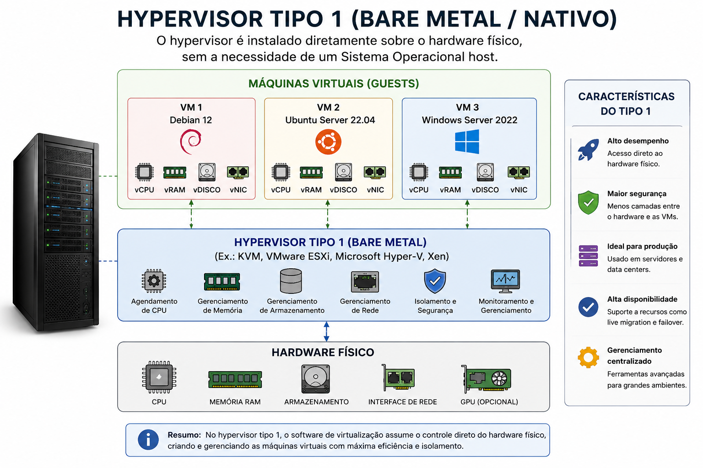

Os hipervisores tipo 1 são altamente eficientes porque acessam diretamente o hardware físico. Esse recurso também aumenta sua segurança, pois não há nada entre eles e a CPU que um invasor possa comprometer. No entanto, um hipervisor tipo 1 geralmente exige uma máquina de gerenciamento separada para administrar diversas VMs e controlar o hardware do host.

#### Hypervisor Tipo 2 (Hospedado)

**Um hypervisor tipo 2** (também conhecido como hipervisor incorporado ou hospedado) não é executado diretamente no hardware subjacente. Em vez disso, é executado como uma aplicação em um SO.

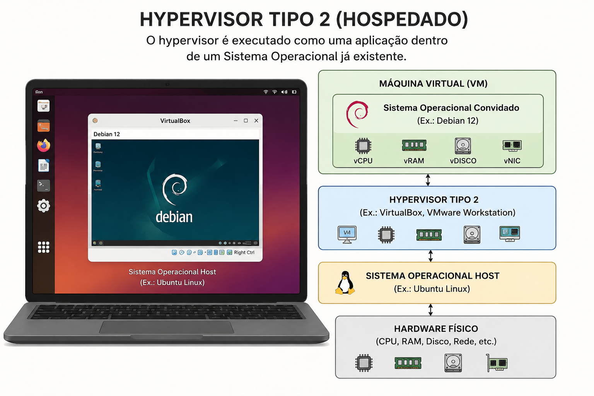

Os hipervisores tipo 2 raramente aparecem em ambientes baseados em servidores. Em vez disso, são adequados para usuários individuais de PCs que precisam executar sistemas operacionais diferentes. Por exemplo, engenheiros, profissionais de segurança que analisam malware e usuários corporativos que precisam acessar aplicações disponíveis somente em outras plataformas de software.

Os hipervisores tipo 2 muitas vezes apresentam toolkits adicionais para os usuários instalarem no SO convidado. Essas ferramentas oferecem conexões aprimoradas entre o convidado e o SO host, normalmente possibilitando que o usuário corte e cole entre os dois ou acesse arquivos e pastas do SO host a partir da máquina virtual convidada.

Um hipervisor tipo 2 possibilita o acesso rápido e fácil a um SO convidado alternativo juntamente com o sistema principal em execução no sistema host. Esse recurso possibilita produtividade para o usuário final. Um consumidor pode utilizá-lo para acessar suas ferramentas de desenvolvimento favoritas baseadas em Linux enquanto utiliza um sistema de ditado de voz disponível somente no Windows, por exemplo.

No entanto, um hipervisor tipo 2, ao acessar recursos de computação, memória e rede por meio do SO host, introduz problemas de latência que podem afetar o desempenho. Ele também introduz possíveis riscos de segurança se um invasor comprometer o SO host, pois ele poderá manipular qualquer SO convidado em execução no hipervisor tipo 2.

### Hipervisores no mercado

Há atualmente muitos hipervisores no mercado. Veja a seguir algumas das principais soluções de propriedade de fornecedores.

- **VMware ESXi:** O VMware ESXi (Elastic Sky X Integrated) é um hipervisor tipo 1 (ou bare metal) dedicado à virtualização de servidores no data center. O ESXi gerencia coleções de virtual machines da VMware.
- **VMware Workstation Pro:** Esse hipervisor é compatível com desktops e notebooks que executam sistemas operacionais Windows e Linux.
- **VMware Fusion Pro.** Também para usuários de desktops e notebooks, esse hipervisor é a oferta da empresa voltada para o MacOS, que permite que os usuários de Mac executem uma grande variedade de sistemas operacionais convidados. O VMware Fusion Pro é gratuito para uso pessoal e pago para uso comercial.

> **Observação:** a VMware descontinuou o Workstation Player, e o VMware Fusion Player, desde o início do VMware Workstation Pro e do Fusion Pro.3

- **Oracle VM VirtualBox:** O VirtualBox é um hipervisor tipo 2 que é executado nos sistemas operacionais Linux, Mac OS e Windows.
- **Parallels Desktop:** O Parallels Desktop é uma tecnologia de hipervisor que permite aos usuários executar sistemas operacionais (como Linux ou Windows) e outros aplicativos em um Mac.
- **Microsoft Hyper-V:** O Hyper-V é o hipervisor da Microsoft projetado para uso em sistemas Windows
- **Citrix Hypervisor:** O Citrix Hypervisor (antigo Xen Server do projeto de código aberto Xen) é um hipervisor comercial tipo 1 compatível com os sistemas operacionais Linux e Windows.
- **Hipervisores de código aberto:** As tecnologias de hipervisor de código aberto oferecem boa relação custo-benefício, opções de personalização e forte suporte da comunidade. Os hipervisores de código aberto mais populares incluem os seguintes.
- **Xen Hypervisor:** Esse hipervisor tipo 1 de código aberto é executado em arquiteturas Intel e ARM. O Xen é compatível com diversos tipos de virtualização, incluindo ambientes com assistência de hardware usando Intel VT e AMD-V. 
- **Linux KVM (virtual machine baseada no kernel):** O KVM é um hipervisor tipo 1 baseado em Linux que pode ser adicionado à maioria dos sistemas operacionais Linux, inclusive Ubuntu, SUSE e Red Hat Enterprise Linux (RHEL).
- **Red Hat OpenShift Virtualization:** O Red Hat OpenShift Virtualization é baseado no KubeVirt, um projeto de código aberto que possibilita executar VMs em uma plataforma de contêineres gerenciada do Kubernetes. O KubeVirt oferece virtualização nativa de contêineres usando uma KVM dentro de um contêiner Kubernetes.

> Cada sistema virtualizado é chamado de máquina virtual (VM) ou hóspede, e comporta-se como um computador real — com BIOS, controladores, disco, interfaces de rede e drivers próprios.

### Máquinas virtuais (VMs)

As máquinas virtuais (VMs) são ambientes virtuais que simulam um computador físico em forma de software. Elas normalmente compreendem vários arquivos contendo a configuração da VM, o armazenamento para o disco rígido virtual e algumas capturas instantâneas da VM que preservam o seu estado em um determinado ponto no tempo.

### Recuperação de Desastres e Alta Disponibilidade

A recuperação de desastres é um dos pontos fortes da virtualização.
Em caso de falha grave no sistema, é possível restaurar rapidamente uma VM a partir de um snapshot ou migrá-la para outro host.

Além disso, como cada VM é totalmente independente, o tempo de inatividade de um servidor não afeta os demais — um fator crítico em ambientes de produção.

Para fechar o entendimento necessário para a LPI, a virtualização pode ser resumida como a tecnologia que permite criar múltiplos recursos computacionais simulados a partir de um único hardware físico. Ela é o pilar que sustenta o Cloud Computing e a infraestrutura moderna.

## KVM — Kernel-based Virtual Machine

O **KVM (Kernel-based Virtual Machine)** ou **máquina virtual baseada em Kernel** é a solução nativa de virtualização completa do Linux, integrada diretamente ao kernel desde a versão `2.6.20`. Ele transforma o Linux em um hipervisor de alto desempenho, capaz de executar múltiplos sistemas operacionais simultaneamente — incluindo Linux, Windows e BSD.

O KVM utiliza o QEMU (Quick Emulator) como mecanismo de emulação de hardware, oferecendo um ambiente flexível e altamente eficiente.

### Principais Recursos do KVM

- **Overcommitting:** permite alocar mais recursos virtuais (CPU/RAM) do que os disponíveis fisicamente, otimizando a utilização do hardware.
- **KSM (Kernel Same-page Merging):** permite que diferentes VMs compartilhem páginas de memória idênticas, reduzindo o consumo de RAM.
- **QEMU Guest Agent:** agente instalado no sistema convidado que permite controle e monitoramento detalhado pela máquina host.
- **Compatibilidade com Hyper-V:** o KVM implementa diversas funções do Hyper-V, otimizando o desempenho de VMs Windows.

### Ferramentas de Gerenciamento: Libvirt e Ecosistema

Uma ferramenta de gerenciamento de virtualização é útil para monitorar as VMs quando várias delas estão sendo executadas. Algumas ferramentas de gerenciamento de VM são executadas na linha de comando, outras oferecem interfaces de usuário gráficas (GUIs), e outras são criadas para gerenciar VMs em grandes ambientes empresariais. Confira algumas soluções comuns de gerenciamento de virtualização para a KVM.

O `libvirt` `virsh` é uma ferramenta de interface de linha de comando (CLI) para gerenciar o hypervisor e as máquinas virtuais convidadas, é a camada de gerenciamento da virtualização no Linux. 

O comando `virsh` pode ser usado em modo somente leitura por usuários sem privilégios ou para administração completa por usuários com acesso `root`. Além disso, `virsh` é a principal interface de gerenciamento para domínios, convidados e pode ser usada para `criar`, `pausar`, `encerrar` domínios, bem como `listar` domínios atuais, além de entrar em um shell de virtualização. Esta ferramenta é instalada como parte do pacote libvirt-client.

Ele fornece uma API unificada e independente de hipervisor, permitindo criar, modificar e controlar VMs de forma segura.

**Principais Ferramentas:**

- **virsh:** ferramenta de linha de comando (CLI) baseada em libvirt. Permite criar, pausar, listar, iniciar e encerrar máquinas virtuais.
- **virt-manager:** ferramenta gráfica leve e intuitiva, ideal para gerenciar VMs localmente, criar novas instâncias e acessar consoles gráficos.
- **Consoles web:** os administradores podem gerenciar VMs usando interfaces baseadas na web. Por exemplo, o Cockpit oferece uma solução para os usuários gerenciarem VMs em uma interface web. O Red Hat Enterprise Linux tem um plug-in de console web voltado à virtualização.
- **KubeVirt:** o  `KubeVirt` é uma solução para gerenciar grandes quantidades de VMs em um ambiente do Kubernetes. Nesse local, as VMs podem ser gerenciadas junto às aplicações em container. O Kubevirt oferece a base para o Red Hat OpenShift® Virtualization.
- **virt-install:** utilitário em linha de comando para provisionar novas VMs de forma interativa ou automatizada, suportando mídias locais e remotas (HTTP, FTP, NFS).

Essas ferramentas permitem o gerenciamento completo do ciclo de vida das máquinas virtuais, incluindo criação, migração, monitoramento de desempenho e controle de recursos.

### KVM vs. VMware

A VMware oferece um conjunto completo de produtos de virtualização, incluindo o ESXi (um hipervisor de tipo 1) e o vSphere. Uma das principais diferenças em relação à VMware reside nos seus modelos de licenciamento. Sendo open source, o KVM não tem custos de licenciamento para o hipervisor em si, ao passo que os produtos da VMware normalmente requerem licenças comerciais.

O ecossistema maduro e o conjunto abrangente de funcionalidades da VMware, incluindo ferramentas de gestão avançadas, podem ser vantajosos para grandes empresas com necessidades de virtualização complexas. Contudo, isso acarreta um custo superior.

O KVM, com o seu conjunto crescente de funcionalidades e um desempenho robusto, é uma alternativa interessante, especialmente para as organizações que procuram uma solução económica e flexível. Frequentemente, a escolha depende do orçamento, das funcionalidades pretendidas e do nível de suporte necessário.

### KVM vs. Hyper-V

O Hyper-V é a plataforma de virtualização da Microsoft, perfeitamente integrada no sistema operativo Windows Server. Tal como o KVM, o Hyper-V é um hipervisor de tipo 1 (executado diretamente sobre o hardware). Uma diferença fundamental reside no ecossistema: o KVM é nativo do Linux, enquanto o Hyper-V é a base do ecossistema Windows. Isto faz do Hyper-V uma escolha natural para as organizações que investem fortemente nas tecnologias da Microsoft.

O KVM, por outro lado, oferece uma maior flexibilidade em termos de sistemas operativos convidados (guests) e beneficia de uma comunidade open source vibrante. Do ponto de vista do desempenho, ambas as plataformas oferecem excelentes resultados, embora os ensaios de referência (benchmarks) específicos possam variar em função da carga de trabalho e do tipo de serviços alojados.

### Escolher a plataforma de virtualização adequada

O custo é invariavelmente um fator determinante, e a natureza open source do KVM torna-o uma opção altamente rentável. Contudo, devem ser avaliadas as funcionalidades específicas exigidas pelo negócio, tais como a migração em direto (live migration), a gestão de armazenamento e a alta disponibilidade (HA).

As métricas de desempenho e o seu alinhamento com os requisitos da carga de trabalho (workload) são fundamentais. Adicionalmente, deve-se ponderar a maturidade do ecossistema, a disponibilidade de recursos de suporte e a dimensão da comunidade. Por fim, a integração na infraestrutura informática existente e a compatibilidade com o conjunto de ferramentas de gestão atuais são aspetos cruciais para garantir a continuidade do negócio.

### Resumo do Cenário de Laboratório

Compreender o conceito de virtualização e o funcionamento do KVM é fundamental para montar um ambiente de laboratório eficiente. O cenário apresentado neste capítulo servirá de base para os próximos, onde serão implementados diversos serviços de rede — tais como DNS, DHCP, HTTP, Firewall, Proxy e Controlador de Domínio — sobre as distribuições Debian 13, Rocky Linux e Ubuntu Server LTS.

A partir deste ponto, cada máquina virtual (VM) criada será configurada como parte de uma infraestrutura de rede simulada, refletindo as práticas reais de administração de servidores corporativos GNU/Linux. Todo este percurso está alinhado com os requisitos da trilha de certificação LPI.

## Preparando o Ambiente

Tudo pronto, vamos instalar o Docker em máquinas virtuais para que o estudo seja  facilitado, para isto utilizaremos o **Vagrant** somado ao **Vir-manager**, você pode utilizar a solução de virtualização que preferir, porém eu indico que você siga exatamente como listado aqui. Pode postar duvidas no comentário, caso você precise de suporte e eu farei o possivel de ajudar.

> Lembre-se de habilitar a virtualização `Intel VT-x` ou `AMD SVM` na UEFI/BIOS.

## Instalando o Vagrant e Virt-manager 

### O que é vagrant

Vagrant é um software de código aberto para criar e manter ambientes de desenvolvimento virtuais portáteis, utilizando VirtualBox, KVM, Hyper-V, Docker containers, VMware, e AWS. Ele tenta simplificar a gerência de configuração de software das virtualizações para aumentar a produtividade do desenvolvimento.

### Para Instalar o vagrant no windows siga os passos:

1. Acesse a página de [Downloads](https://developer.hashicorp.com/vagrant/install) e faça o download da versão correspondente ao seu sistema operacional.


2. Para Windows, clique sob o instalador e avance até o final da instalação.

2.1. Para Linux execute o programa de instalação de pacotes ( `sudo dpkg -i <pacote>.deb` para sistemas debian-like ou `sudo rpm -i <pacote>.rpm`).

### Instalação do vagrant base debian

**Vamos primeiro baixar as chaves:**

- `wget -O - https://apt.releases.hashicorp.com/gpg | sudo gpg --dearmor -o /usr/share/keyrings/hashicorp-archive-keyring.gpg`

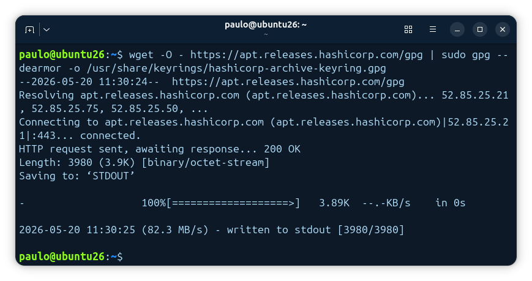

**A seguir vamos adicionar o repositório:**

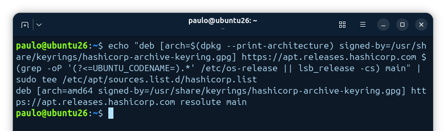

> Para o debian o repositório atual fica assim: 

```bash
echo "deb [arch=$(dpkg --print-architecture) signed-by=/usr/share/keyrings/hashicorp-archive-keyring.gpg] https://apt.releases.hashicorp.com $(grep -oP '(?<=VERSION_CODENAME=).*' /etc/os-release) main" | sudo tee /etc/apt/sources.list.d/hashicorp.list
```

Atualize as listas de repositório para confirmar instalação do repositório vagrant. 

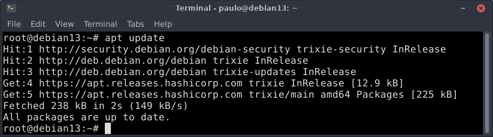

> Na 4ª linha a saida é: 

- `Get:4 https://apt.releases.hashicorp.com resolute/main amd64 Packages [234 kB]`. 

O que significa que o repositório do vagrant já esta instalado no sistema.

**Por ultimo a instalação do vagrant**

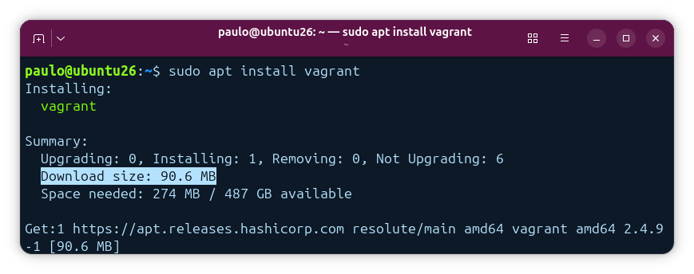

Instale o pacotes `build-essential`, caso não o tenhas no sistema.

O pacote **build-essential** (note que o nome correto é build-essential, sem “s” no final) é um meta-pacote do Debian e do Ubuntu que instala as ferramentas básicas necessárias para compilar programas a partir do código-fonte.

Ele não é um programa em si — ele instala vários pacotes importantes automaticamente.

**Principais ferramentas incluídas**

| **Pacote**  | **Descrição**                          |
| ----------- | -------------------------------------- |
| `gcc`       | Compilador C/C++                       |
| `g++`       | Compilador para C++                    |
| `make`      | Ferramenta para automatizar compilação |
| `libc6-dev` | Headers da biblioteca C                |
| `dpkg-dev`  | Ferramentas para criar pacotes Debian  |

**Instalação**

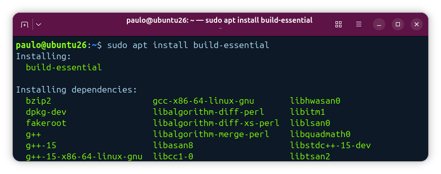

Podemos ver quanto de downloads esse pacote requer.

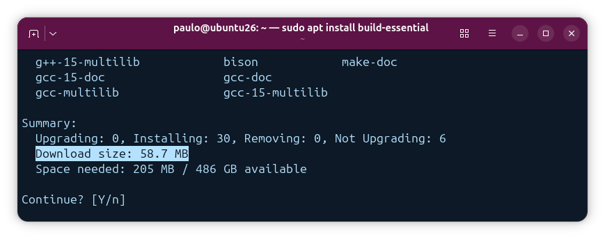

Instalação concluida com sucesso.

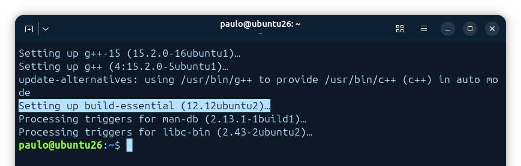

Após a instalação abra um terminal ou um prompt de comando e execute o comando `vagrant --version` para verificar se o pacote foi instalado com sucesso.

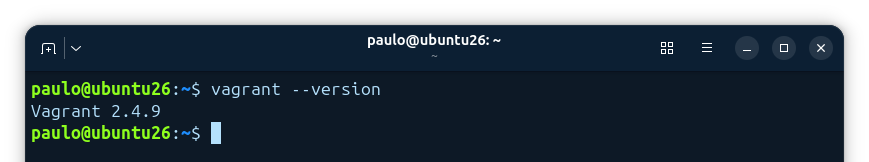

> Para mais detalhes sobre o Vagrant veja o [vídeo](https://www.youtube.com/watch?v=yW-2dFpL2-k).

### O que é virt-manager

A aplicação `virt-manager` é uma interface de utilizador de ambiente de trabalho para gerir máquinas virtuais através da `libvirt`. Destina-se principalmente a máquinas virtuais **KVM**, mas também gere **Xen** e **LXC** (containers Linux). Apresenta uma visão resumida dos domínios em execução, o seu desempenho em tempo real e estatísticas de utilização de recursos. Os assistentes permitem a criação de novos domínios, a configuração e ajuste da alocação de recursos e hardware virtual de um domínio. Um visualizador de cliente VNC e SPICE incorporado apresenta uma consola gráfica completa para o domínio convidado.

Para instalar o **Virt-manager** é muito simples siga os passos:

Para Linux debian-like execute o programa de instalação de pacotes `sudo apt install` ou `sudo yum install` para sistemas Rhel.

### Instalação e Configuração do KVM no Ubuntu GNU/Linux

1. **Verificação de Requisitos do Sistema**

Antes de instalar o KVM (Kernel-based Virtual Machine), é fundamental confirmar se o hardware e o sistema operacional host oferecem suporte à virtualização. A maioria dos processadores modernos da Intel e AMD já possui esse recurso integrado, identificado pelas extensões `VMX (Intel VT-x)` ou `SVM (AMD-V)`.

**Para verificar o suporte, execute:**

`grep -E --color '(vmx|svm)' /proc/cpuinfo`

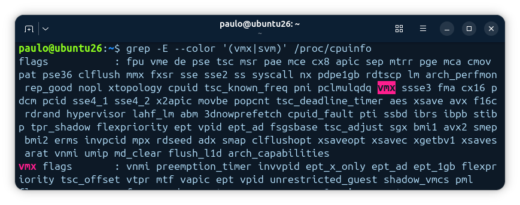

Se o comando retornar a tag `vmx` ou `svm`, significa que a CPU suporta virtualização por hardware — requisito essencial para o KVM.

> **Boa prática:** Certifique-se de que a virtualização também esteja ativada na `BIOS/UEFI` do sistema. Sem essa opção habilitada, o KVM não conseguirá inicializar corretamente, mesmo que o processador ofereça suporte.

**Atualização do Sistema**

Antes de iniciar a instalação, é recomendável atualizar a base de pacotes e garantir que o sistema está com as versões mais recentes dos componentes.

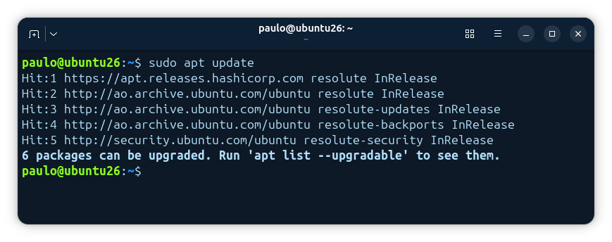

Essa prática previne conflitos de dependência e garante maior estabilidade e segurança ao ambiente.

> **Dica:** Após uma atualização completa, reinicie o sistema (sudo reboot) para garantir que todos os módulos e kernels atualizados sejam carregados.

**Instalação dos Pacotes Necessários**

A instalação do KVM no ubuntu pode ser feita em diferentes níveis. Para este laboratório, faremos uma instalação completa e otimizada, que inclui o hipervisor, ferramentas de gerenciamento, bibliotecas e utilitários de rede.

```bash
:~# sudo apt install qemu-system-x86 libvirt-daemon-system libvirt-clients libvirt-daemon virtinst bridge-utils libosinfo-bin libguestfs-tools virt-manager
```
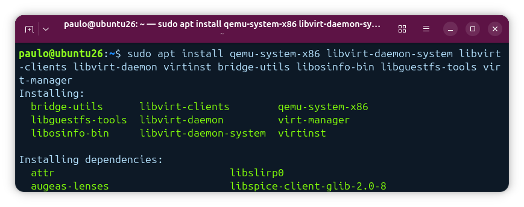

Podemos também ver quanto de download é necessario.

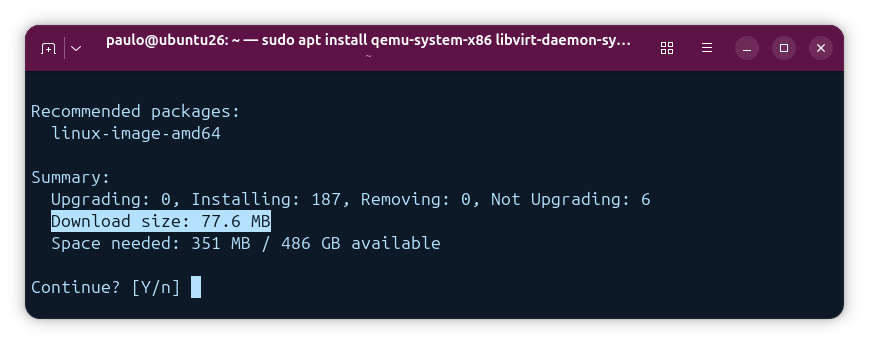

A tabela abaixo mostra a definição de cada pacote.

| Pacote                    | Função                                     | Detalhes técnicos                                                                                                                         |
| ------------------------- | ------------------------------------------ | ----------------------------------------------------------------------------------------------------------------------------------------- |
| **qemu-system-x86 **              | Ativa virtualização KVM                    | Permite que o QEMU use aceleração por hardware (Intel VT-x / AMD-V). Sem ele, as VMs rodam sem aceleração.                                |
| **libvirt-daemon-system** | Serviço principal do libvirt               | Fornece o daemon `libvirtd` e configurações padrão para gerenciar hipervisores como KVM. Necessário para gerir VMs de forma centralizada. |
| **libvirt-clients**       | Ferramentas de linha de comando do libvirt | Inclui comandos como `virsh`, `virt-clone`, `virt-top`. Permite interagir com VMs via terminal.                                           |
| **libvirt-daemon**        | Daemon que implementa libvirt              | Responsável pela comunicação entre o libvirt e o hipervisor KVM/QEMU. Também coordena redes, storage pools e dispositivos.                |
| **virtinst**              | Ferramentas para criação de VMs            | Inclui `virt-install` e `virt-clone`. Permite criar máquinas virtuais via CLI usando parâmetros detalhados.                               |
| **bridge-utils**          | Criação de bridges de rede                 | Pacote que fornece `brctl` para criar bridges, permitindo que VMs tenham acesso direto à rede física.                                     |
| **libosinfo-bin**         | Base de dados de sistemas operacionais     | Inclui `osinfo-query`. Fornece informações de sistemas operativos para criação automatizada de VMs (ex.: nome, drivers, requisitos).      |
| **libguestfs-tools**      | Manipulação de discos de VMs               | Inclui ferramentas como `guestmount`, `virt-edit`, `virt-rescue`. Permite editar discos de VMs sem inicializá-las.                        |
| **virt-manager**          | Interface gráfica para KVM                 | Ferramenta GUI para gerenciar VMs, redes, snapshots, discos, CPU, RAM. Ideal para administração visual.                                   |

Após a conclusão, o sistema estará pronto para o ambiente.

**Verificação da Instalação**

Por padrão, o `virt-manager` solicita autenticação de root ao ser iniciado.

Para garantir que o serviço inicie automaticamente junto ao sistema e evitar ter que inserir a senha sempre, adicione seu usuário aos grupos `libvirt` e `kvm`com os seguintes comandos:

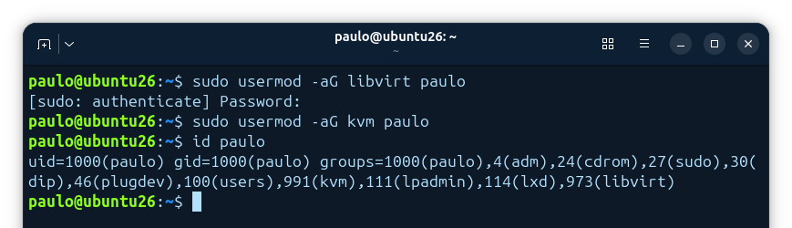

> Com o comando `id`, podemos verificar quais grupos o usuário `paulo` pertence.

Habilita o serviço no boot e inicie com os seguintes comandos: `systemctl enable --now libvirtd`. 

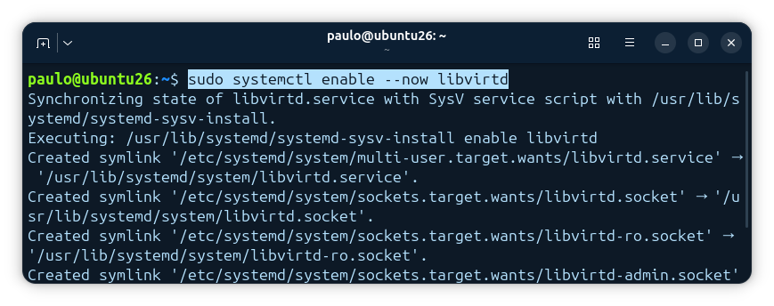

Inicie e verifique se o serviço libvirtd está ativo e rodando o comando: `systemctl start libvirtd` e `systemctl status libvirtd`

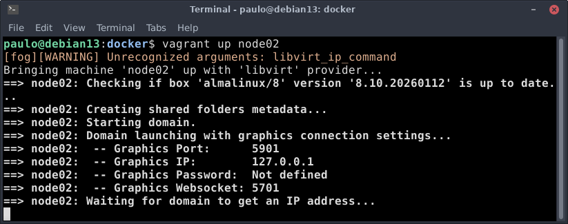

**Instalação de pacotes adicionais.**

- `apt install libvirt-dev nfs-kernel-server`

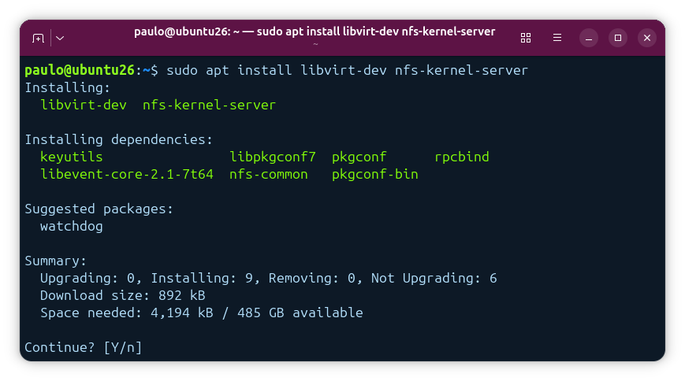

Instale o vagrant plugin: `vagrant plugin install vagrant-libvirt`

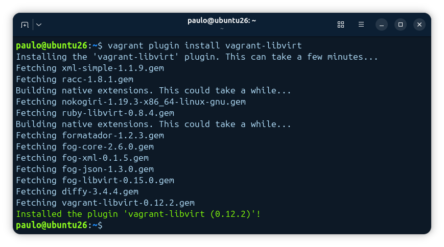

Repare que o pacote foi istalado sem privilegios administrativos.

> **Observação:** Em alguns casos a rede pode estar desativada e receber o erro de: `default network is not active` ao iniciar o virt-manager. Para que isso não aconteça usamos o comando `virsh net-start default`.

Depois, encerre a sessão e faça login novamente para que as permissões sejam aplicadas.

> **Nota de segurança:** Em ambientes de produção, não é recomendado conceder permissões administrativas amplas sem necessidade. Neste material, manteremos o uso do `sudo` para termos privilégios administrativos.

**Interface Gráfica: Virt-Manager**

Após a instalação, o virt-manager pode ser iniciado pelo menu do sistema ou via terminal: `virt-manager`

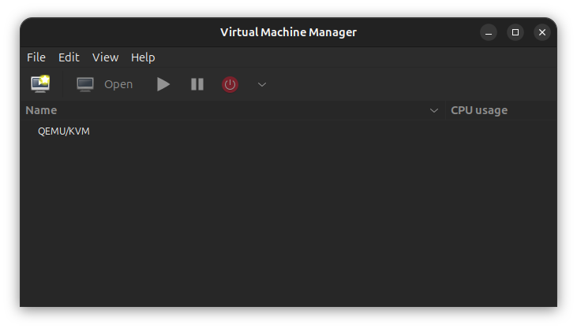

> **Dica profissional:** Utilize a aba **Ajuda → Sobre** para confirmar a versão do virt-manager instalada. Isso ajuda na compatibilidade com futuras atualizações de libvirt e qemu.

[Menu-sobre](../imagens/sobre.png)

## O Ambiente

Após instalar o **Vagrant** e o **Virt-manager**, podemos criar um diretório com toda estrutura do ambiente.

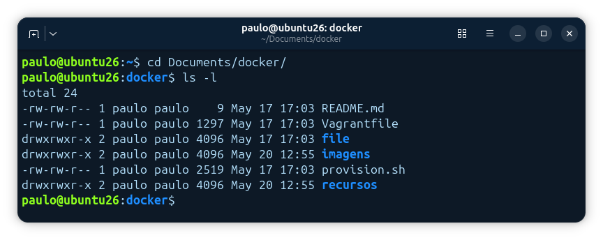

### O que é o Vagrantfile

**A principal função do Vagrantfile é descrever o tipo de máquina necessária para um projeto e como configurar e provisionar essas máquinas**. Os Vagrantfiles são chamados assim porque o nome literal do ficheiro é Vagrantfile (as maiúsculas e minúsculas não importam, a menos que o seu sistema de ficheiros esteja a funcionar num modo estritamente sensível a maiúsculas e minúsculas).

O Vagrant foi concebido para ser executado com um Vagrantfile por projeto, e o Vagrantfile deve ser submetido ao controlo de versão. Isto permite que outros programadores envolvidos no projeto verifiquem o código, executem o `vagrant up` e sigam em frente. Os Vagrantfiles são portáteis em todas as plataformas suportadas pelo Vagrant.

A sintaxe dos Vagrantfiles é **Ruby**, mas não é necessário ter conhecimento da linguagem de programação Ruby para fazer modificações no Vagrantfile, uma vez que se trata principalmente de atribuições de variáveis simples. Na verdade, Ruby nem sequer é a comunidade mais popular em que o Vagrant é utilizado, o que deve ajudar a mostrar que, apesar de não terem conhecimento de Ruby, as pessoas têm muito sucesso com o Vagrant.

**Adicione o conteúdo ao seu arquivo Vagrantfile**

```bash
# -*- mode: ruby -*-
# vi: set ft=ruby :

domain = "docker-lab.example"
network_ip_range = "192.168.200"

machines = {
  "master"   => {"memory" => "2048", "cpu" => "2", "ip" => "10", "image" => "debian/bookworm64"},
  "node01"   => {"memory" => "2048", "cpu" => "2", "ip" => "21", "image" => "debian/bookworm64"},
  "node02"   => {"memory" => "1024", "cpu" => "1", "ip" => "22", "image" => "almalinux/8"},  
  "registry" => {"memory" => "2048", "cpu" => "2", "ip" => "50", "image" => "debian/bookworm64"}
}

Vagrant.configure("2") do |config|
  config.vm.boot_timeout = 600

  config.vm.provider "libvirt" do |libvirt|
    libvirt.uri = "qemu:///system"
  end

  machines.each do |name, conf|
    config.vm.define name do |machine|
      machine.vm.box = conf["image"]
      machine.vm.hostname = "#{name}.#{domain}"

      machine.vm.network "private_network",
        ip: "#{network_ip_range}.#{conf["ip"]}",
        libvirt__network_name: "vagrant-private-net"

      machine.vm.provider "libvirt" do |libvirt|
        libvirt.memory = conf["memory"]
        libvirt.cpus = conf["cpu"]
      end

      # Passando variáveis de ambiente para o script
      machine.vm.provision "shell", 
        path: "provision.sh",
        env: {"REGISTRY_IP" => "#{network_ip_range}.50"}
    end
  end
end
```

> **Nota:** O arquivo `provision.sh` em ambientes Docker, ele é usado para automatizar tarefas de configuração ou instalação dentro de uma imagem ou contêiner.

**O arquivo é mostrado abaixo:**

```bash
#!/bin/bash
set -e

echo "--- Iniciando Provisionamento em $(hostname) ---"

# 1. Configurar /etc/hosts para resolução local
# Mantemos o localhost e adicionamos as máquinas do lab
cat <<EOF > /etc/hosts
127.0.0.1   localhost
192.168.200.10 master.docker-lab.example master
192.168.200.21 node01.docker-lab.example node01
192.168.200.22 node02.docker-lab.example node02
192.168.200.50 registry.docker-lab.example registry
EOF

# 2. Detectar SO e Instalar Docker (COMENTADO)
if [ -f /etc/debian_version ]; then
    OS_TYPE="debian"
elif [ -f /etc/redhat-release ]; then
    OS_TYPE="rhel"
fi

echo "[INFO] Instalação automática do Docker para $OS_TYPE está desativada (bloco comentado)."

: '
if [ "$OS_TYPE" == "debian" ]; then
    echo "Sabor detectado: Debian/Ubuntu"
    apt-get update
    apt-get install -y apt-transport-https ca-certificates curl gnupg lsb-release
    curl -fsSL https://download.docker.com/linux/debian/gpg | gpg --dearmor -o /usr/share/keyrings/docker-archive-keyring.gpg
    echo "deb [arch=$(dpkg --print-architecture) signed-by=/usr/share/keyrings/docker-archive-keyring.gpg] https://download.docker.com/linux/debian $(lsb_release -cs) stable" > /etc/apt/sources.list.d/docker.list
    apt-get update
    apt-get install -y docker-ce docker-ce-cli containerd.io

elif [ "$OS_TYPE" == "rhel" ]; then
    echo "Sabor detectado: RHEL/AlmaLinux"
    yum install -y yum-utils
    yum-config-manager --add-repo https://download.docker.com/linux/centos/docker-ce.repo
    yum install -y docker-ce docker-ce-cli containerd.io
    systemctl enable --now docker
fi
'

# 3. Configurar Insecure Registry
# Nota: Só tentará configurar/reiniciar se o binário do docker existir
if [ -x "$(command -v docker)" ]; then
    echo "[INFO] Configurando Insecure Registry e permissões..."
    mkdir -p /etc/docker
    cat <<EOF > /etc/docker/daemon.json
{
  "insecure-registries": ["192.168.200.50:5000"],
  "exec-opts": ["native.cgroupdriver=systemd"]
}
EOF

    systemctl restart docker
    usermod -aG docker vagrant

    # 4. Se for a máquina Registry, rodar o container de registro
    if [[ "$(hostname)" == *"registry"* ]]; then
        if ! docker ps -a | grep -q "local-registry"; then
            echo "Configurando Container Registry..."
            docker run -d -p 5000:5000 --restart=always --name local-registry registry:2
        fi
    fi
else
    echo "[WARN] Docker não encontrado. Pulando configurações do daemon.json e Registry."
fi

echo "--- Provisionamento concluído! ---"
```

Adicione também as seguintes entradas ao arquivo `hosts` da sua máquina.

```bash
# Docker
192.168.200.10  master.docker.example
192.168.200.21  node01.docker.example
192.168.200.22  node02.docker.example
192.168.200.50  registry.docker.example
```

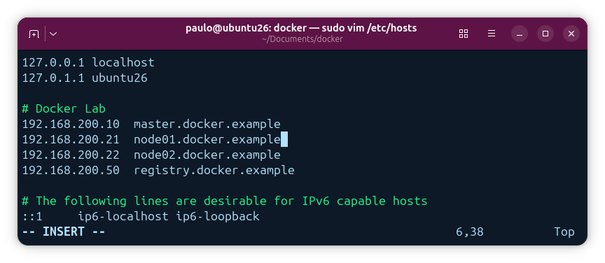

> Em máquinas **Linux** e **MacOS** o arquivo fica localizado em `/etc/hosts`. Em máquinas **Windows** o arquivo fica localizado em `C:\Windows\System32\drivers\etc\hosts`.

### Garantindo as chaves

Para criar as chaves use o seguinte comando: `ssh-keygen -q -t rsa -f key -N ''`

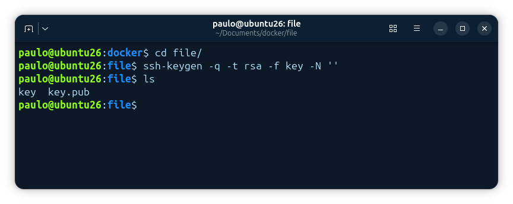

### Adicionando as imagens

As imagens ou box vagrant podem ser encotradas [aqui](https://portal.cloud.hashicorp.com/vagrant/discover)

**Adicionando a imagem do debian12 com o seguinte comando:**

`vagrant box add debian/bookworm64`

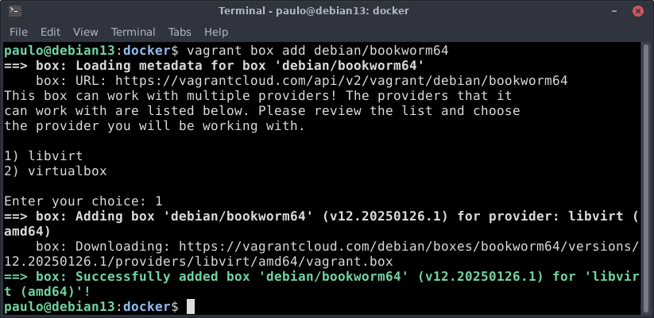

Repare que baixamos a imagem para o nosso privider: `libvirt`.

`==> box: Successfully added box 'debian/bookworm64' (v12.20260519.1) for 'libvirt (amd64)'!`


**Adicionando a imagem do almalinux8**.

`vagrant box add almalinux/8`

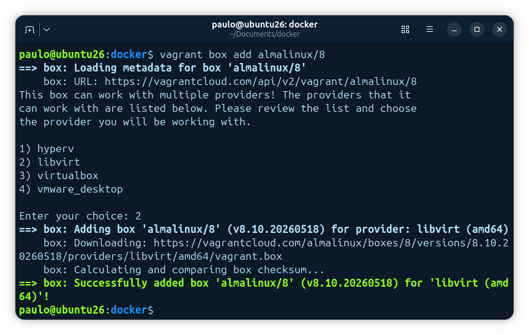

Aqui a escolha foi a opção 2.

```
1) hyperv
2) libvirt
3) virtualbox
4) vmware_desktop

Enter your choice: 2
==> box: Adding box 'almalinux/8' (v8.10.20260518) for provider: libvirt (amd64)
```

Podemos confirmar as imagens dento de `~/.vagrant.d/boxes`.

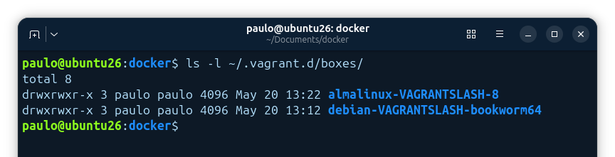

### Subindo o ambiente

Para criar o ambiente do laboratório, execute o comando `vagrant init`, e o `vagrant up` irá criar todas as máquinas virtuais bem como configurar os hostnames e endereços IP's.

Aqui vamos subir as maquinas por etapas. 

Execute o comando `vagrant up node01` e `vagrant up node02` para criar nossa infraestrutura. Vamos subir as maquinas `debian` **(node01)** e `almalinux`, **(node02**) para os nossos exemplos. O comando `vagrant --version` é usado para testar e ver a versão atual no sistema, como já vimos.

Dentro do diretório onde está a infraestrutura execute o comando abaixo:

**Subir Debian**

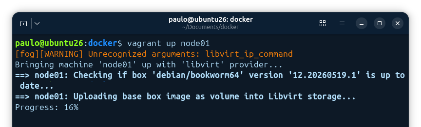

A configuração da maquina começa, se não haver erro ela e concluida com sucesso.

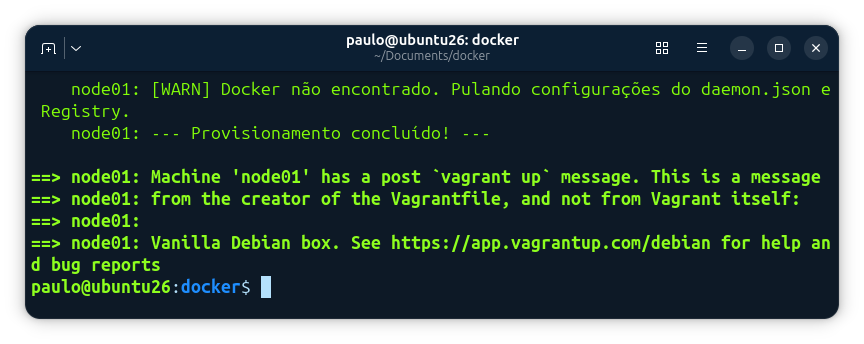

**Subir almalinux**

E o mesmo processo acontece para a maquina **node02** A imagem é processada.

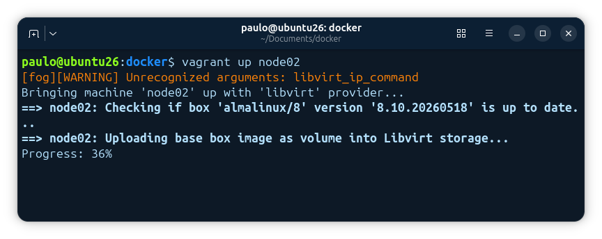

A maquina é configurada 

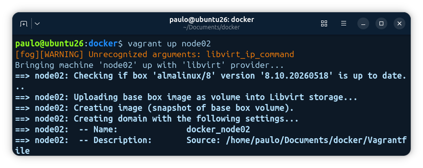

Por fim finalizada.

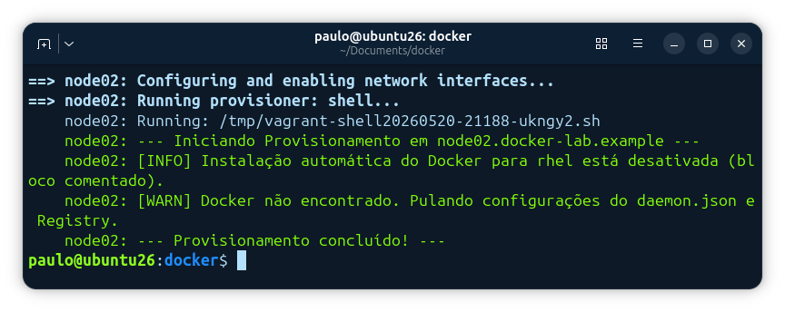

> **Observação:** Temos um alerta ao subir as imagens, `[fog][WARNING] Unrecognized arguments: libvirt_ip_command` o que não é um erro e deixa o laboratório seguir em frente. 

Para deixar o sistema mais limpo, em alguns caso pode nos der recomendados a usar o comando `vagrant provision`.

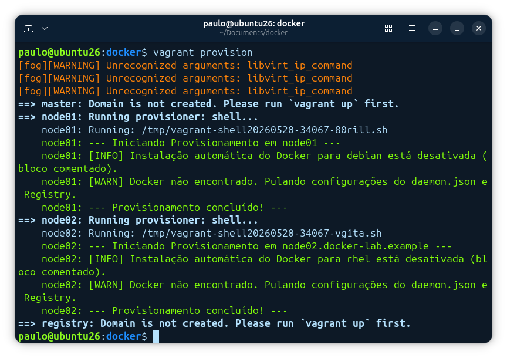

Vamos agora confirmar se as maquinas estão a rodar:

- `vagrant status`.

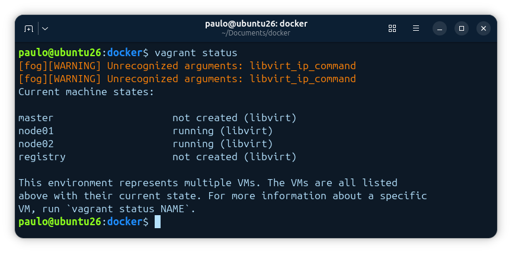

No virt-manager podemos ver também.

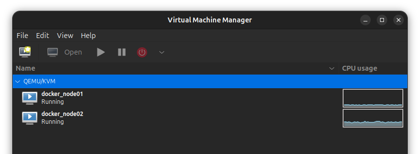

> No debian o Vagrant usa `rsync` para sincronizar arquivos entre sua máquina host e a VM. Instale com o comando: `apt install rsync`

### Acesso direto as maquinas

- **user:** `vagrant`
- **pass:** `vagrant`

Para se conectar as máquinas utilize o comando `vagrant ssh <host>` informando o nome do host a ser conectado, lembre-se de estar dentro da pasta com o Vagrantfile.

**Vamos acessar a maquina node01**

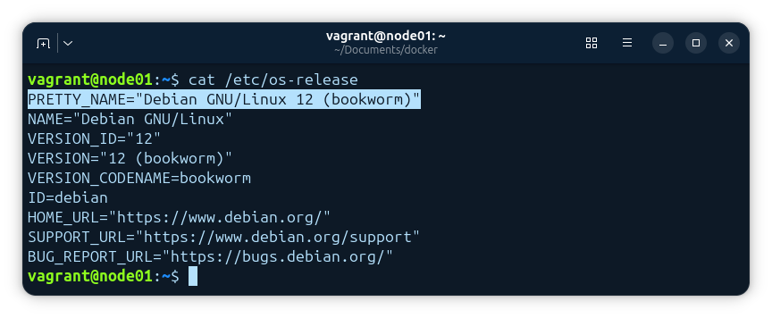

Podemos confirmar o sistema com o comando: `cat /etc/os-release`.

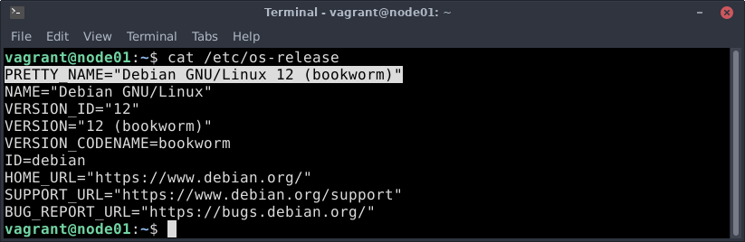

Vamos deixar a lista de repositório atualizada.

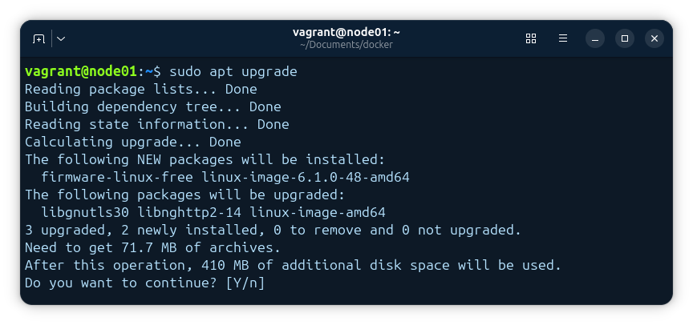

3 pacotes podem ser atualizados, vamos rodar o comando `sudo apt upgrade`.

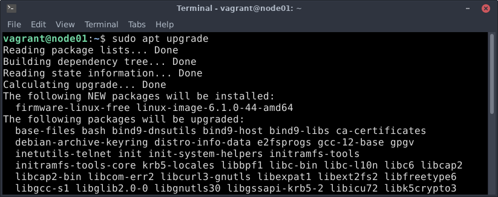

Vamos proceder com a instalação dos pacotes novos.

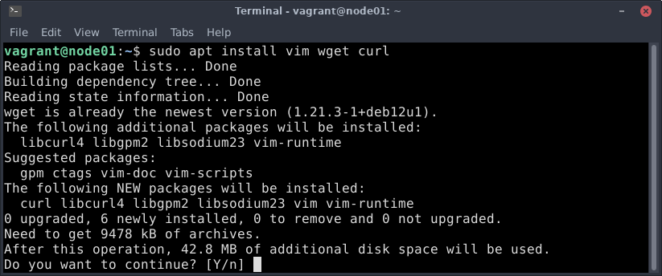

Por fim tudo atualizado.

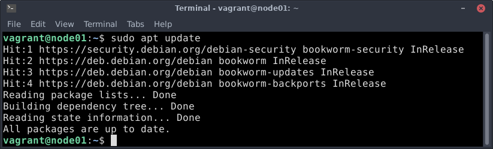

**Vamos acessar a maquina node02**. Vamos também confirmar o sistema com o comando: `cat /etc/os-release`.

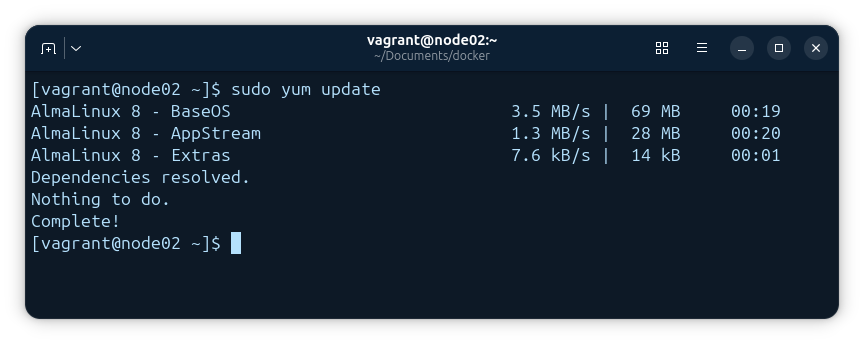

Vamos atualizar o sistema. 


Em distribuições RedHat-like ele atualiza e instala novos pacotes no mesmo comando. Vamos a instalação de pacotes basicos.

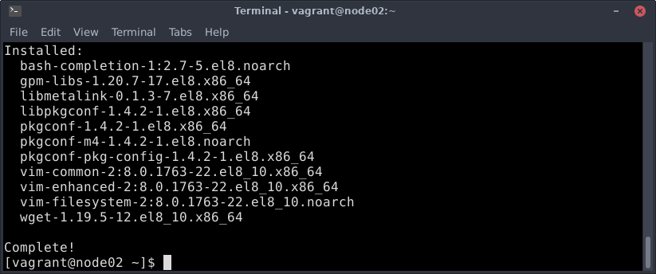

Para desligar as máquinas com segurança execute o comando `vagrant halt`. Para destruir o ambiente execute o comando `vagrant destroy`.

Até Aqui vemos que todo ambiente está em perfeitas condições, e podemos desligar de forma segura com o comando `vagrant halt`.

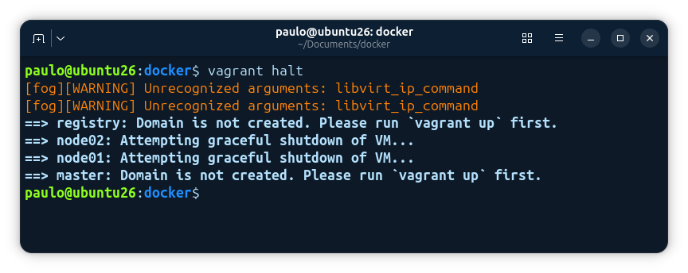

Podemos ver o status.

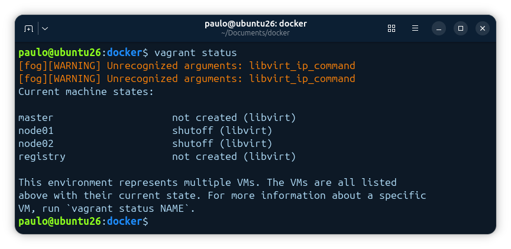

Bem como no virt-manager

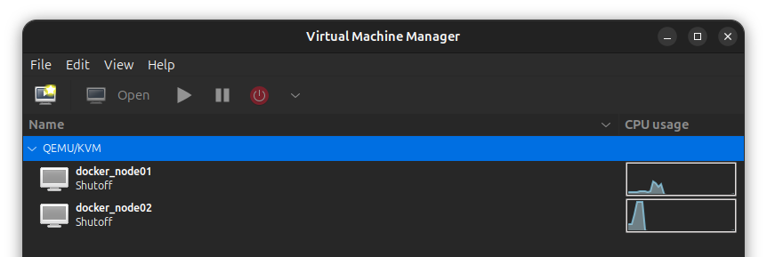

### Principais comandos do vagrant

Antes de prosseguir com as primeiras configurações, o técnico deve estar familiarizado com uma série de comandos `Vagrant` para criar, configurar, provisionar e gerenciar máquinas virtuais, além de interagir com o Docker dentro dessas máquinas. Abaixo estão alguns dos principais comandos `Vagrant` e como eles são usados no contexto de ambientes de laboratório Docker:

| **Comando** | **Descrição** |
|-------------|---------------|
| `vagrant up` | Inicia as máquinas definidas no Vagrantfile. Se for a primeira vez, ele baixa a box e executa o provisionamento. |
| `vagrant status` | Mostra o estado atual das máquinas (rodando, desligada, não criada). |
| `vagrant ssh <nome>` | Dá acesso ao terminal da VM. Ex: `vagrant ssh master`. |
| `vagrant halt` | Desliga a máquina virtual de forma segura (como um shutdown). |
| `vagrant reload` | Reinicia a VM. Essencial se você alterar algo no Vagrantfile (como CPU ou Rede). |
| `vagrant provision` | Reexecuta os scripts de instalação (provision.sh) sem precisar reiniciar a máquina. |
| `vagrant suspend` | "Pausa" a VM, salvando o estado atual na memória RAM (útil para economizar CPU sem desligar). |
| `vagrant resume` | Retoma a máquina que foi pausada pelo comando anterior. |
| `vagrant destroy` | Deleta tudo. Apaga os discos e remove a VM do KVM (não apaga o seu Vagrantfile). |
| `vagrant box list` | Lista as imagens (boxes) que já estão baixadas no seu computador. |

> Caso você queira saber mais sobre Vagrant veja o post no blog onde `Caio Delgado` ensina como utilizar o Vagrant para subir os laboratórios de estudo, para acessar basta clicar[aqui](https://caiodelgado.dev/vagrant-101)

