## Inslação e comandos do Docker 

## O que é o Docker

**Docker** é uma plataforma Open Source escrita em **Go (Linguagem de programação em alta performance desenvolvida pela Google)** que ajuda na criação e a administração de ambientes isolados. Isso permite que as aplicações partilhem o kernel do SO anfitrião em vez de executarem um SO convidado. Este design torna os **containers Docker** leves, rápidos e portáteis, mantendo-os isolados uns dos outros

Com a utilização do Docker podemos gerenciar toda a infraestutura de uma aplicação, bem como garantir que ambientes de desenvolvimento, homologação e produção contenham os mesmos componentes e versões de aplicações, a fim de minimizar impactos no processo de desenvolvimento e entrega de software.

O Docker trabalha com uma virtualização a nível do sistema operacional, onde o mesmo utiliza de recursos como o kernel do sistema hospedeiro para executar seus containers. Diferente do modelo tradicional de Máquinas Virtuais, o Docker não necessita da instalação de um sistema operacional por completo, e sim apenas dos arquivos necessários para a aplicação ser executada. 

**Então o docker já trás as seguintes vantagens:**

- Escrito na linguagem de programação Go.
- Suporta instalações Windows, macOS e Linux (o Docker Engine é executado nativamente no Linux).
- Resolve o problema _“funciona na minha máquina”_, garantindo que o código seja executado de forma idêntica em todos os ambientes.
- Ao contrário do VMware (virtualização no nível do hardware), o Docker opera no nível do sistema operacional.

Embora o Docker e as máquinas virtuais tenham um propósito semelhante, seu desempenho, portabilidade e suporte a sistemas operacionais diferem significativamente.

**A principal diferença é que os containers do Docker compartilham o sistema operacional do host, enquanto as máquinas virtuais também têm um sistema operacional convidado sendo executado no sistema host, (virtual box,vmware, etc...)**. Esse método de operação afeta o desempenho, as necessidades de hardware e o suporte do SO. Confira a tabela abaixo para uma comparação detalhada.

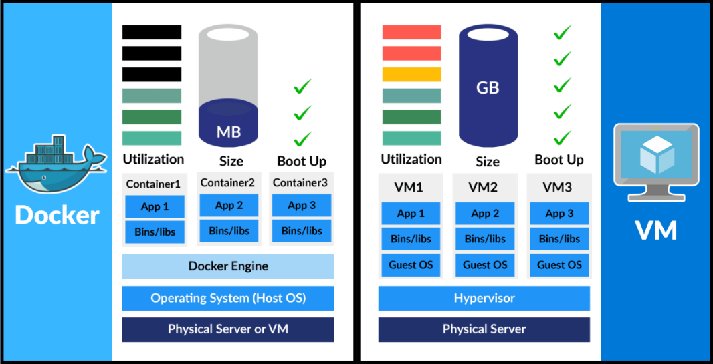

- **Máquinas Virtuais (VMs):** Cada VM inclui a aplicação, as bibliotecas necessárias e um sistema operacional convidado (Guest OS) inteiro, rodando em cima de um Hypervisor. Isso consome muita memória, espaço em disco e demora para iniciar.
- **Contêineres (Docker):** Os contêineres compartilham o mesmo kernel do sistema operacional hospedeiro (Host OS). Eles são isolados, mas não precisam de um SO próprio. Por isso, iniciam em milissegundos e ocupam uma fração do espaço de uma VM.

### Por que usar Docker?

**Antes do Docker:**

A implantação de aplicativos entre ambientes era muitas vezes difícil, dependências, configurações e variações de sistema operacional causavam dores de cabeça do tipo **“funciona aqui, mas não lá”**.

Em 2013, Docker introduziu o que se tornou o padrão da indústria para containers, trouxe uma maneira simples, rápida e eficiente de executar aplicações sem a complexidade de uma máquina virtual.

Docker garante um ecossistema completo, fazendo com que o desenvolvedor possa trabalhar sem se preocupar, por exemplo, com a abertura de tickets para uma equipe de infraestrutura provisionar um ambiente por completo, atrasando o trabalho de entrega de software.

Existem diversas engines e runtimes de containers e até é possível utilizar containers sem Docker, mas atualmente o Docker é a engine/runtime de container mais utilizada no mercado, o que torna o conhecimento do mesmo um **"Must have"** e dificilmente encontraremos vagas na área de tecnologia que não pedem um conhecimento, mesmo que básico, de containers ou Docker. **Viu a expressão container?**. Vamos ver mais adiante.

### Componentes do Docker

A seguir estão alguns dos principais componentes do Docker:

- **Docker Engine:** O Docker Engine tem um daemon docker como parte central, que lida com a criação e o gerenciamento de contêineres.
- **Imagem do Docker:** A imagem Docker é um modelo só de leitura que é utilizado para criar conatainers, contendo o código da aplicação e as dependências.
- **Docker Hub:** É um repositório baseado na nuvem que é utilizado para encontrar e partilhar as imagens de containers.
- **Dockerfile:** É um ficheiro que descreve os passos para criar uma imagem rapidamente.
- **Docker Registry:** É um sistema de distribuição de armazenamento para imagens Docker, onde é possível armazenar as imagens nos modos público e privado.

### Docker Engine

O Docker Engine é o componente principal que permite que o Docker execute containeres em um sistema. Segue uma arquitetura cliente-servidor e é responsável pela criação, execução e gestão de contentores Docker.

- O **Docker Engine Daemon (dockerd)** é executado em segundo plano, ouvindo pedidos de API e gerindo objectos como imagens, containers, redes e volumes.
- O **Cliente Docker (docker CLI)** se comunica com o daemon usando uma API REST. Fornece o ambiente de execução onde as imagens Docker são instanciadas em containers activos.

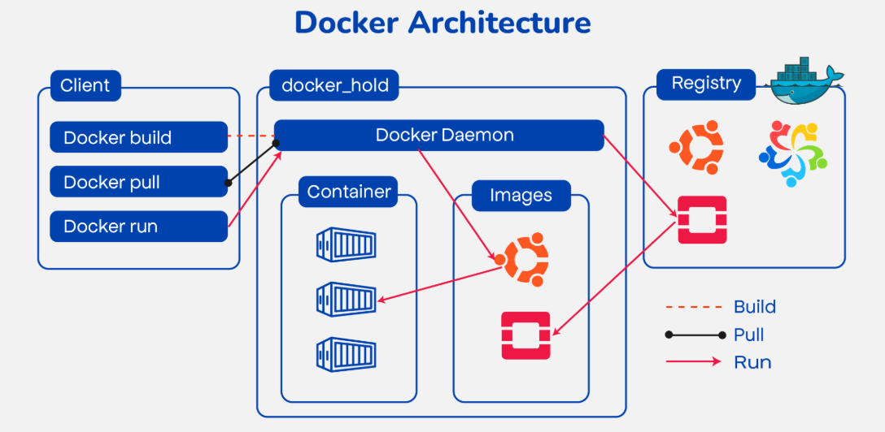

Sem o motor Docker, as imagens Docker não podem ser construídas ou os containers executados.

- O **Cliente** envia comandos Docker (docker build, docker run, etc.).
- O **Daemon** recebe estes comandos e executa operações de container. 

> O daemon do Docker, muitas vezes referido simplesmente como "Docker", é um serviço em segundo plano que gere os contentores Docker num sistema

- A **API REST** é a interface que permite esta comunicação.

Em suma, o Docker Engine é o tempo de execução que torna a contentorização possível, ligando o cliente Docker ao daemon para construir e gerir containers de forma eficiente.

### Dockerfile

O Dockerfile usa DSL (Domain Specific Language) e contém instruções para gerar uma imagem Docker. O Dockerfile definirá os processos para produzir rapidamente uma imagem. Ao criar a sua aplicação, deve criar um Dockerfile por ordem, uma vez que o daemon do Docker executa todas as instruções de cima para baixo.

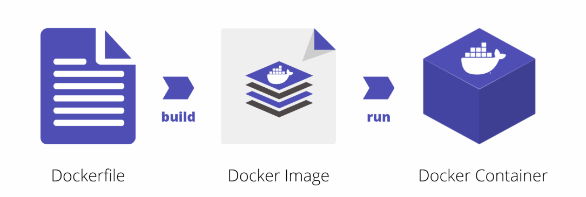

O Dockerfile é o código-fonte da imagem. É um documento de texto que contém os comandos necessários que, ao serem executados, ajudam a montar uma imagem Docker. A imagem Docker é criada usando um Dockerfile.

### Imagem Docker

Uma imagem Docker é um ficheiro composto por várias camadas que contém as instruções para construir e executar um contentor Docker. Funciona como um pacote executável que inclui tudo o que é necessário para executar uma aplicação - código, tempo de execução, bibliotecas, variáveis de ambiente e configurações.


### Como funciona:

- A imagem define como um containers deve ser criado.
- Especifica quais componentes de software serão executados e como eles são configurados.
- Uma vez que uma imagem é executada, ela se torna um Docker Container.

**Relação com Containers:**

1. Imagem do Docker → Blueprint (estático, somente leitura).
2. Docker Container → Instância de execução dessa imagem (dinâmica, executável)

### Arquitetura e funcionamento do Docker

O Docker utiliza uma arquitetura cliente-servidor. O cliente Docker 
fala com o daemon Docker que ajuda a construir, executar e distribuir 
os contentores Docker. O cliente Docker é executado com o daemon no 
mesmo sistema ou podemos conectar o cliente Docker com o daemon Docker 
remotamente. Com a ajuda da API REST através de um socket UNIX ou de 
uma rede, o cliente Docker e o daemon interagem entre si. Para saber 
mais sobre o funcionamento do Docker, consulte arquitetura do docker.

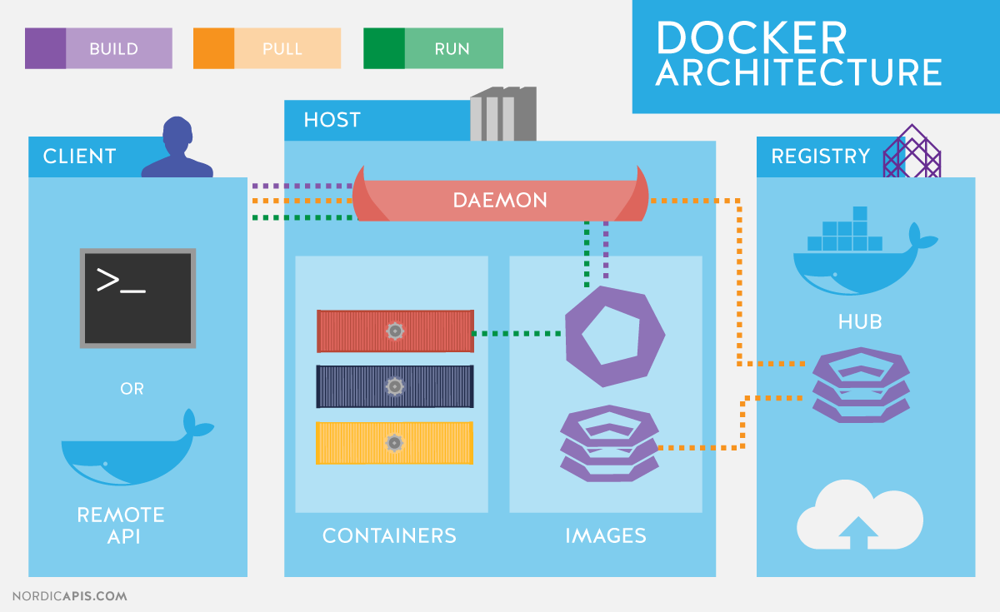

- **CLI do Docker**: Interface de linha de comandos para interagir com o Docker. Comandos comuns: docker run, docker build, docker pull
- **API Rest do Docker**: API HTTP utilizada pela CLI e outras ferramentas. Facilita a comunicação com o daemon do Docker
- **Daemon do Docker**: Trata de imagens, contentores, redes e volume. Serviço principal que gere objectos do Docker
- **Tempo de execução de alto nível**: Gere as operações do ciclo de vida dos containers. As tarefas incluem criar, iniciar, parar e eliminar containers.

## O que é um container

Um container é um ambiente completo que empacota uma aplicação e todas as suas dependências (bibliotecas, binários e arquivos de configuração) em um único pacote. Ao containerizar uma aplicação, as diferenças entre distribuições de sistemas operacionais e as camadas inferiores de infraestrutura são completamente abstraídas.

Todas as configurações e instruções para iniciar ou parar um container são ditadas por uma imagem Docker. Sempre que um usuário executa uma imagem, um novo container é gerado.

O gerenciamento desses ambientes é feito de forma simples através da API do Docker ou da sua Interface de Linha de Comando (CLI). Além disso, caso seja necessário coordenar múltiplos containers interdependentes, os usuários podem controlá-los utilizando o Docker Compose (Ferramenta de composição).

> **Analogia:** Imagine que o container Docker funciona exatamente como um contêiner de carga real em um navio cargueiro (o servidor). Todos os contêineres estão organizados lado a lado, compartilhando o mesmo navio, mas o conteúdo e o ecossistema de um não interferem nos outros.

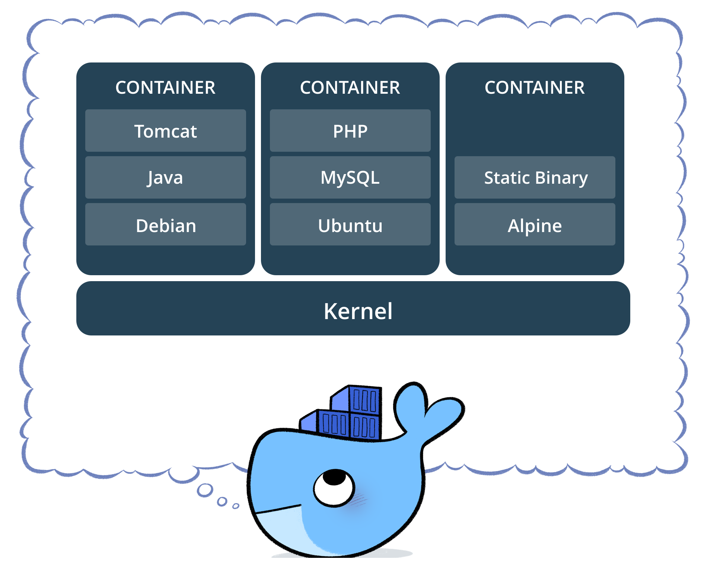

Em suma, podemos dizer que o container é a unidade mínima computacional do Docker — ou seja, o menor recurso isolado que a plataforma pode fornecer.

### Docker Container

Um Contentor Docker é a instância viva, leve e executável de uma imagem Docker. Ele isola o código da aplicação juntamente com as suas dependências para garantir que a aplicação seja executada de forma rápida e consistente em qualquer ambiente — seja no computador pessoal dum programador, em servidores de testes ou em ambientes de produção na nuvem.

Tecnicamente, o contentor é executado como um processo isolado na máquina hospedeira (host), mas partilhando o mesmo kernel do sistema operativo nativo. Isto permite que dezenas de contentores corram simultaneamente no mesmo sistema sem gerar overhead ou interferências mútuas.

> Suponha que tem uma imagem que combine o sistema básico do Ubuntu com o servidor web NGINX. Ao executar esta imagem com o comando docker run, o Docker criará um contentor isolado onde o NGINX passará a correr imediatamente sobre essa base do Ubuntu.

**Relação Fundamental:**

- Imagem Docker: É o Blueprint / Receita (estática, imutável e de apenas leitura).
- Docker Container: É a instância viva desse blueprint (dinâmica, isolada e executável).

### Distinção Histórica

A tecnologia de contêineres não foi inventada pela Docker. Ela já existia no ecossistema Linux muito antes (desde o início dos anos 2000).

Um contêiner é apenas um isolamento lógico de processos dentro do sistema operacional. O Linux atinge esse isolamento combinando dois recursos nativos do seu Kernel:

- Namespaces: Isolam o que o processo pode enxergar (rede, usuários, discos, outros processos).
- Cgroups (Control Groups): Limitam o quanto o processo pode gastar de hardware (limite de CPU, memória, IO de disco).

Tecnologias antigas como LXC (Linux Containers), OpenVZ e Solaris Zones já criavam contêineres muito antes da Docker nascer. O problema é que criar e configurar isso manualmente era extremamente complexo e exigia conhecimentos profundos do Kernel Linux.

O **Docker nasceu em 2013** e revolucionou o mercado porque ele pegou essa tecnologia complexa de contêineres (inicialmente usando o próprio LXC por baixo dos panos) e envelopou tudo em uma ferramenta amigável, padronizada e absurdamente fácil de usar.

Um Docker Container é um contêiner que segue o padrão de ecossistema criado pela Docker, trazendo recursos adicionais como:

- Formato de Imagem Padronizado: A capacidade de empacotar o contêiner em camadas e compartilhá-lo facilmente (via Docker Hub).
- Ferramenta de Linha de Comando (CLI): Onde um comando simples como docker run faz o trabalho pesado de configurar redes, isolamento e discos em milissegundos.
- Portabilidade Absoluta: O contêiner Docker roda exatamente igual no seu computador local, no Play with Docker (PWD), ou em uma nuvem como a AWS.

Hoje, o Docker cria contêineres seguindo as especificações da OCI. Isso significa que um contêiner gerado pelo Docker pode ser executado por outras ferramentas concorrentes (como o Podman, que você viu que vem nativo no AlmaLinux, ou o Kubernetes), porque no fim do dia, todos eles geram e gerenciam a mesma coisa: um contêiner Linux padronizado.

### O que é o Docker Hub?

O Docker Hub é um serviço de registo e repositório baseado na nuvem. Funciona como uma biblioteca centralizada onde programadores e engenheiros DevOps podem publicar (Push) as suas próprias imagens de contentores ou descarregar (Pull) imagens criadas por outras pessoas e empresas, a qualquer momento e de qualquer lugar através da internet.

De forma geral, ele facilita drasticamente a descoberta, o armazenamento e a reutilização de componentes. Entre as suas principais funcionalidades, destaca-se a opção de armazenar as suas imagens em repositórios públicos (visíveis para toda a comunidade) ou privados (restritos à sua equipa ou empresa).

O Docker Hub é uma peça fundamental na cultura DevOps. Embora a plataforma Docker em si seja de código aberto e gratuita, o Hub opera como um serviço SaaS (Software como Serviço) com planos gratuitos e empresariais, sendo compatível com qualquer sistema operativo.

Podemos encará-lo como o "GitHub das imagens Docker": um grande ecossistema onde armazenamos os nossos blueprints de infraestrutura para os extrair apenas quando necessário. Para interagir com ele através do terminal, precisamos de dominar alguns comandos essenciais.

### Comandos Docker

Através da introdução dos comandos essenciais, o Docker tornou-se um software poderoso na racionalização do processo de gestão de containers. Ele ajuda a garantir um desenvolvimento contínuo e fluxos de trabalho de deploy eficientes.

A seguir, encontram-se alguns dos comandos do Docker que são utilizados mais comummente:

| Comando Clássico | Formato Atual (Recomendado) | Descrição                                                                                                       |
| ---------------- | --------------------------- | --------------------------------------------------------------------------------------------------------------- |
| `docker run`     | `docker container run`      | Usado para iniciar contentores a partir de imagens, especificando opções de execução e comandos.                |
| `docker pull`    | `docker image pull`         | Transfere (download) imagens de contentores de um registo (como o Docker Hub) para a máquina local.             |
| `docker ps`      | `docker container ps`       | Exibe os contentores em execução com informações importantes como ID, imagem e estado (*status*).               |
| `docker stop`    | `docker container stop`     | Encerra contentores em execução, desligando os processos de forma controlada.                                   |
| `docker start`   | `docker container start`    | Inicia ou reinicia contentores parados, retomando as suas operações.                                            |
| `docker login`   | `docker login`              | Permite a autenticação num registo Docker, possibilitando o acesso a repositórios privados.                     |
| `docker restart` | `docker container restart`  | Reinicia um contentor em execução, útil para aplicar novas configurações ou atualizações.                       |
| `docker rm`      | `docker container rm`       | Remove contentores parados do sistema, libertando espaço em disco.                                              |
| `docker rmi`     | `docker image rm`           | Remove imagens Docker locais que já não estão a ser utilizadas.                                                 |
| `docker images`  | `docker image ls`           | Lista todas as imagens Docker disponíveis localmente, mostrando o tamanho e as *tags*.                          |
| `docker exec`    | `docker container exec`     | Executa um comando dentro de um contentor em execução. Ex.: `docker exec -it <contentor> sh`.                   |
| `docker logs`    | `docker container logs`     | Exibe os registos (*logs*) de saída de um contentor, sendo essencial para diagnóstico e resolução de problemas. |

> Veremos em mais detalhe cada um destes comandos nas secções seguintes.

### Docker Engine

O software que aloja e executa os contentores chama-se Docker Engine. Trata-se de uma aplicação baseada na arquitetura cliente-servidor. O motor do Docker é composto por três componentes principais:

- **Servidor (Docker Daemon - dockerd):** É o coração do sistema. Funciona como um processo de fundo (daemon) e é o responsável direto pela criação, execução e gestão de todos os objetos do Docker, tais como imagens, contentores, redes e volumes.
- **API REST:** É a camada de comunicação intermediária. Especifica a forma como outras aplicações podem interagir com o servidor, definindo um conjunto de interfaces padronizadas para lhe dar instruções sobre o que fazer.
- **Cliente (Docker CLI):** É a interface de linha de comando com a qual nós, utilizadores, interagimos diretamente no terminal. Quando executa um comando como docker run, o cliente transforma essa instrução numa chamada de API REST e envia-a para o Servidor (daemon) processar.

> **Sabia que?** Como o cliente e o servidor comunicam através de uma API REST, eles não precisam de estar na mesma máquina! É perfeitamente possível instalar o Cliente (CLI) no seu portátil (Windows ou macOS) e configurá-lo para controlar um Servidor (Docker Daemon) que esteja a correr num servidor Linux remoto na nuvem.

### Versões

O ecossistema Docker divide-se fundamentalmente em duas variantes principais: a versão da comunidade (Community Edition) e a versão empresarial (Enterprise Edition).

- **Community Edition (CE):** Gratuita e de código aberto (open-source), é a versão ideal para utilizadores individuais, equipas de desenvolvimento e contribuidores de projetos comunitários.
- **Enterprise Edition (EE):** Versão comercial (atualmente mantida e distribuída pela **Mirantis**), focada em ambientes corporativos que exigem segurança avançada, componentes certificados e suporte técnico especializado.

A maioria dos sistemas baseados em Docker utiliza a versão Community Edition. O licenciamento anual da versão empresarial pode ter um custo elevado por nó, o que leva muitas organizações a optarem pela versão comunitária para a sua infraestrutura.

> **Foco na Certificação DCA:** Para efeitos do exame de certificação **Docker Certified Associate (Docker DCA)**, assume-se a boa prática clássica de que a versão **Community** deve ser utilizada apenas em ambientes de desenvolvimento. Para ambientes de produção crítica, a recomendação oficial do exame aponta para a utilização da versão **Enterprise**.

A `Docker Inc.` vendeu a sua divisão Enterprise (incluindo o UCP e o DTR) à empresa Mirantis há alguns anos. Atualmente, o Docker EE foi rebatizado como Mirantis Kubernetes Engine (MKE) e Mirantis Secure Registry (MSR), e a própria certificação DCA passou a ser gerida pela Mirantis. No ecossistema oficial da Docker Inc., a versão focada em empresas agora chama-se Docker Business (gerida através do Docker Desktop).

A versão Enterprise conta com ferramentas de gestão centralizada como o **UCP (Universal Control Plane)** e o **DTR (Docker Trusted Registry)**, além de suporte técnico dedicado, bem como suporte da Docker Inc.

| Perfil do Nó             | Papel no Cluster                                           | Recomendação Mínima                                                               | Recomendação Ideal (Produção)                                                               |
| ------------------------ | ---------------------------------------------------------- | --------------------------------------------------------------------------------- | ------------------------------------------------------------------------------------------- |
| **Manager (Gestor)**     | Controlo e orquestração do cluster Docker Swarm.           | **8 GB RAM**, **2 vCPUs** e **10 GB** em `/var` (com pelo menos **6 GB livres**). | **16 GB RAM**, **4 vCPUs** e entre **25 GB e 100 GB** livres em disco.                      |
| **Worker (Trabalhador)** | Execução de contentores e cargas de trabalho da aplicação. | **4 GB RAM** e **500 MB livres** em `/var`.                                       | Recursos escaláveis de acordo com a carga de trabalho e o número de contentores executados. |

### Vantagens do Docker

- **Portabilidade:** É o maior trunfo do Docker. Permite que os utilizadores empacotem uma aplicação complexa numa máquina e tenham a certeza absoluta de que ela irá correr exatamente da mesma forma em qualquer outro servidor, sem necessidade de intervenção ou configurações adicionais.
- **Automação:** Através de ferramentas de agendamento (como cron jobs) e da previsibilidade dos containers, torna-se extremamente simples automatizar rotinas de teste e fluxos de trabalho, poupando tempo e evitando tarefas repetitivas.
- **Comunidade Ativa:** O Docker possui um ecossistema gigante, com fóruns de discussão robustos e forte presença em plataformas de programadores como o [StackOverflow](https://stackoverflow.com/questions). Além disso, o [Docker Hub](https://hub.docker.com/) aloja atualmente milhões de imagens prontas a usar.

### Desvantagens do Docker

- **Desempenho (Overhead de Rede/Disco):** Embora a execução de uma aplicação num container seja drasticamente mais rápida e leve do que numa Máquina Virtual (VM), ainda pode existir uma perda marginal de desempenho em operações intensivas de rede ou disco quando comparada com a execução nativa diretamente no servidor físico (bare-metal).
- **Curva de Aprendizagem e Interface:** O Docker foi desenhado para correr aplicações de linha de comandos e serviços de fundo, não sendo a ferramenta ideal para aplicações que exijam uma interface gráfica (GUI). Isto exige que os utilizadores dominem o terminal. Adicionalmente, o ecossistema evolui rapidamente e a introdução da orquestração de larga escala acrescenta uma nova camada de complexidade.
- **Segurança (Partilha de Kernel):** Como os contentores partilham o mesmo kernel do sistema operativo hospedeiro (host), uma falha grave de segurança ou um código malicioso que consiga explorar uma vulnerabilidade do kernel poderá, em teoria, romper o isolamento e afetar a máquina física e os restantes containers.

### Instalação zsh

Para esse capitulo vamos deixar o sistema com um ar mais [devop](https://azure.microsoft.com/pt-br/resources/cloud-computing-dictionary/what-is-devops). 

Vamos instalar o pacotes: `zsh`.

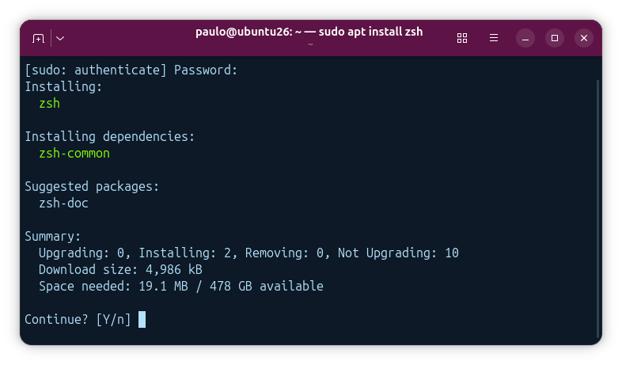

**Clonamos o repositório zsh.**

- `sh -c "$(curl -fsSL https://raw.githubusercontent.com/ohmyzsh/ohmyzsh/master/tools/install.sh)"` E 

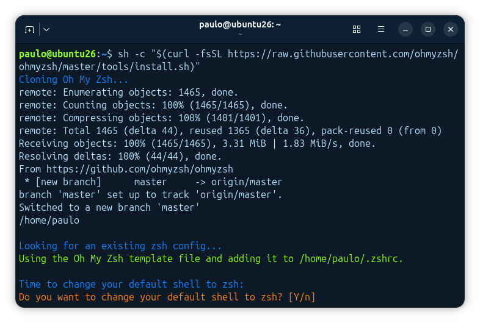

**Aceitamos as mudanças no terminal**

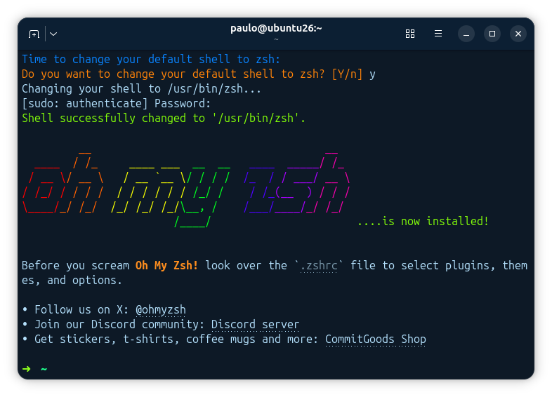

**Editamos o arquivo** `.zshrc`, **e mudamod o tema para** `agnoster`.

[zsh](imagens/zsh3.png)

**Instalamos as fontes para o tema.**

- `sudo apt install fonts-powerline`

[zsh](imagens/dev4.png)

> Apos fazer logout, as mudanças entram em vigor.

[zsh](imagens/zsh5.png)

**Configure seu git com os comandos abaixo:**

```bash
paulo@debian13:~$ git config --global user.name "teu-nome-aqui"
paulo@debian13:~$ git config --global user.email "teu-email-aqui"
paulo@debian13:~$ git config --global core.editor "vim"
paulo@debian13:~$ git config --global init.defaultBranch main
```
Vamos continuar...

**Existem duas maneiras de instalar o Docker**

**1ª Opção: Script de Conveniência**

Este método é ideal para ambientes de estudo, laboratórios e testes rápidos, mas não é recomendado para ambientes de produção. Este script automatizado instala o Docker com todas as configurações padrão do sistema.

Pode descarregar o script diretamente ou analisar o seu conteúdo acedendo ao endereço [aqui](https://get.docker.com/).

**Para utilizá-lo, o fluxo de comandos é o seguinte:**

- Descarrega o script de conveniência: `curl -fsSL https://get.docker.com -o get-docker.sh`

- Executa o script com privilégios de root: `sudo sh get-docker.sh`


2ª Opção: Repositório Manual (Método Tradicional)

Este é o método oficial, recomendado para ambientes corporativos e o único método cobrado explicitamente nos exames de certificação (como o Docker DCA). Consiste em adicionar manualmente as chaves GPG e o repositório oficial da distribuição ao gestor de pacotes (apt ou dnf).

Para fins de demonstração prática no nosso ambiente, iremos distribuir os métodos de instalação da seguinte forma:

Máquina `master`. instalação via Script de Conveniência (para compreendermos o funcionamento da automação). Máquinas `node01` e `node02`, instalação via Repositório Manual (seguindo o método tradicional e oficial).

## Instalação por script de Conveniência.


A pagina de instalação do docker pode ser encontrada [aqui](https://docs.docker.com/engine/install/).

Os passos seguintes serão executados exclusivamente na máquina master. Não se esqueça de abrir um novo terminal e aceder à máquina virtual executando o comando: `vagrant ssh master`

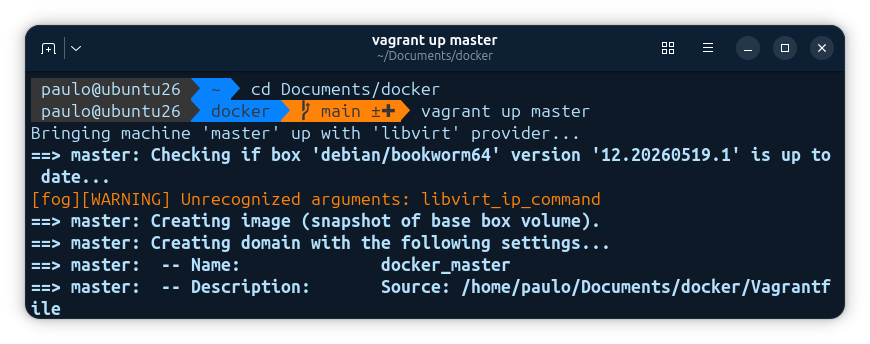

**Acessando a maguina:**

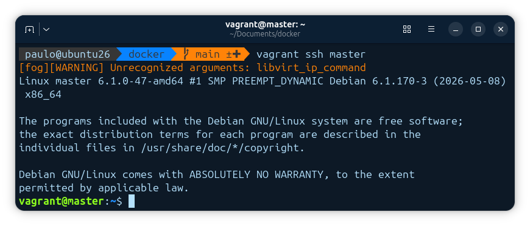

A Docker disponibiliza um `script de conveniência`, que consiste numa forma simples e rápida de instalar o Docker em ambientes de desenvolvimento. Este script deteta automaticamente a distribuição Linux em utilização e instala todos os pacotes necessários para o correto funcionamento do ecossistema. 

Antes de descarregarmos o script, precisamos de efetuar alguns ajustes e preparações na máquina:

- Atualização das listas de repositório: `sudo apt update`

[Docker-install](imagens/docker3.png)

- Instalar as atualizações: `sudo apt upgrade`

[Docker-install](imagens/docker4.png)

- Instalação de pacotes básicos: `sudo apt install vim curl wget`

[Docker-install](imagens/docker5.png)

Para instalar o Docker através do script de conveniência, basta descarregar o ficheiro e executá-lo:

Descarregar o script: `curl -fsSL https://get.docker.com -o get-docker.sh`

Executa o script com privilégios de superutilizador: `sudo sh get-docker.sh`

Alternativamente, poderíamos executar todo o processo numa única linha de comandos, direcionando a saída do `curl` diretamente para o interpretador `bash`:

```bash
vagrant@master:~$ curl -fsSl https://get.docker.com | sudo bash
```

[Docker-install](imagens/docker6.png)

No final do processo, o próprio terminal exibirá as informações que confirmam o sucesso da operação.

[Docker-install](imagens/docker7.png)

De seguida, é apresentada a mensagem informando que o Docker Engine foi instalado com êxito e está pronto a ser utilizado.

[Docker-install](imagens/docker8.png)

> Em distribuições baseadas em Red Hat (como o AlmaLinux ou RHEL), seria necessário habilitar e iniciar o serviço manualmente via systemctl após a instalação. No entanto, em sistemas baseados em Debian/Ubuntu (como é o caso da nossa máquina master), o script faz isso de forma totalmente automatizada:

```bash
+ sh -c 'systemctl enable --now docker.service 2>/dev/null'
INFO: Docker daemon enabled and started
```

Concluímos assim, com sucesso, a instalação do Docker através do  **script de conveniência**.

## Instalação manual 

A pagina de instalação fica [aqui](https://docs.docker.com/engine/install)

Para isso vamos acessar a maquina `node01`, com o comando `vagrant up node01`. 

Abaixo tem o processo completo da inicialização da maquina. Uma vez conectado na máquina docker, execute os seguintes comandos:

Esses comandos são o procedimento padrão para preparar o seu sistema (neste caso, um Debian ou derivado) para baixar o Docker diretamente da fonte oficial, garantindo que o software seja autêntico e atualizado.

- Atualiza a lista de pacotes dos repositórios

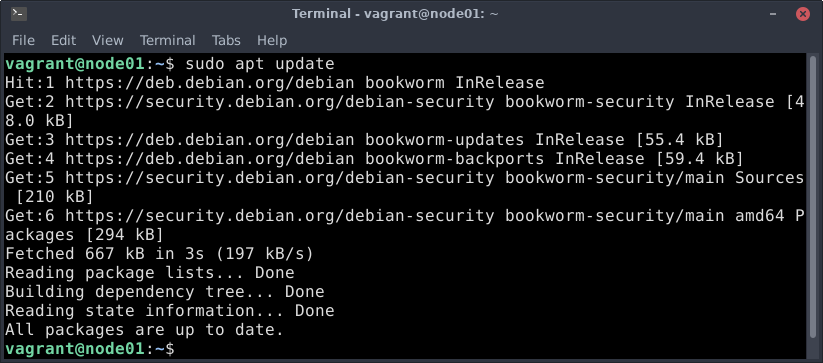

- Instale as atualizações

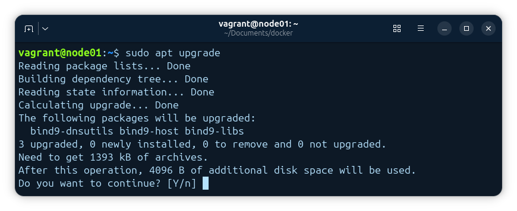

- Permitir que o sistema verifique a validade de certificados de sites (segurança SSL/TLS).

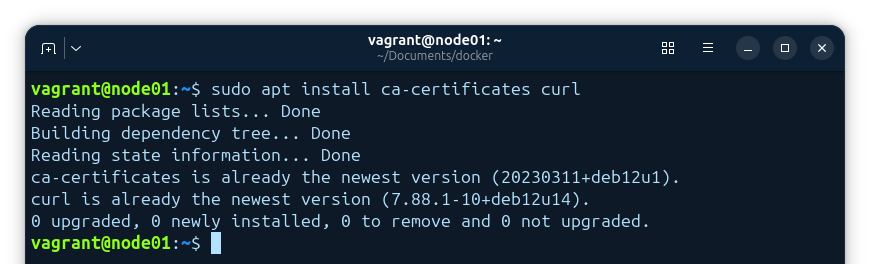

- Cria a pasta onde as chaves de segurança de terceiros serão guardadas. Baixa a chave pública oficial do Docker. E altera as permissões do arquivo da chave para garantir que todos os usuários (incluindo o serviço de atualização do sistema) consigam ler (a+r) o arquivo.

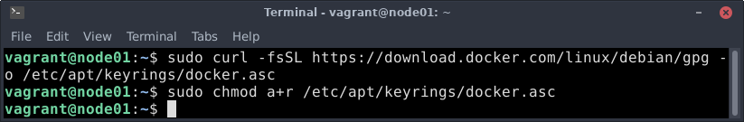

- Cria um novo arquivo de "fonte" (source). Basicamente, você está dizendo ao seu computador: "Ei, além dos servidores padrão, agora você também pode buscar programas neste endereço do Docker".

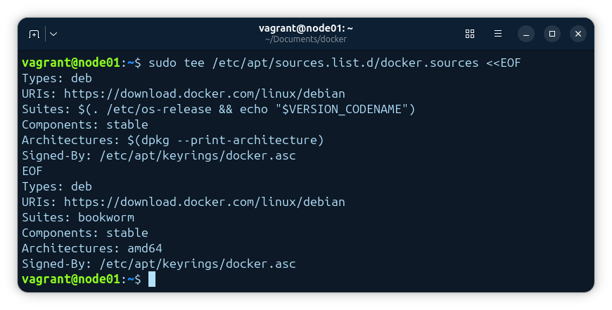

- Podemos atualizar as listas de repositórios novamente.

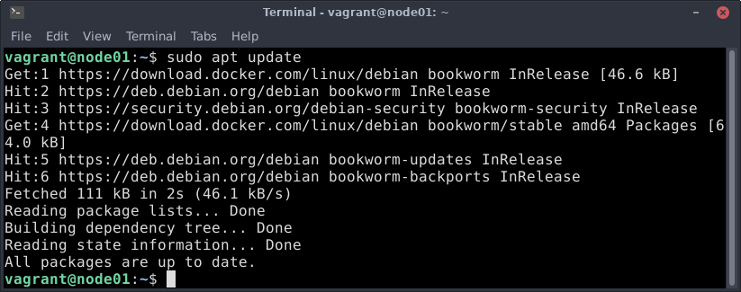

Note as linhas `Get:1 https://download.docker.com/linux/debian bookworm InRelease [46.6 kB]` e `Get:6 https://download.docker.com/linux/debian bookworm/stable amd64 Packages [71.3 kB]` elas confirmam que o seu Debian (bookworm) agora está "conversando" com os servidores oficiais do Docker e baixando a lista de pacotes disponíveis de lá. Como não houve erros de "GPG" ou "404", a chave e o repositório que adicionamos estão corretos.

- Instalando os componentes principais do motor do Docker.

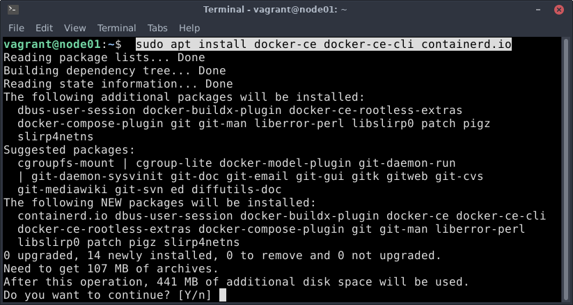

Vejá que ele instala pacotes adicionais:

```bash
The following additional packages will be installed:
  dbus-user-session docker-buildx-plugin docker-ce-rootless-extras
  docker-compose-plugin git git-man liberror-perl patch pigz
```

**Aqui está o que cada um desses pacotes faz no seu sistema:**

- **docker-ce:** O "Community Edition". É o motor (engine) propriamente dito, o serviço que roda em segundo plano e gerencia os containers.
- **docker-ce-cli:** A ferramenta de linha de comando que você usa para digitar docker run, docker ps, etc. Ela se comunica com o motor.
- **containerd.io:** O "executor" de baixo nível. O Docker delega a gestão do ciclo de vida dos containers (iniciar, parar) para ele.

Instalação finalizada com sucesso.

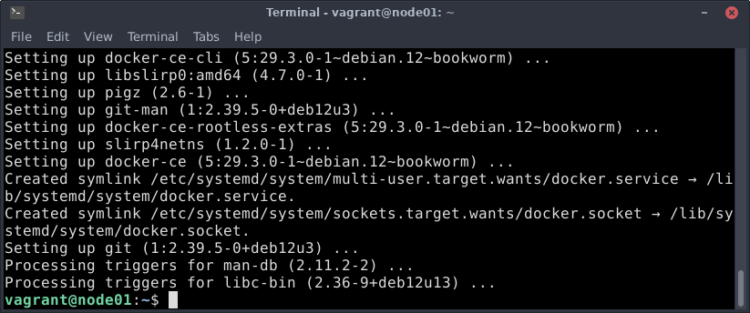

Após a conclusão da instalação, podemos configurar agora nosso usuário para fazer parte do grupo `docker`, isso garantirá que possamos executar os comandos do docker sem a necessidade de elevar os privilégios.

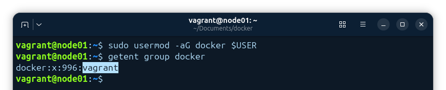

Vamos também instalar o recurso de `Bash Completion` através do comando:

```bash
$ sudo curl https://raw.githubusercontent.com/docker/machine/v0.16.0/contrib/completion/bash/docker-machine.bash -o /etc/bash_completion.d/docker-machine
```

[Docker-install](imagens/docker18.png)

Saia do terminal e inicie uma nova sessão e o usuário já poderá executar o comando como super user.

### Teste de Execução

Para garantirmos que o docker foi instalado corretamente e está funcional, podemos rodar nosso primeiro container e verificar o retorno na tela.

```bash
$ docker container run --rm -it hello-world
```

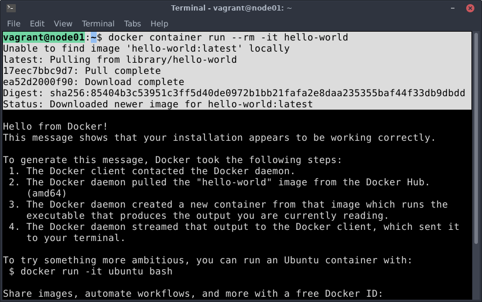

**Aqui está o que aconteceu nos bastidores, linha por linha:**

1. **A busca local (Unable to find image...)**

O Docker primeiro olhou dentro do seu próprio computador (o node01) para ver se você já tinha baixado a imagem hello-world antes. Como ele não a encontrou, ele avisou que precisaria buscar fora.

2. **O download (Pulling from library/...)**

Como não estava localmente, o Docker conectou-se ao Docker Hub.

> Note que ele baixou a versão latest (a mais atual), já que você não especificou uma versão.

3. **A criação e execução**

Após o download, o Docker:

- Criou um container baseado nessa imagem.
- Executou o comando que estava programado dentro dela (que é apenas imprimir esse texto de boas-vindas).
- Encaminhou a saída do container diretamente para o seu terminal.

4. **O papel das flags:**

As duas flags são muito importantes no comando:

- `--rm`: Isso diz ao Docker: "Assim que este container terminar de rodar, apague-o da memória". Isso evita que seu disco fique cheio de containers parados e inúteis.
- `-it`: É a combinação de -i (interativo) e -t (tty/terminal). Basicamente, garante que você consiga ver o que o container está "falando" e interagir com ele se necessário.

**Esse teste confirmou três coisas cruciais:**

- O serviço do Docker está ativo.
- Sua conexão com a internet está autorizada a baixar imagens do Docker Hub.
- O seu usuário já tem permissão para rodar comandos (já que você não precisou usar sudo desta vez!).

### Instalando Docker no almalinux

Vamos aqui repetir todo processo mais mudando para o almalinux.

Primeiramente vamos acessar a máquina `node02` e um pequeno ajuste pode ser feito.

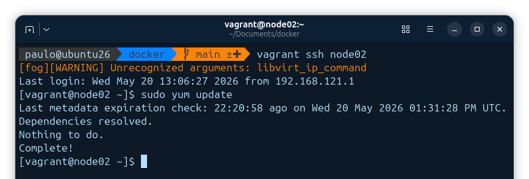

Uma vez conectado na máquina docker, execute os seguintes comandos:

**Atualização do repositório**

[Docker-install](imagens/docker21.png)

**Instalação de pacotes utéis.**

- `sudo yum install yum-utils epel-release`

[Docker-install](imagens/docker22.png)

**O que são esses pacotes:**

- O `yum-utils` é um conjunto de ferramentas e extensões para o gerenciador de pacotes yum. Ele não instala um programa específico, mas dá "superpoderes" ao terminal para gerenciar repositórios.
- `EPEL` significa **Extra Packages for Enterprise Linux**. É um repositório mantido pela comunidade Fedora que contém pacotes de software de altíssima qualidade que não estão incluídos nos repositórios padrão do Red Hat ou CentOS.

Adicionar os repositório docker no almalinux

`sudo dnf config-manager --add-repo https://download.docker.com/linux/centos/docker-ce.repo`

> Para o AlmaLinux, o repositório correto a ser mapeado é o do CentOS (que compartilha a mesma base binária do RHEL).

[Docker-install](imagens/docker23.png)

Instalação do docker

[Docker-install](imagens/docker24.png)

Instalação completa

[Docker-install](imagens/docker25.png)

Após a conclusão da instalação, podemos configurar agora nosso usuário para fazer parte do grupo `docker`, isso garantirá que possamos executar os comandos do docker sem a necessidade de elevar os privilégios.

[Docker-install](imagens/docker26.png)

> Nos sistemas RHEL like, precisamos habilitar e iniciar o serviço após a instalação do mesmo.

```bash
$ sudo systemctl enable --now docker
$ sudo systemctl start docker
```
[Docker-install](imagens/docker27.png)

Vamos também instalar o recurso de `Bash Completion` através do comando:

```bash
$ sudo curl https://raw.githubusercontent.com/docker/machine/v0.16.0/contrib/completion/bash/docker-machine.bash -o /etc/bash_completion.d/docker-machine
```

[Docker-install](imagens/docker28.png)

Saia do terminal e inicie uma nova sessão e o usuário já poderá executar o comando como super user.

```bash
$ exit
$ vagrant ssh node02
```

### Teste de Execução

Para garantirmos que o docker foi instalado corretamente e está funcional, podemos rodar nosso primeiro container e verificar o retorno na tela.

`$ docker container run --rm -it hello-world`

[Docker-install](imagens/docker29.png)

> Já vimos anteriormente o que o comando `$ docker container run --rm -it hello-world` faz.


### Docker Client

O Docker Client é o pacote `docker-ce-cli` ele fornece os comandos do lado do cliente, como por exemplo o comando `docker container run`, que irá interagir com o Docker Daemon

### Docker Daemon 

O Docker Daemon é o pacote `docker-ce` ele é o servidor propriamente dito, que receberá os comandos através do Docker Client e fornecerá os recursos de virtualização a nível de sistema operacional.

### Docker Registry

O Docker Registry é o local de armazenamento de imagens Docker, normalmente o Docker hub, de onde o Docker Daemon receberá as imagens a serem executadas no processo de criação de um container.

## A Tecnologia por Trás dos Contêineres Namespaces e Cgroups

O Docker tira partido de vários recursos nativos do próprio kernel do Linux — tais como os **namespaces** e os **cgroups**, entre outros que iremos abordar detalhadamente mais à frente — para garantir o isolamento e a limitação de recursos dos contentores que serão executados.

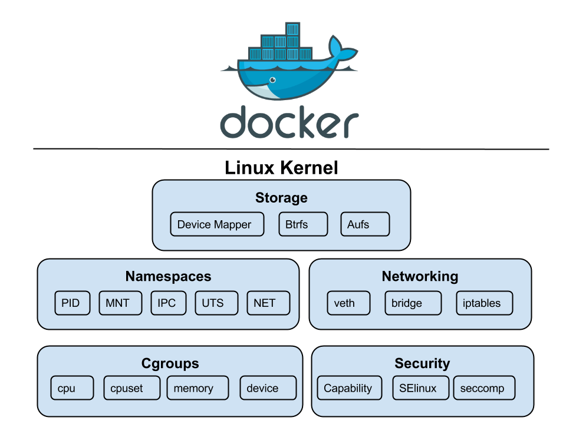

### Namespaces 

Os namespaces fazem parte do kernel do Linux desde 2002 (introduzidos na versão 2.4.19). Trata-se de uma funcionalidade que permite criar e gerir diversos contextos num mesmo sistema, fazendo com que cada contexto visualize propriedades globais diferentes e totalmente isoladas.

Basicamente, os namespaces são responsáveis por gerar o isolamento de grupos de processos ao nível lógico (como a gestão de utilizadores, redes, discos, etc.), garantindo que o container não veja os processos da máquina hospedeira (host) e vice-versa. Logo, ao criar um container, o Docker solicita ao kernel a criação de um conjunto de namespaces dedicados a esse processo.

A utilização de container oferece um ambiente isolado que, ao utilizador, se assemelha a uma **Máquina Virtual (VM)** completa. No entanto, é importante reforçar que não é uma VM — é apenas um processo nativo em execução num servidor. Se, por exemplo, iniciar dois containers, terá dois processos a correr no mesmo sistema operativo, mas completamente invisíveis um ao outro graças a esta tecnologia.

**Os Principais Namespaces Utilizados pelo Docker:**

- **PID (Process ID):** Isola a árvore de processos. O processo principal da aplicação dentro do contentor ganha o PID 1, ficando completamente isolado dos PIDs da máquina hospedeira.
- **MNT (Mount):** Isola os pontos de montagem do sistema de ficheiros. Garante que os processos em namespaces diferentes não consigam visualizar ou alterar os ficheiros uns dos outros. Funciona de forma semelhante a um comando chroot avançado.
- **NET (Network):** Isola os recursos de rede. Cada container recebe a sua própria pilha de rede virtual, o que inclui interfaces de rede próprias, tabelas de encaminhamento (routing) e portas exclusivas.
- **IPC (Inter-Process Communication):** Isola os recursos de comunicação entre processos. Impede que um processo dentro do container aceda à memória partilhada ou às filas de mensagens de processos externos.
- **UTS (UNIX Timesharing System):** Permite que cada container tenha o seu próprio nome de máquina (hostname) e nome de domínio, independentemente do nome configurado no servidor físico.
- **USER (User IDs):** Isola os identificadores de utilizadores e grupos (UID/GID). Permite que um processo corra como utilizador root (UID 0) dentro do container, mas que fora dele (no host) seja visto apenas como um utilizador comum sem privilégios, aumentando drasticamente a segurança.

### cgroups

Os cgroups são, fundamentalmente, a tecnologia do kernel do Linux que nos permite definir limites, restrições e controlos sobre a utilização de recursos físicos por parte de um processo ou grupo de processos.

Se os namespaces servem para garantir o isolamento (o que o contentor pode ver), os cgroups servem para garantir a limitação (o que o contentor pode gastar).

**Esta tecnologia fornece quatro capacidades principais:**

- **Limitação de Recursos:** Permite configurar um teto máximo para determinar quanta memória, CPU ou largura de banda de disco um determinado container pode consumir.
- **Priorização:** Em cenários de elevado consumo (contenção de recursos), permite definir que um determinado grupo de container tenha maior prioridade no acesso à CPU ou ao disco em comparação com outros.
- **Medição e Contabilização (Accounting):** Monitoriza a utilização dos recursos ao nível do cgroup, gerando relatórios e métricas em tempo real sobre o que está a ser consumido.
- **Controlo de Estado:** Permite alterar o estado de todos os processos pertencentes a um cgroup (como congelar, parar ou reiniciar) através de um único comando.

Os cgroups são um componente chave para a existência dos containers. Num ambiente de orquestração mais complexo, como o **Kubernetes**, por exemplo, os cgroups são utilizados nos bastidores para implementar os conceitos de Requests (solicitações) e Limits (limites) de hardware ao nível dos Pods.

**Os Principais Subsistemas (Sub-cgroups) Geridos pelo Docker:**

Para efetuar este controlo, o kernel divide os recursos em subsistemas específicos:

- **cpu:** Controla a distribuição e o peso do tempo de processamento da CPU entre os container.
- **cpuset:** Permite aplicar máscaras de CPU, definindo exatamente em quais cores ou threads específicas do processador um determinado container tem autorização para rodar.
- **memory:** Define limites máximos de utilização de memória RAM e de swap, prevenindo erros de falta de memória no sistema hospedeiro (Out Of Memory - OOM).
- **blkio (I/O de Bloco):** Estabelece limites para o acesso de leitura e escrita em discos físicos (SSD/HDD).
- **devices:** Controla quais os dispositivos de hardware da máquina física (como placas gráficas/GPUs ou interfaces de terminal) que o container pode aceder diretamente.

Os namespaces e os cgroups são os blocos de construção fundamentais para os contentores e para as aplicações modernas. Compreender o seu funcionamento é crucial no processo de refatoração de aplicações para arquiteturas mais modernas e distribuídas.

Enquanto os namespaces garantem o isolamento dos recursos do sistema (criando barreiras visuais entre os processos), os cgroups permitem um controlo minucioso e a aplicação estrita de limites físicos para esses mesmos recursos.

É importante notar que os containers não são a única forma de tirar partido destas tecnologias. Tanto as interfaces de namespaces como as de cgroups estão totalmente integradas no kernel do Linux. Isto significa que qualquer outra aplicação ou serviço do sistema operativo pode utilizá-las de forma independente para fornecer separação e restrições de hardware, sem necessidade de ter o Docker instalado.

## Comandos Essenciais

**Os 3 Pilares do Docker**

> Antes de executar qualquer comando no terminal, é fundamental fixar estes três conceitos interligados:

- **Dockerfile:** A "receita". É um ficheiro de texto simples onde define, passo a passo, como construir a sua imagem (qual o sistema operativo base a utilizar, que pacotes instalar, que ficheiros copiar e quais as portas a expor).
- **Imagem:**O Snapshot estático. É o produto final resultante do build (construção) do Dockerfile. Uma imagem é imutável e contém rigorosamente tudo o que é necessário para a aplicação funcionar.
- **Container:** A imagem em execução. É a instância viva e dinâmica daquela imagem, a correr como um processo isolado na máquina hospedeira.
    
Iremos agora aprender alguns comandos essenciais do Docker.

Para compreender a linha de comandos do Docker, o primeiro passo é perceber que ela está organizada por categorias de objetos. Ao longo deste material, iremos abordar os seguintes comandos de gestão estrutural:

- `docker container`: Gere o ciclo de vida dos contentores (criar, iniciar, parar, eliminar).
- `docker image`: Gere as imagens locais e interações com o registo (listar, apagar, transferir).
- `docker network`: Configura as redes isoladas para a comunicação entre contentores.
- `docker volume`: Trata da persistência de dados de forma independente do ciclo de vida do contentor.
- `docker system`: Exibe dados do sistema, consumo de espaço e permite efetuar limpezas gerais.

Para consultar a lista completa de opções e comandos globais a qualquer momento, basta executar o comando de ajuda no seu terminal:

`docker help`

[Docker-install](imagens/docker30.png)

Se precisar de ajuda específica para uma categoria (por exemplo, contentores), pode refinar a pesquisa utilizando:

`docker container --help`

Para cada comando de gestão mencionado anteriormente, temos diversos subcomandos disponíveis para execução. Muitos deles são familiares para quem já utiliza sistemas Linux, como por exemplo o `ls`, o `rm`, entre outros.

Antigamente, o comando padrão utilizado para listar contentores era o `docker ps`. Embora esta sintaxe antiga ainda seja totalmente suportada e mantida por questões de retrocompatibilidade, a boa prática atual e a documentação oficial recomendam a utilização da nova sintaxe estruturada: `docker container ls`.

> O comando clássico `ps` é a abreviatura de _Process Status (Estado do Processo)_, herdado do Unix/Linux. Por sua vez, o `ls` é a abreviatura de _List (Listar)_, que faz parte da nova arquitetura de comandos do Docker, tornando-a mais intuitiva e organizada por categorias de objetos.

Existem diversos outros subcomandos associados a cada categoria de gestão que iremos explorar detalhadamente ao longo deste curso.

### Executando comandos

Já com a sessão iniciada na nossa máquina virtual, vamos começar a executar os comandos do Docker.

Para visualizar as informações gerais do ambiente, podemos utilizar o comando `docker system info` (ou o seu atalho `docker info`). Este comando exibirá dados estruturais importantes, tais como a versão do motor, a quantidade de containers ativos e parados, os storage drivers em utilização, entre outros.

[Docker-install](imagens/docker33.png)

_Os comandos listados acima são equivalentes._

> **Nota:** Para listar qualquer objeto no Docker (contentores, imagens, redes ou volumes), utilizamos uniformemente a sintaxe: 

`docker <objeto> ls`

- `docker container ls` - Lista os contentores ativos.
- `docker image ls` - Lista as imagens locais.
- `docker network ls` - Lista as redes configuradas.
- `docker volume ls` - Lista os volumes de dados.

Para procurar uma imagem oficial ou comunitária diretamente no Docker Hub, utilizamos o comando `docker search` seguido do nome do componente desejado:

[Docker-install](imagens/docker34.png)

Para transferir a imagem do registo para a nossa máquina local, utilizamos o comando `docker image pull`:

[Docker-install](imagens/docker35.png)

Podemos efetuar o mesmo procedimento para obter a imagem do Alma Linux:

[Docker-install](imagens/docker36.png)

Para validar e listar todas as imagens que foram descarregadas e que já se encontram armazenadas localmente, executamos: `docker image ls`

[Docker-install](imagens/docker37.png)

### Primeiro Container

Para criar e instanciar um novo container, utilizamos o comando docker container run acompanhado das respetivas flags de configuração:

`docker container run -dit --name debian1 --hostname c1 debian`.

[Docker-install](imagens/docker38.png)

**Descrição do comando:**

- **docker container run:** Cria e inicia um novo contentor a partir duma imagem base.
- **-dit** - Executa um container como processo (**d** = Detached), habilitando a interação com o container (**i** = Interactive) e disponibiliza um pseudo-TTY(**t** = TTY)
- **-i + -t:** juntos (-it) são comuns para containers interativos.
- **--name debian1:** Define o nome do container como debian1 (assim você não precisa usar o ID depois)
- **--hostname c1:** Define o hostname dentro do container como c1

Agora que temos o nosso primeiro contentor em execução, podemos listá-lo com `docker container ls` e ligar-nos diretamente à sua consola interativa através do comando `docker container attach`:

[Docker-install](imagens/docker39.png)

> Repare que, ao ligar-se ao contentor, o indicador do terminal (PS1) altera-se imediatamente para `root@c1:/#`, confirmando que está a operar como superutilizador dentro do ecossistema isolado.

Se tentar executar o comando `ip` a ou `ip link` para verificar o endereçamento de rede, irá deparar-se com um erro:

[Docker-install](imagens/docker40.png)

Este comportamento é perfeitamente normal. As imagens oficiais do Docker são propositadamente minimalistas para garantir leveza e segurança, pelo que não trazem ferramentas de rede pré-instaladas. O utilitário `ip` faz parte do pacote `iproute2`, que precisa de ser instalado manualmente. 

Para resolver isto, atualize o índice de pacotes internos do contentor e instale o utilitário:

Atualiza as listas de repositórios do Debian interno.

[Docker-install](imagens/docker41.png)

Instala o pacote de ferramentas de rede.

[Docker-install](imagens/docker42.png)

Agora já pode validar a interface de rede virtual do container executando:

[Docker-install](imagens/docker43.png)

Pode testar outros comandos utilitários para auditoria, tais como hostname ou inspecionar o mapeamento de DNS local: `hostname` e `cat /etc/hosts`.

[Docker-install](imagens/docker44.png)

Se digitar o comando `exit` para sair do terminal do contentor e de seguida tentar listar os contentores ativos `docker container ls`, ou `docker container ls -a` irá notar um comportamento importante:

[Docker-install](imagens/docker45.png)

Compreender a diferença entre os seguintes comandos é crucial no dia a dia:

- `docker container ls`: Apresenta única e exclusivamente os container que estão ativos e em execução (Running).
- `docker container ls -a (All)`: Exibe o histórico completo de todos os container do sistema, estejam eles ativos, pausados ou parados (Exited).

> O contentor parou porque, ao digitar exit, o processo principal (o PID 1, que era o próprio Bash) terminou com um código de retorno. Lembre-se: um container permanece ativo apenas enquanto o seu processo principal estiver em execução.

Para listar de forma rápida apenas os IDs hexadecimais de todos os container (útil para automações e scripts de limpeza), utilize a flag -q (Quiet): `docker container ls -aq`

[Docker-install](imagens/docker46.png)

Para reativar um container que foi parado sem ter de criar um novo do zero, utilizamos o comando `docker container start`. Para o interromper de forma controlada a partir de fora, usamos o `docker container stop`:

Inicia o contentor parado, e liga-se novamente à consola dele.

[Docker-install](imagens/docker47.png)

### Estado e a Sequência de Escape

Se quiser sair do terminal do contentor sem o desligar, deixando-o a correr em segundo plano, não utilize o comando `exit`. Em vez disso, utilize a combinação de teclas conhecida como **Sequência de Escape (Read escape sequence)**:

```bash
<CTRL> + <P> + <Q>
```

[Docker-install](imagens/docker48.png)

Note que, ao regressar ao terminal da máquina hospedeira, se executar `docker container ls`, o estado do contentor aparecerá como `Up`, confirmando que ele continua em plena execução nos bastidores.

[Docker-install](imagens/docker49.png)

### Auditoria e Logs do container

O comando `docker container logs` (ou simplesmente docker logs) é a sua principal ferramenta de "caixa-preta". Como os contêineres rodam de forma isolada, muitas vezes em segundo plano (modo daemon), esse comando serve para você espiar o que está acontecendo com a aplicação lá dentro.Por padrão, ele captura tudo o que a aplicação jogou no `STDOUT` (saída padrão) e no `STDERR` (saída de erro). 

Se o seu contêiner morreu misteriosamente ou está dando erro 500, é aqui que você descobre o motivo.

Aqui está o resumo ideal de sintaxe e as flags mais importantes para o seu docker:

Sintaxe Básica

`docker container logs [OPÇÕES] ID_OU_NOME_DO_CONTEINER`

### Principais Opçẽs do comando `docker container logs`

| **Opção**            | **Descrição**                                                    | **Exemplo de uso**                       |
|----------------------|------------------------------------------------------------------|------------------------------------------|
| `-f`, `--follow`     | Acompanha os logs em tempo real (similar ao `tail -f`).          | `docker container logs -f meu_container` |
| `--since`            | Mostra logs gerados a partir de uma data/hora específica.        | `docker container logs --since 2026-05-01 meu_container` |
| `--until`            | Mostra logs até uma data/hora específica.                        | `docker container logs --until 10m meu_container` |
| `-t`, `--timestamps` | Exibe a data e hora exata em cada linha do log.                  | `docker container logs -t meu_container` |
| `--tail`             | Mostra apenas as últimas N linhas do log.                        | `docker container logs --tail 100 meu_container` |
| `--details`          | Exibe detalhes adicionais fornecidos pelo driver de log.         | `docker container logs --details meu_container` |
| `-n` (ou `--tail`)   | Quantidade de linhas do log a exibir (equivalente ao `--tail`).  | `docker container logs -n 50 meu_container` |

As 4 Flags que Salvam Vidas no Dia a Dia. Para não ser soterrado por uma parede de texto gigante (especialmente em contêineres antigos), use estas flags:

1. **--follow ou -f (Modo "Tail")** Funciona igual ao tail -f do Linux. Ele trava o terminal e fica mostrando os logs em tempo real conforme eles acontecem. Excelente para debugar requisições chegando no servidor.

`docker container logs -f meu_nginx`

2. **--tail (Limitar o Histórico)** Mostra apenas as últimas $n$ linhas do histórico de logs. É uma boa prática usar junto com o -f para não carregar o lixo do passado.

Mostra as últimas 50 linhas e continua acompanhando em tempo real

`docker container logs -f --tail 50 meu_banco_dados`

3. **--timestamps ou -t (Linha do Tempo)** Adiciona a data e a hora exata (com precisão de nanossegundos) em que cada linha de log foi gerada. Essencial se a aplicação interna não gera timestamps nativos no log.

`docker container logs -t meu_container`

4. **--since (Filtrar por Tempo)** Permite extrair logs criados a partir de um momento específico. Aceita tempos relativos (como 5m para 5 minutos, 1h para 1 hora) ou datas completas.Bash# Mostra apenas os logs gerados nos últimos 10 minutos

`docker container logs --since 10m minha_api`

> Dica de Infraestrutura: Se você rodar comando `docker container logs` e ele não trouxer nada, mas você sabe que a aplicação está rodando, verifique o Logging Driver do Docker. Por padrão, o Docker usa o driver **json-file** (que guarda os logs em ficheiros JSON dentro de `/var/lib/docker/containers/`). Se a infraestrutura da empresa tiver sido alterada para encaminhar os logs diretamente para um Syslog remoto, Fluentd ou Splunk, o comando local do Docker ficará vazio!

Atente no seguinte cenário real de erro cometido por um administrador durante a análise:

```bash
vant@node01:~$ docker container logs debian1
root@c1:/# docke container log debian1
bash: docke: command not found
root@c1:/# docker container log debian1
bash: docker: command not found
root@c1:/# exit
exit
```

O utilizador tentou executar o comando docker dentro do próprio container Debian (root@c1:/#). Como o container é isolado e minimalista, ele não tem o binário do Docker instalado lá dentro. Para gerir os logs ou o estado do container, os comandos têm de ser executados na máquina hospedeira (host), o que obrigou o utilizador a digitar `exit` para regressar ao terminal correto.

### Eliminação de containers

Para parar e remover o contentor de forma limpa, e de seguida auditar o ambiente, execute:

- Para o contentor: `docker container stop debian1`
- Remove o contentor do sistema: `docker container rm debian1`
- Valida se o contentor foi totalmente removido: `docker container ls -a`

[Docker-install](imagens/docker50.png)

> **Noata:** É possível forçar a remoção de um contentor ativo sem o parar previamente utilizando a `flag -f` (Force): `docker container rm -f debian1`-

### Cópia de Ficheiros e Execução Remota (cp e exec)

Inicie um novo contentor de testes:

`docker container run -dit --name c1 --hostname c1 debian`

[Docker-install](imagens/docker51.png)

Crie um ficheiro de teste na pasta `/tmp` da máquina hospedeira para enviá-lo para dentro do contentor c1:

```bash
vagrant@node01:~$ echo "Arquivo de teste docker" > /tmp/arquivo.txt
vagrant@node01:~$ docker container cp /tmp/arquivo.txt c1:tmp
Successfully copied 2.05kB to c1:tmp
```

[Docker-install](imagens/docker52.png)

> O comando `docker container cp` é bidirecional. Permite copiar ficheiros da máquina hospedeira (host) para dentro do contentor, ou extrair ficheiros do contentor para o host.

Para verificar se o ficheiro foi copiado corretamente sem ter de abrir uma sessão interativa `(attach)`, utilize o comando `exec`:

[Docker-install](imagens/docker53.png)


```bash
[vagrant@node02 ~]$ docker container exec c1 ls -l /tmp
total 4
-rw-rw-r--. 1 1000 1000 24 May 22 10:48 arquivo.txt
[vagrant@node02 ~]$ docker container exec c1 cat /tmp/arquivo.txt
Arquivo de teste docker
```

> O comando **docker container exec** executa um comando no container e envia o retorno na saída padrão(STDOUT) da máquina, caso o container não tenha sido iniciado com a opção **-i** o retorno não será mostrado no STDOUT.

Remova o contentor c1 antes de avançar para o próximo exercício:

[Docker-install](imagens/docker54.png)
 
### Automatização com Scripts: Criação e Remoção em Massa

Se precisarmos de criar containers de teste sequencialmente para simular uma carga de trabalho, podemos utilizar uma estrutura de repetição (loop) em Bash:

```bash
for i in $(seq 1 10)
> do  
> docker conatainer run -it hello-word
> done
```
Se preferir executar tudo numa única linha diretamente no terminal: `for i in $(seq 1 10); do docker container run -it hello-world; done`.

[Docker-install](imagens/docker55.png)

**Explicação**

- `for i in`: Inicia o ciclo (loop). A letra i é a variável local que guardará o número da iteração atual.
- `$(seq 1 10)`: Gera a sequência numérica de 1 a 10 que alimenta o ciclo.
- `; do`: Abre o bloco de execução das instruções.
- `docker container run`: Cria e inicia um novo contentor.
- `-it (-i + -t)`: * -i (Interactive): Mantém o canal de entrada padrão (STDIN) aberto para interagir com o contentor.
- `-t (TTY)`: Aloca um pseudo-terminal simulado dentro do contentor.
- `hello-world`: A imagem oficial de teste do Docker.
- `; done`: Encerra o ciclo.

Para listar apenas os identificadores hexadecimais únicos (IDs) de todos os containers que foram criados pelo script, adicionamos a flag `-aq`:

`docker container ls -aq`

[Docker-install](imagens/docker56.png)


### Apagar todos os containers de uma vez

Para limpar o ambiente de laboratório e eliminar todos os contentores (ativos ou parados) instantaneamente, combinamos o comando de remoção com a substituição de comandos do Bash:

`docker container rm $(docker container ls -aq)`

O Bash executa primeiro o comando que está dentro dos parênteses $(...), que gera a lista com todos os IDs existentes. De seguida, injeta essa lista como argumento diretamente no comando `docker container rm -f`, eliminando-os a todos em simultâneo.

[Docker-install](imagens/docker57.png)

## Play with Docker (PWD)

O **Play with Docker (PWD)** é uma das ferramentas mais fantásticas e, por vezes, subestimadas por quem está a aprender ou a ensinar Docker. Criado por Marcos Nils e Jonathan Leibiusky (e oficialmente apoiado pela Docker Inc.), este projeto consiste num playground gratuito baseado na nuvem que corre diretamente no seu navegador de internet (browser).

A grande magia do PWD é permitir o acesso instantâneo a um terminal Linux com o Docker Engine totalmente pré-instalado e configurado, sem necessidade de descarregar ou instalar absolutamente nada na sua máquina local.

### Como Funciona?

Ao aceder ao site [oficial](labs.play-with-docker.com), basta efetuar a autenticação (login) utilizando a sua conta gratuita do Docker Hub. A plataforma disponibiliza imediatamente uma sessão de laboratório com uma duração máxima de **4 horas**.

**Dentro desta sessão, poderá:**

- **Criar múltiplas instâncias:** Com um simples clique, pode instanciar várias máquinas virtuais independentes baseadas em Alpine Linux.
- **Simular Clusters (Docker Swarm):** Possui suporte nativo para criar uma infraestrutura Swarm, definindo nós Gestores (Managers) e Trabalhadores (Workers) de forma automatizada para testar a orquestração de serviços.
- **Acesso facilitado a portas:** Se executar um contentor que exponha uma porta pública (como um servidor Nginx na porta 80), o PWD gera automaticamente um link HTTP no topo do ecrã para que possa clicar e abrir a aplicação noutra aba do seu navegador.

Se está a estruturar um manual técnico ou a preparar um laboratório prático, o PWD é um aliado excecional por três motivos principais:

- **Zero Atrito de Instalação:** Se algum aluno ou leitor tiver limitações de espaço em disco, estiver a utilizar um computador corporativo bloqueado pelas políticas de TI, ou enfrentar conflitos de rede com o WSL2 no Windows, o PWD elimina essa barreira. O foco da aula passa a ser 100% a aprendizagem dos comandos do Docker.
- **Ambiente Totalmente Descartável:** É o ecossistema perfeito para testar comandos complexos ou transferir imagens de grande dimensão sem consumir a largura de banda da sua internet local. Assim que o temporizador da sessão chega ao fim, tudo é destruído e limpo de forma segura.
- **Visualizador de Rede Integrado:** A plataforma exibe de forma gráfica como as diferentes instâncias criadas estão ligadas na mesma rede virtual interna, o que facilita imenso a explicação visual de conceitos de arquitetura de redes e sub-redes no Docker.

> Lembre-se de que, por ser um ambiente efémero e descartável, nenhum dado é guardado após o encerramento da sessão. Ficheiros de configuração importantes ou Dockerfiles desenvolvidos lá dentro devem ser copiados para fora ou guardados num repositório Git antes do fim do tempo limite.

### Laboratório Prático: Executar o Super Mário no Docker

Para consolidar os conhecimentos adquiridos sobre a execução de contentores e o mapeamento de portas, vamos correr um projeto lúdico: o jogo clássico do Super Mário a correr dentro de um contentor Docker.

Execute o seguinte comando no terminal da sua máquina hospedeira:

`docker container run -d -p 8080:8080 --name mario pengbai/docker-supermario`

> `-d` (Detached). Isto permite que o jogo corra em segundo plano, libertando imediatamente o seu terminal para que possa continuar a trabalhar enquanto o servidor do jogo está ativo.

## Desligar as Máquinas

Após concluir os testes e os exercícios do dia, é uma excelente prática de administração de sistemas limpar o ambiente de contentores e desligar a infraestrutura de máquinas virtuais (Vagrant) para libertar os recursos de hardware (RAM e CPU) do seu computador.

Siga estes passos sequenciais: 

1. Antes de desligar a máquina virtual, remova o contentor que ficou a correr em segundo plano: `docker container rm -f mario`

2. Se ainda estiver ligado dentro da máquina `master` (ou de qualquer outro nó), termine a sessão SSH para regressar ao terminal do seu computador local: `exit`

3. Navegue até à pasta no seu computador local onde se encontra o ficheiro Vagrantfile do projeto e execute o comando de encerramento: `vagrant halt`

[Docker-install](imagens/docker58.png)

Pode ver também pela interface grafica do virt-manager

[Docker-install](imagens/docker59.png)

> Se no futuro quiser apagar completamente as máquinas virtuais do seu disco rígido para libertar espaço, o comando a utilizar na sua máquina local será o `vagrant destroy -f`. No entanto, o `vagrant halt` apenas as desliga (equivalente a fazer Shut Down), preservando todos os ficheiros e instalações que realizámos para a próxima aula.

## Conclusão do Capítulo

Dominar o ciclo de vida dos containers transforma radicalmente a gestão de infraestrutura, garantindo ambientes isolados, previsíveis e imutáveis. Neste capítulo, cobrimos desde o aprovisionamento rápido com o comando `docker container run` até à governação estrita do ecossistema através de comandos essenciais de listagem `(docker container ls -a)`, inicialização e interrupção `(docker start/stop)`, e eliminação de recursos obsoletos `(docker rm)`.

Vimos como auditar aplicações em tempo real através do `docker container logs`, como interagir com processos ativos utilizando o `docker container exec`, e como automatizar este fluxo criando scripts de implementação (deploy) padronizados. Para acelerar esta curva de aprendizagem, a plataforma **Play with Docker (PWD)** mostrou-se uma aliada indispensável, fornecendo um laboratório ágil, gratuito e direto no navegador que elimina qualquer barreira inicial ou atrito de instalação.

Vimos também três abordagens equivalentes no Linux para limpar o laboratório e eliminar todos os contentores de uma só vez:

1. Substituição de comandos clássica (Recomendada)

`docker container rm -f $(docker container ls -aq)`

2. Utilizando pipes e o utilitário xargs do Linux

`docker container ls -aq | xargs docker container rm -f`

3. Sintaxe moderna direta (Equivalente à Opção 1)

`docker rm -f $(docker ps -aq)`

Com esta base sólida de comandos e automação, eliminou em definitivo o velho estrangulamento do **"na minha máquina funciona"** e está finalmente pronto para escalar aplicações com total consistência.

## Glossário: Terminologia Essencial do Docker

Para garantir o sucesso no exame DCA e alinhar a comunicação técnica, recapitulemos os conceitos fundamentais:

- **Contentor (Container)**: Ambiente isolado, seguro e leve que possui a sua própria árvore de processos, interfaces de rede e utilizadores, partilhando o mesmo kernel do sistema operativo hospedeiro. É a instância viva criada a partir de uma imagem.
- **Imagem**: Pacote executável e imutável que contém rigorosamente tudo o que é necessário para correr uma aplicação (código fonte, executáveis, variáveis de ambiente, ficheiros de configuração e bibliotecas).
- **Dockerfile**: Ficheiro de texto simples contendo a sequência de instruções lógicas e ordenadas para automatizar a construção de uma imagem Docker.
- **Tag**: O identificador de versão de uma imagem (ex: ubuntu:24.04). Cada imagem possui uma ou mais tags associadas.
- **Docker Hub**: O registo público oficial e centralizado da Docker Inc., onde a comunidade e as empresas alojam e partilham milhões de imagens.
- **Docker Engine**: O motor/sistema central de virtualização que permite criar, executar e gerir os contentores Docker.
- **Docker Registry**: Serviço responsável por armazenar, alojar e distribuir imagens Docker. Pode ser público (como o Docker Hub) ou privado (como o Harbor).
- **Docker CLI / Arquitetura**: Interface de Linha de Comandos que permite ao utilizador interagir com o Docker. O Docker opera numa arquitetura cliente-servidor: o Cliente (CLI) envia ordens ao Servidor (o processo de fundo chamado Docker Daemon), podendo comunicar localmente através de sockets Unix ou remotamente via API RESTful.

## Índice do Conteúdo Oficial

Este manual foi estruturado com base nos requisitos oficiais da certificação Docker Certified Associate (DCA). Ao longo do nosso percurso, iremos abordar os seguintes módulos práticos:

- 📦 Docker-DCA 01: Instalação, Arquitetura e Fundamentos (Concluído)
- 🖥️ Docker-DCA 02: Comandos Estruturais, Ciclo de Vida e Imagens
- 🛠️ Docker-DCA 03: Docker Images – Melhores Práticas e Multistage Build
- 💾 Docker-DCA 04: Persistência de Dados com Volumes
- 🔌 Docker-DCA 05: Plugins de Volumes e Armazenamento Distribuído
- 🌐 Docker-DCA 06: Engenharia de Redes no Docker (Networking)
- 🎼 Docker-DCA 07: Orquestração Local com Docker Compose (docker-compose)
- 🤝 Docker-DCA 08: Algoritmo de Consenso Raft e Introdução ao Docker Swarm
- 🚀 Docker-DCA 09: Docker Swarm – Registos, Services e Tasks
- 🗺️ Docker-DCA 10: Docker Swarm – Gestão Avançada de Stacks
- 📊 Docker-DCA 11: Monitorização Avançada (Prometheus + Node Exporter + Grafana + cAdvisor)
- 🧰 Docker-DCA 12: Ferramentas de Ecossistema (PWD, Swarmpit, Portainer, Harbor e Docker Machine)
- ☸️ Docker-DCA 13: Transição e Fundamentos de Kubernetes

**Bons estudos!**
